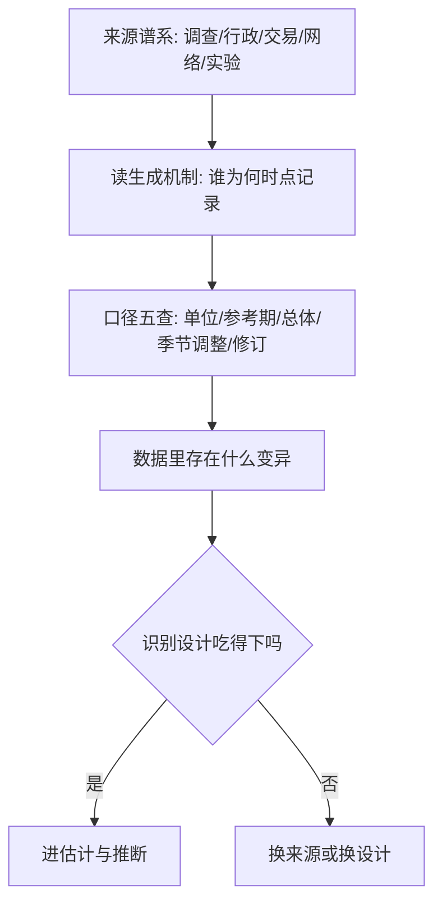

# 经济数据的来源与口径

大数据没有替换经济学的问题，替换的是哪些量测得到、哪些约束验得起；数据的第一性质永远是它是怎么被生成的。

<footer>—— 据 Einav and Levin, Economics in the Age of Big Data, Science 2014 整理</footer>

[上一课](/econ/ca-map)把因果方法的学科应用收束：变异从制度缝隙来，读数为谁而估，跨域搬运过假设、目标、搬运的三问审计。缺口再往前挪一步：无论测的是什么，量本身从哪来、按什么口径计算，先于一切估计。本课是「经济数据与计算」的第一课：行政数据怎么进协议、大数据与调查怎么组合、计算环境怎么冻结、规模化怎么排梯子，都默认你已经把「来源谱系加口径检查」当作接触任何数据集的第一个动作。

## 问题

经济数据大多不是为研究而生：它为收税、发工资、记账、成交而沉淀。生成目的与使用目的的错位留下三个缺口。量与构念错位：[GDP 三种算法](/econ/gdp-accounts)已经钉过，增加值是约定边界内的生产，不是福利；CPI 的篮子与权重同样是约定（[CPI 与 PCE](/econ/cpi-vs-pce)），拿统计口径直接当理论构念，第一行就错。口径漂移：定义、覆盖、参考期随机构与政策而变，修订还会改写历史。可得性与识别错配：数据里存在哪种变异是来源决定的，而识别设计吃的就是变异。

### 来源谱系与口径五查

按生成机制分五类。调查：为测量而生，抽样框清楚，代价是成本高、回答率下滑。行政：为管理而生，覆盖大、时间长，但字段是管理定义。交易与扫描：为成交而生，高频高频次，覆盖停在交易边界内。网络与文本：为传播而生，测量要过[上一课](/econ/pm-text-as-data)的三重验证。实验：为识别而生，构念与分配可控，外部有效性另需论证（见[外部有效性](/econ/pe-external-validity)）。

拿到任何数据集先过口径五查：单位与名义/实际，实际值怎么缩、链式指数的坑见[链式指数偏差](/econ/chain-index-bias)；参考期与频率，流量还是存量、月历月还是财年；总体与抽样框，[常住与领土](/econ/gdp-accounts)那一刀切在谁身上；季节调整，调整程序本身就是滤波模型，取舍与 [HP 滤波](/econ/hp-filter-cycles)同类；修订与版本，季度 GDP 先行估计之后约一个月内还要修两次，全面修订约每五年随基准换基。

BLS 每月为 CPI 收集约八万个报价；即便这种「为测量而生」的数据，篮子与网点的更新节奏仍是统计机构的约定——口径不是数据的属性，是生产流程的属性，所以要读手册而不是读表头。

## 方法

流程上，读生成机制先于读表：谁录入、在什么激励下录入、漏录意味着什么；然后口径五查，把每个字段的定义史记下来；最后把「存在的变异」与设计对上。要做[双重差分](/econ/difference-in-differences)，政策断面与时间断面都得有变异；要用工具变量，来源里得存在排除约束讲得通的移动，弱工具的代价见[弱工具变量](/econ/iv-weak-instruments)。

## 机制

口径错误无法靠计量补救，因为它进入回归的结构不是白噪声。经典测量误差使系数衰减；非经典误差——比如拿今天的修订序列回测当年决策者面对的 vintage 数据——直接制造不存在的规律：当年的预期对应的是当时看到的数据，不是后来修正的数据。这与[上一课](/econ/pm-text-as-data)的「今天的词典回放昨天」同源，都是把未来信息泄进测量。变异同理是先定的：采样机制决定了哪个维度有变异、哪个维度被截断，设计是在给定变异上做文章，不是无中生有。

## 边界

本课不教采集与清洗的工程细节，隐私与访问协议是行政数据课的事；大数据与调查怎么互补、怎么加权，是融合课的事。指数构造的公式在[价格指数与实际值](/econ/price-index-real)已经讲过，这里只把它当口径五查的一格。谱系也不是教条：收入在调查、税务、雇主报表里各有一份，多源的校验与组合正是后两课的素材。后课默认你已经会先问：这是谁、为什么、按什么口径记下来的。

## 小结

- 经济数据按生成机制分五类：调查、行政、交易扫描、网络文本、实验；每类的偏在生成机制里，不在文件格式里。
- 口径五查：单位与名义/实际、参考期、总体与抽样框、季节调整、修订版本；vintage 数据是回放历史的唯一合法口径。
- 口径错误是结构性测量误差，计量救不了；识别可用的变异由来源先定。
- 读生成机制先于读表：谁录入、为什么、漏掉谁。
- 出处：Einav and Levin, *Science* 2014；Varian, *JEP* 2014；统计口径据 BLS、BEA 手册整理。
