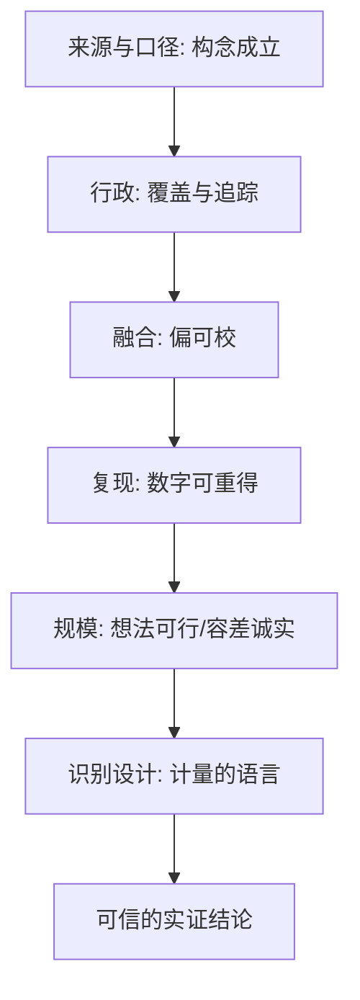
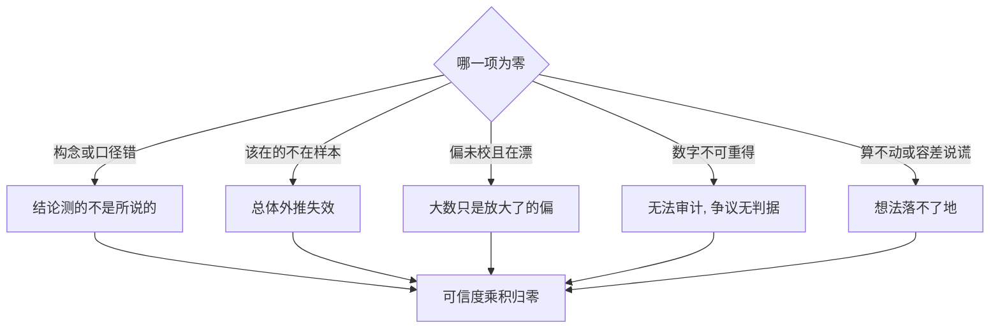

# 数据与计算收束

实证结论的可信度是乘法：识别、测量、覆盖、复现、成本，任何一项为零，乘积为零。

<footer>—— 据 Athey 2018 与 Einav and Levin, Science 2014 的论断整理</footer>

[上一课](/econ/ec-scaling-computation)把规模化的阶梯与瓶颈定位钉住，计算这半边收齐了。本课是「经济数据与计算」的最后一课，本课程到此收束：把五课收成一张图，交还给整门实证方法的主线——数据与计算不生产可信结论，它们决定识别设计的功夫有多少能落袋。

## 问题

五课合起来回答一个问题：一条实证结论凭什么可信。[来源与口径](/econ/ec-data-sources)决定构念是否成立；[行政数据](/econ/ec-administrative-data)决定覆盖与追踪能到谁；[融合](/econ/ec-bigdata-survey-fusion)决定偏能不能被校；[复现环境](/econ/ec-reproducible-computing)决定数字可不可以重新得到；[规模化](/econ/ec-scaling-computation)决定想法可不可行、容差有没有说谎。这五项与识别是乘法不是加法：任何一项为零，[潜在结果](/econ/potential-outcomes)层面的精巧都无处安放。直觉类比：乘法关系就是链条承重——五节链环，断一节全断。数值上，识别做得再好记 0.9，口径错得离谱记 0.1、数字重跑不出来记 0，乘起来还是 0；加法思维会让人以为长板能补短板，乘法告诉你：短板为零时，长板毫无意义。

### 一条检查序列

读一篇实证、或自己动手之前，按序过五问。第一问：每个量是什么构念、哪一来源、什么口径与 vintage？第二问：谁不在样本里——行政边界、平台边界、不应答者？第三问：链接与校准引入了什么新误差，偏移稳不稳？第四问：结果能否一条命令重跑，种子、容差、环境锁在哪？第五问：计算瓶颈定位了吗，内层解收敛了吗？很多「显著」会在第二问或第四问掉下来；都过得去，才轮到识别假设的辩论。常见误区：初学者容易把全部火力对准识别假设，实际上先查口径与复现成本更低——一个连一条命令都重跑不出来的结果，讨论它的识别策略是白费；顺序本身就是省时间的工具。

Gentzkow–Shapiro–Taddy 2019 把国会演讲变成高维选择数据测极化——这条线索从[文本作为数据](/econ/pm-text-as-data)的测量纪律走到本课程的口径与复现，是「新数据进经济学」的完整样本：测量、验证、进入协议、可复现交付，一环不缺。

## 方法

方法在收束课里是一张交接图。向上，本课程把测量的语言交还给[计量课](/econ/ml-causal-econ)与[实证规范](/econ/pm-specification-map)：识别设计的前提在此列齐。向下，它向计算机栏要接口：数据库、调度与分布式语义按分组聚合与逐组估计的口径谈，不再往下钻。横向，它与[政策评估](/econ/pe-case-map)和[结构估计](/econ/se-case-map)共享同一套数据纪律——那些课的每一种设计，都默认本课程五问已经通过。

第一张图画的是五关的通过顺序；换一个问题——任一关挂掉时结论的成色——则是乘法结构的分叉图。

## 机制

为什么收在数据与计算而不是识别：识别的语言在计量课已经钉死，本课程补的是它的必要条件集。经验上，实证争议最多的不在「识别策略错」，而在口径错位、样本缺席、数字无法重得——这些恰恰不进论文的方法节，散落在附录与代码里。把五问变成默认动作，等于把争议从不可审的个人判断挪到可审的工件上：手册、快照、种子、容差；争论才落在判据上，不是数据上。「可审工件」就是能被第三方独立检查的实物证据：数据手册、环境快照、随机种子、容差声明。有了它们，争论从「我信不信作者」变成「任何人重跑同一条命令能不能得到同一个数」——判断标准从信任换成了复得。

## 边界

本课程不覆盖隐私法与合规细节——进入协议只在统计机构语境下示范；数据库与分布式的工程原理在计算机栏；文本与 NLP 的测量在预测课与文本课。这些是邻接域，接口已在各课边界段写明。也要防收束课的通病：清单不是防火墙，五问通过不保证结论对，它们只保证结论可以在共同事实上辩论。数据与计算到此收束；下一课起，树回到理论的纸面——但每一行理论落到数据上时，都从本课程的五问重新出发。

## 小结

- 数据与计算对识别是乘法关系：构念、覆盖、偏校、复现、成本，缺一即零。
- 五问检查序列：构念与口径、谁缺席、链接误差、可复现性、瓶颈与容差。
- 实证争议的大头在方法节之外：口径、缺席与不可复得；收束的意义是把它们变成可审工件。
- 新数据进经济学的完整路径：测量验证、进入协议、复现交付、规模可行。
- 本课程到此收束：识别的语言归计量，工程的接口归计算机栏，两边的乘积才是可信实证。
- 出处：Athey, The Impact of Machine Learning on Economics, 2018；Einav and Levin, *Science* 2014；Gentzkow, Shapiro and Taddy, *Econometrica* 2019。
