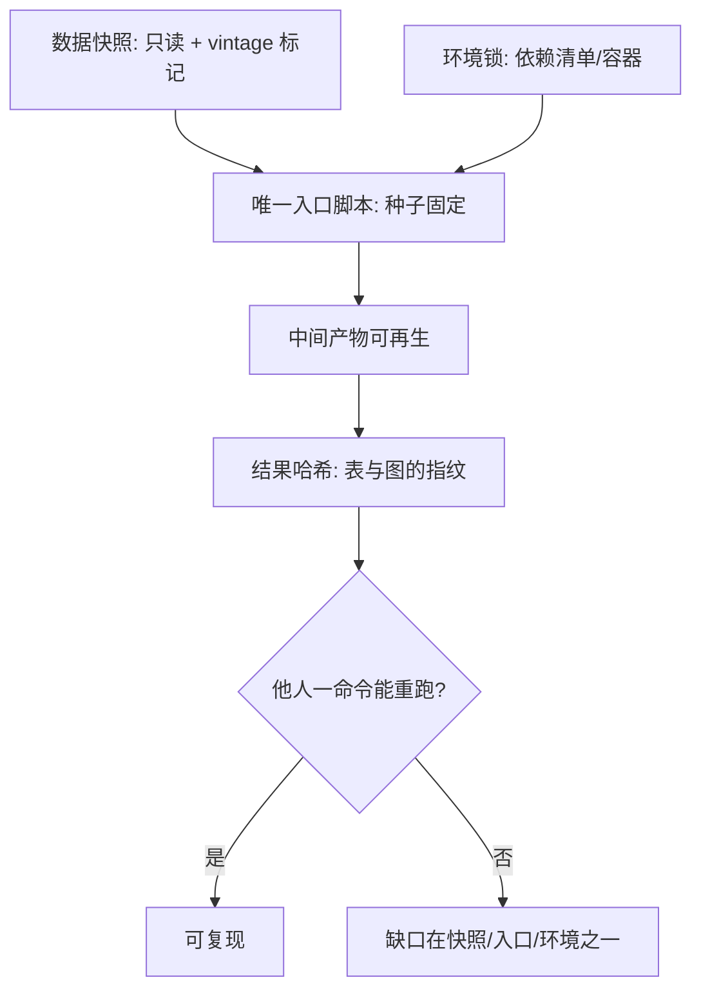

# 可复现的计算环境

关于计算科学的论文不是学术成果本身，只是广告；成果是生成那些图表的完整软件环境与全部指令。

<footer>—— Claerbout 的表述，转引自 Peng, Reproducible Research in Computational Science, Science 2011</footer>

[上一课](/econ/ec-bigdata-survey-fusion)把两源组合钉成估计问题；这一课换层：得到估计之后，别人——包括半年后的你自己——能不能重新得到同一个数。[实证规范课](/econ/pm-specification-map)已把复现三件套列为规范的一格；本课把那一格展开成完整工程。前三课的口径、协议、链接若不能冻结下来，全部白费：复现是数据纪律的落袋方式。

## 问题

实证结果是代码、数据、环境三者的合取，任何一角漂移，结果就动。软件版本改变数值：优化器路径、随机数实现、默认方法都在变。数据修订改写历史：今天的公开序列不再等于写作那天的 vintage，[第一课](/econ/ec-data-sources)的口径五查若没留快照，回放无从谈起。隐式自由度散落在代码里：样本过滤、异常值处理、聚类层级、并行归约次序。这不是新患：Dewald–Thursby–Anderson 1986 的《货币、信贷与银行杂志》复制项目发现，交付的数据与代码普遍无法原样重跑；Chang–Li 2015 用独立代码复算六十六篇论文，约半数结果对不上。

### 最小复现包

Chang 与 Li 2015 的标题即结论：六十六篇「成功了一半」。失败多不在算法，而在未记录的自由度——样本过滤、清洗规则、口径选择。钉死这些自由度，比换任何统计软件都重要。

一个复现包最少五件。数据快照：原始数据只读存档，附点-in-time 标记。代码：唯一入口、随机数种子固定、禁止交互输入。环境锁：依赖清单或容器镜像，把「能跑」钉在环境定义上而不是某台机器上。一命令重跑：make 目标或管线 DAG，中间产物全部可再生。结果哈希：对每张表、每幅图做指纹，任何一环被改动都能检出。写作层用 literate 方式把叙述与执行绑在同一份源里（Knuth 1984 是源头）；Gentzkow–Shapiro 2014 的实践指南把这套纪律翻译成社会科学工作流。

## 方法

次序有讲究：先锁环境再跑代码，否则锁文件里混进临时安装的包；先快照再过滤，过滤后的数据与原始数据并存、附过滤脚本；种子连同并行拓扑一起记录，因为并行归约的加法次序本身影响浮点结果——这些次序信息不属于注释，属于交付物。

## 机制

复现性的来源是把自由度钉死。统计自由度要进推断，多重检验的折价见[多重检验](/econ/multiple-testing-econ)；计算自由度同样要进交付：种子、迭代次数、收敛容差、并行次序，每少报一项，读者就多背一项。浮点加法不满足结合律，归约次序不同，逐位结果就不同——于是工程上区分两个层级：数值复现（容差内一致）与逐位复现（哈希一致）；交付时声明用的是哪个层级，是审计契约的一部分。

不这么做会错在哪：把「我这边能跑」当复现；版本升级后图表微动却已进出版流程；审稿人要求一处改动，却发现没人能重新生成那张表。

## 边界

复现不等于正确：独立复算通过只说明「数是这么算出来的」，构念与识别对不对是[计量课](/econ/ml-causal-econ)的管辖。保密数据无法公开，退而求其次是在安全环境内的受控复现与代码审查——上一课的进入协议在这里接上。容器与锁文件也不是终点：环境会腐化，镜像要定期重建验证，否则「可复现」只是被推迟的不可复现。协作、评审与跨团队共享是这套环境的组织面，留给收束课排进全景。

## 小结

- 结果是代码、数据、环境的合取；复现工程就是钉死三者的自由度。
- 最小复现包五件：快照、唯一入口、环境锁、一命令重跑、结果哈希。
- 数值复现与逐位复现是两个层级，交付时声明用的是哪个。
- 经济学的复现危机有据可查：从 JMCB 复制项目到独立复算半数不符，未记录自由度是主因。
- 出处：Peng, *Science* 2011；Dewald, Thursby and Anderson, *AER* 1986；Chang and Li, *AEA Papers and Proceedings* 2015；Christensen and Miguel, *JEP* 2018；Gentzkow and Shapiro 2014 实践指南。
