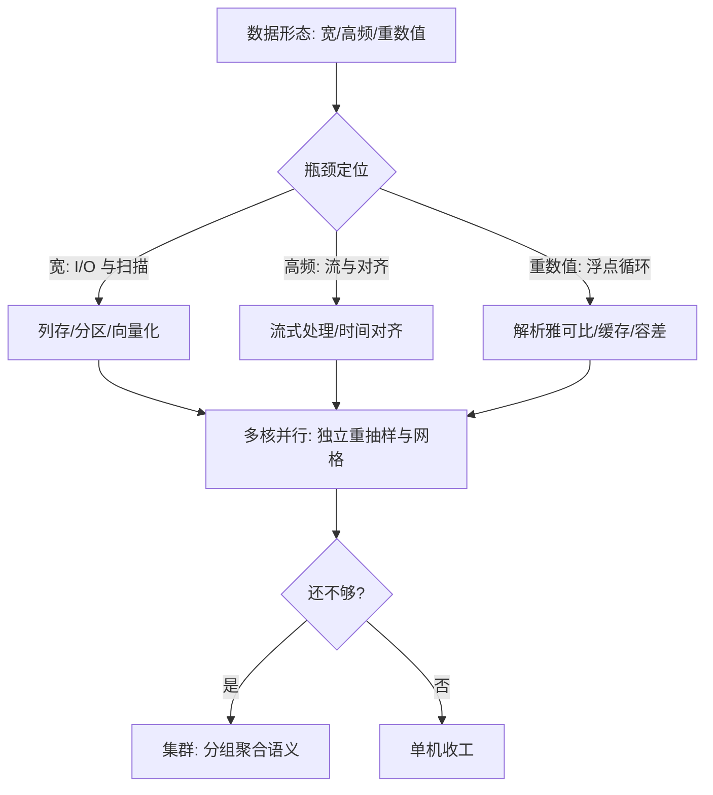
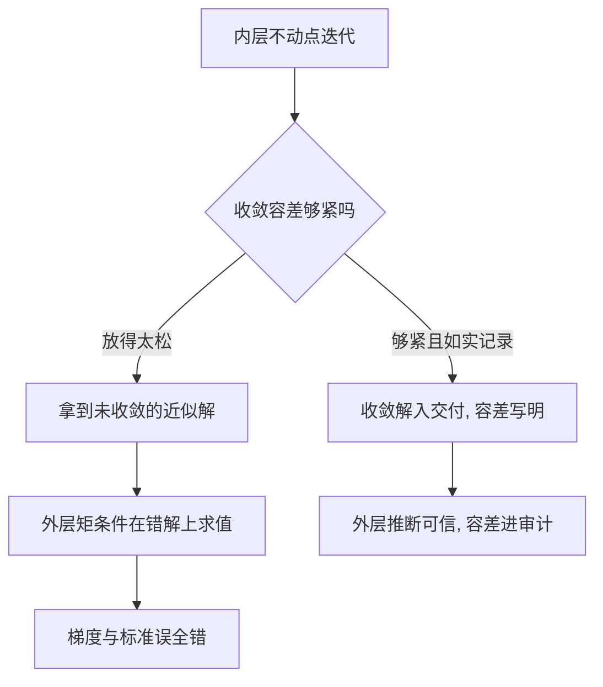

# 经济计算的规模化

数据变大之后，缺的从来不是统计理论，而是把既有估计量搬到这个规模上的工程。

<footer>—— 据 Varian, Big Data: New Tricks for Econometrics, JEP 2014 整理</footer>

[上一课](/econ/ec-reproducible-computing)把计算环境钉成可复现的闭包；这一课把闭包放到更大的数据与更重的数值上。问题不是「怎么用集群」，而是先回答两问：这份工作真的需要规模化吗？需要的话，瓶颈在哪一层？

## 问题

经济计算的「大」有三种，瓶颈各不相同。宽：行政面板千万个体乘数十年，吃内存布局与顺序 I/O——扫描与分组是常态运算，随机访问是灾难。高频：逐笔价格与逐笔成交，吃流式处理与时间对齐。重数值：结构估计的内层不动点、动态规划的值函数迭代、贝叶斯的链抽样，吃浮点循环与收敛判据，数据本身可能很小。三类混谈的代价是错配：把单机向量化就能完成的横截面回归搬上集群，工期翻倍；把内层不动点的瓶颈归咎于机器不够大，加节点毫无改善。直觉类比：三种「大」像三种活——「宽」是搬一张超长的桌子，门太窄只能拆开顺着搬（顺序扫描）；「高频」是接一根不停流的水管，得边流边处理；「重数值」是解一道要反复试的谜题，纸只有一页，难在算得深，不在纸大。

### 单机阶梯与瓶颈定位

BLP 型结构估计（[BLP 需求](/econ/se-blp-deep)）的时间几乎全花在内层：给定非线性参数，份额与价格要迭代到不动点，外层才轮到矩条件。把内层雅可比解析化、把不动点结果缓存复用，常比换更大的机器省一个数量级——这是 Berry, Levinsohn and Pakes 1995 以来人尽皆知却常被忘的账。

阶梯自下而上。向量化把循环换成矩阵运算，是第一倍数。数字实例：对一千万个数求和，写成 for 循环要解释器逐个执行千万次，向量化后整块交给底层连续内存运算，常快一到两个数量级——第一档都不爬就谈上集群，是这套阶梯最常见的浪费。列式存储与分区把「宽」变成顺序扫描。多核并行吃掉天然独立的部分——[bootstrap](/econ/bootstrap-econ) 的重抽样、参数网格的格子、模拟矩的重复抽样——这些彼此独立的活不必分布式。集群只在前三档都不够时上，语义是分组聚合与逐组估计，不是把回归「分布化」。

## 方法

实验管理随规模成为一等公民：参数扫描要有成本预算与断点续跑，每个格子的结果连同种子按[上一课](/econ/ec-reproducible-computing)的复现包归档——规模一大，丢一个格子等于丢一条结论，找不回来的那种。

## 机制

规模化改变成本结构，不改变统计逻辑。大 $N$ 压抽样方差，不碰偏差：覆盖偏与选择偏仍是[融合课](/econ/ec-bigdata-survey-fusion)的管辖，规模只是让偏的置信区间变窄——把偏得更自信。常见误区：「数据大所以结论准」。大样本只让抽样误差变小；如果样本本身漏了某一群人，多出来的数据全是同一群人的重复——偏差原样保留，你只是更自信地错着。数值层同理：收敛容差是模型风险的一部分，容差放得太松，外层矩条件在一个未收敛的解上求值，梯度与标准误全是错的；这是[值函数迭代](/econ/value-function-iteration)与[模拟矩方法](/econ/se-smm)讲过的纪律在规模化语境下的重申。Athey 2018 给这层的总结算：机器学习的可扩展性把过去因计算而不可行的问题——异质效应的搜索、政策函数的估计——变成常规作业，但识别约束一条没少。

容差这条线值得单独画清楚：内层的松紧如何一路污染外层的推断。

不这么做会错在哪：用样本量代替代表性论证；把未收敛的内层解当收敛解传给外层；在向量化都没做的代码上谈分布式。

## 边界

分布式系统的原理、数据库与调度的工程细节不在本栏，计算机栏另行处理；这里只冻结接口：经济学要的是分组聚合、逐组回归与参数网格的规模化语义。云上实验的成本控制是治理问题——预算、配额与优先级——收束课排进全景。最后一条边界最常被忘：规模化的终点是可行的识别与推断，不是吞吐量；算得快是为了多验几个设计，不是为了少想一个。

## 小结

- 经济计算的三种大——宽、高频、重数值——瓶颈不同，先定位再动手。
- 单机阶梯：向量化、列存分区、多核并行；集群只在语义真是分组聚合时上。
- 结构估计的时间在内层不动点：解析雅可比与缓存比扩容有效。
- 容差是模型风险：外层矩条件必须在收敛解上求值。
- 规模化改成本结构不改统计逻辑：大 $N$ 缩方差，不缩偏差。
- 出处：Varian, *JEP* 2014；Einav and Levin, *Science* 2014；Athey 2018；Berry, Levinsohn and Pakes, *Econometrica* 1995。
