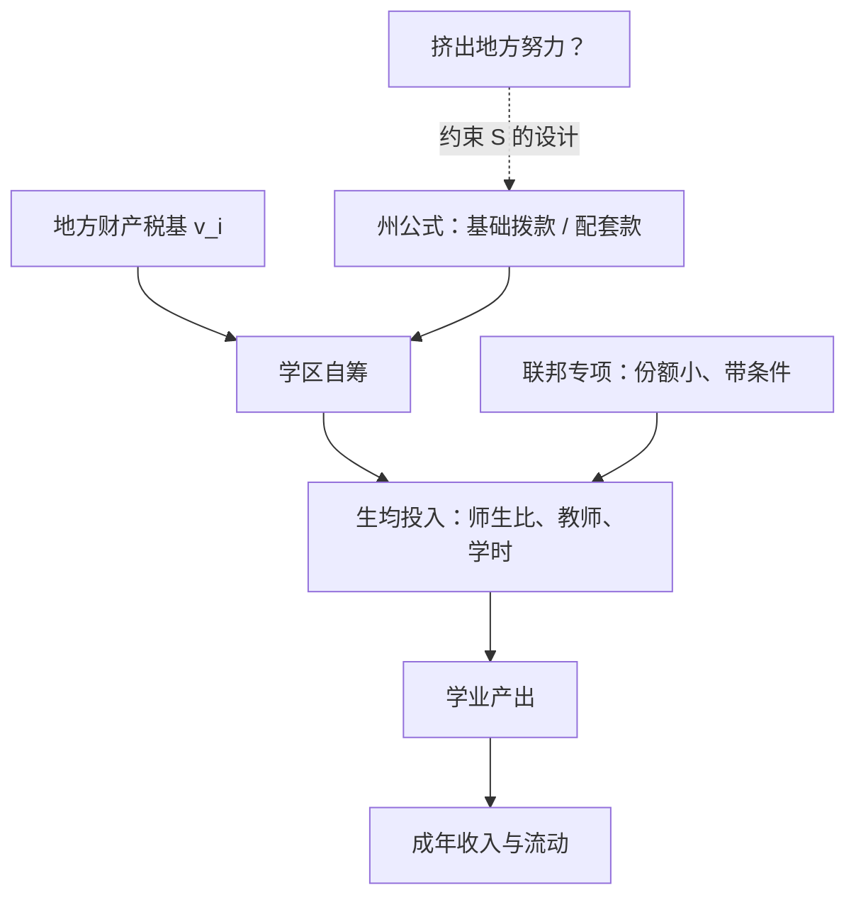

# 教育财政

学校的钱在谁手里，比钱有多少更早地决定了钱花到哪去——财政不是教育的后勤，是它的宪法。

<footer>—— 据 Card and Payne, Journal of Public Economics 2002；Jackson, Johnson and Persico, QJE 2016 整理</footer>

[上一课](/econ/ed2-skill-formation)说了钱该花在什么时候；本课说钱从哪里来、经过什么管道、落到谁头上。前几课的生产函数、教师与择校都默认预算存在；把预算本身打开，才发现它的分配规则先于一切教学决策。

## 问题

美国的地方财政以财产税供养学区，于是税基厚薄直接决定学生资源：相邻两个学区，生均支出可以差出一倍。公平诉讼由此展开——Serrano v. Priest（加州，1971）以「财产税财政违宪」的口径宣战，Rodriguez（联邦最高法院，1973）则拒绝把教育升格为联邦宪法的基本权利，战场从此转到州法院。规范之争有两杆尺：均等（equalization，拉平支出）与充足（adequacy，托底到足够让学生达标），再加一杆效率尺：中央拨款会不会挤出地方自己的努力。[公共物品与免费搭车](/econ/public-goods)的分权逻辑在这里被反过来用——教育是最重的辖区公共品，分权给了偏好匹配，也给了不平等。

## 方法

拨款的管道写进公式。基础拨款（foundation grant）的形状是

$$G_i = \max\{0,\; E^{*} - \tau v_i\},$$

即州政府按标准支出 $E^{*}$ 减去地方应尽努力 $\tau v_i$（$v_i$ 为税基）补差额：税基越薄的学区拿得越多。配套款（matching grant）按地方每花一元州里补贴固定比例——它保地方努力，代价是富学区拿得也多；一次性 lump-sum 保均等，代价是挤出。两条管道对应[税收归宿](/econ/tax-incidence)的通用教训：名义上给谁的钱，不等于最后落在谁头上的资源。而拨款的实际效果有个著名的异象——粘蝇纸效应（Hines–Thaler 1995）：公共拨款转化为支出的比例远高于同等规模的私人收入增长，钱粘在它落到的层级上，不会等比例漏进减税。

## 机制

学校财政改革是这段财政史留下的自然实验序列。Card–Payne 2002：改革确实压缩了州内学区间的支出差距，SAT 的贫富分差小幅收窄——管道在动。Jackson–Johnson–Persico 2016 用改革时机做识别，读数是本课的锚：童年十二年被生均支出提高 10% 的低收入学区学生，完成教育多约 0.3 年，成年工资高约 7%，成年贫困率低约 3 个百分点；对高收入学区，同样的钱几乎没有可测效应。机制正是第一课的边际口径：钱在被约束的学区买到了师生比、教师质量与更长学时——平均上无效的投入，在缺钱的边际上有效。

Rodriguez 的判词把教育排除出联邦宪法的基本权利，此后五十年的教育财政诉讼全部转进州宪法——「充足性」条款几乎在每个州都打过一轮，法院成了教育预算的实际设计者之一。

## 边界

Jackson–Johnson–Persico 的口径要钉住：改革年代的边际美元、低收入学区的儿童——不是「任何钱在任何地方都有用」的普适结论，Hanushek 2003 对简单加钱的批评依然成立：不带着治理结构加钱，支出照样蒸发在薪级表与楼宇里。联邦份额小（美国联邦拨款常在一成以下），体系的重心在州与地方。高等教育端另有财政问题——助学金、贷款与学费贴补的取舍是[高等教育经济学](/econ/ed2-higher-ed)的财政面，本课的辖区逻辑到高中为止。最后，公式的政治经济学没有解：税基分拣会随财政均等化重新调整居住选择，分拣与均等在均衡里互相追着改写。

## 小结

- 财产税财政让税基决定资源，Serrano 与 Rodriguez 把公平之战定在州宪法。
- 拨款公式是设计变量：基础拨款保托底，配套款保努力，lump-sum 保均等但挤出。
- 粘蝇纸效应：公共拨款比私人收入更全额地转化为支出。
- 边际读数：改革抬高低收入学区生均支出 10%，成年工资约高 7%（JJP 2016）。
- 出处：Card and Payne, JPubE 2002；Jackson, Johnson and Persico, QJE 2016；Hines and Thaler, JEP 1995；Hanushek, Economic Journal 2003。
