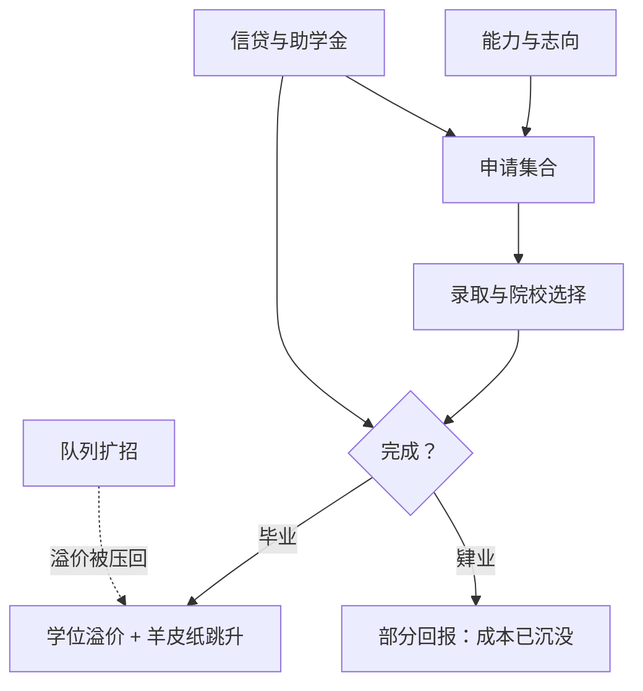

# 高等教育经济学

<div class="epigraph">
<p>读大学的账要用整个职业生涯结清，而付学费的账户在十八岁就得开——时点的错配，是高等教育一切政策的起点。</p>
<footer>—— 据 Card, Econometrica 2001；Dynarski, American Economic Review 2003 整理</footer>
</div>

[上一课](/econ/ed2-school-choice)把基础教育做成市场；高等教育本来就是市场，只是价签更贵、周期更长、贷款约束更紧。基础课已经把回报的两端备齐：[人力资本](/econ/human-capital-becker)给了投资框架，[技能溢价与 Tinbergen 竞赛](/econ/skill-premium-tinbergen)给了价格。本课把两端接成个体决策，并问三个缺口：平均溢价是不是因果回报、读不完怎么办、钱从哪来。

## 问题

投资口径下，读大学的净现值是溢价的贴现流减去两项成本：学费，以及四年里放弃的收入——后者常被忽略，却往往比学费更贵。<span class="marginnote">数字实例：四年学费 20 万，同期打工每年本可挣 6 万，放弃的收入就是 24 万——机会成本比学费还贵；读大学的「总价」接近 44 万，溢价的贴现流要盖过这个数才划算。</span>溢价本身是均衡价格：$w_S/w_U$ 由相对供给与技能偏向的需求共同决定，扩招会把它压回去，所以「溢价高所以都该读」在加总上不成立。三个缺口由此展开。其一，选择：不读大学的人本来工资轨迹就不同，平均溢价混着能力与志向。其二，完成：学位是期权，读不完退不回成本，完成率才是投资的成败线。其三，流动性：收益挂在二十二岁以后，学费压在十八岁——家庭没有抵押物可借，信贷约束把「值得读」变成「读得起」。<span class="marginnote">术语翻译：信贷约束就是「想借也借不到」——十八岁的学生没有抵押物，市场不愿把钱借给一个四年后才开始回报的计划；于是「值得读」被改写成「读得起」，政策杠杆也因此挂在现金流（助学金）上而不是远期收入上。</span>

## 方法

因果回报的口径在[教育中的因果问题](/econ/ca-education-causal)已经立好：义务教育工具的估计不低于 OLS（Card 2001 的综述），说明被约束的边际学生回报不低于平均——约束长在信贷与信息，不长在能力。但个体决策还要多看两块。选择性溢价：Dale–Krueger 2002 把「申请了哪些学校」当控制集，更精英的母校几乎不再抬高收入——名校溢价里至少有一部分是能力与志向的标签，不是教学的产品。<span class="marginnote">常见误区：「上名校所以收入高」。能考进名校的人本来就带着能力与志向；条件于「申请了哪些学校」，名校标签的收入加成基本消失。把筛选误当生产，是教育回报讨论里最常见的混淆。</span>跳跃的文凭：文凭年（毕业年）的收入跳升即羊皮纸效应（Jaeger–Page 1996 的证据），提示[教育作为信号](/econ/signaling-spence-labor)的成分在高等教育不可忽略——完成与肄业在市场眼里是两种商品。价格弹性：Dynarski 2003 的项目证据显示，上千美元的助学金变动能把入学概率挪动好几个百分点——对约束中的家庭，教育需求的收入弹性远高于经济学直觉。



## 机制

完成率是被低估的边际：同样是补助，花在「让已入学的人读到毕业」与花在「让边缘的人进门」是两个不同的政策，前者的回报经常更高——肄业者拿走了大部分成本，却拿不到羊皮纸。

两份同样的补助花在哪个边际，回报路径并不对称。

```mermaid
flowchart TD
  S["同一笔补助"] --> A{"花在哪个边际"}
  A -->|"让边缘的人进门"| E1["入学率上升"]
  E1 --> E2["若读不完: 成本已付, 羊皮纸没拿到"]
  A -->|"让在读的人读到毕业"| C1["完成率上升"]
  C1 --> C2["文凭跳升落地, 回报兑现"]
  E2 --> V["完成边际的回报经常更高"]
  C2 --> V
```专业与院校构成同样内生于价格：高溢价领域吸纳入学分流，这是竞赛在高教内部的重演。信贷约束的机制是流动性而非终身收入：约束家庭的孩子不是「一辈子挣不回学费」，而是「十八岁拿不出学费」——所以助学金弹性大、而远期补贴弹性小，政策的杠杆挂在现金流上。信号成分则给出社会口径的告诫：如果教育的部分回报是排序，那么全社会一起多读一年书，溢价按竞赛逻辑重新定价，个体回报高估社会回报。

<span class="marginnote">Dale–Krueger 2002 的 matched-applicant 口径：条件于申请集合，母校选择性的收入溢价消失；只在弱势与少数族裔子样本里残余正效应——名校可能是那部分学生获得信息与网络的通道。</span>

## 边界

平均溢价是个时点的均衡价格，不能当个人决策的充分统计：它随队列扩招变动，也随技术偏向变动。回报分布右偏而分散，均值掩盖了艺术类、营利部门的大量低回报尾部。Dale–Krueger 的口径控制的是申请行为，控制不掉「被录取后怎么选」，真正的因果关系仍在追赶。最后，本课把四年制本科当标准品；两年制、证书与再培训市场的经济学更接近下一课的终身技能框架——高等教育只是技能形成的一生里最显眼的一段。

## 小结

- 投资口径：溢价的贴现流，减学费与放弃的收入；溢价是会被扩招压回的均衡价格。
- 边际学生回报不低于平均（Card 2001），约束在信贷与信息，不在能力。
- 羊皮纸效应提示信号成分：完成与肄业在市场眼里是两种商品，完成率是政策杠杆。
- Dale–Krueger：条件于申请集合，选择性溢价基本消失；助学金对约束家庭的弹性大。
- 出处：Card, Econometrica 2001；Dale and Krueger, QJE 2002；Jaeger and Page, REStat 1996；Dynarski, AER 2003。
