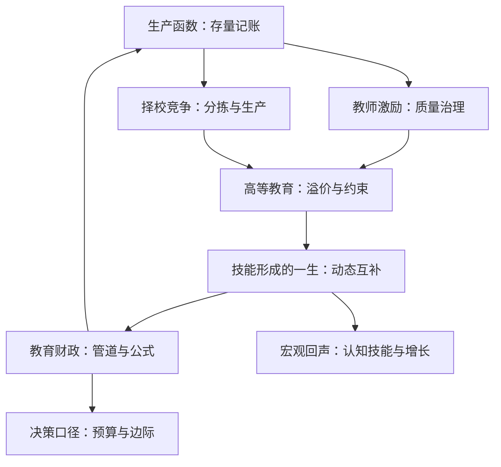
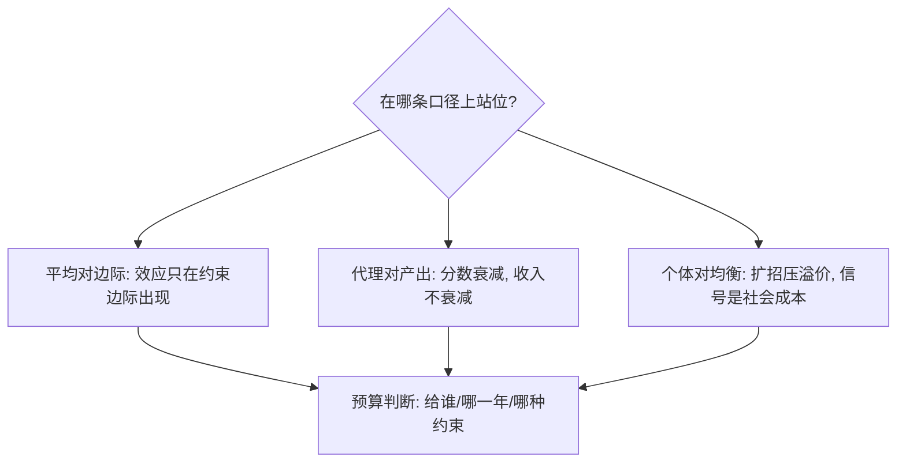

# 教育经济学收束

教育经济学教给决策者的第一课是：别用平均数做预算——平均投入近乎无效，边际的孩子才值得花钱。

<footer>—— 据 Hanushek, Economic Journal 2003；Chetty, Friedman and Rockoff, QJE 2014 整理</footer>

[上一课](/econ/ed2-education-finance)把钱接进了预算与公式，本课程到此收束。剩下的事是把七课的骨架重走一遍，抽出反复出现的三条口径，并交代这门手艺在更大地图上的去向。

## 问题

课程从[教育生产函数的深化](/econ/ed2-production-deep)起笔：存量记账的增值函数、分数与收入两本产出账、以及「平均投入无效、边际投入有效」的分布读数。随后两条治理线接手——[教师激励](/econ/ed2-teacher-incentives)问课堂里的质量从哪来（尾部筛选、绩效工资、执行出勤），[学校选择与竞争](/econ/ed2-school-choice)问学校间的市场会不会变好（分拣吞掉竞争，投入组合救回特许校）。需求侧是[高等教育经济学](/econ/ed2-higher-ed)：溢价、完成率与信贷约束构成十八岁的决策。[技能形成的一生](/econ/ed2-skill-formation)把时间轴拉直：自生产与动态互补让早期投入成为乘数。[教育财政](/econ/ed2-education-finance)最后把管道接上：公式决定钱落在哪一层、哪一个孩子身上。

## 方法

三条口径贯穿全部七课，收束在这里钉死。第一，平均与边际：输入端平均效应近零（Hanushek 元统计、智利全民券），但在被约束的边际上效应可观——STAR 的小班、改革年代的财政美元、缺勤的相机。直觉类比：「平均投入无效」像给全班每人都发一副更贵的眼镜——多数人视力正常，钱撒在了不需要的人身上；「边际有效」是把眼镜递给真正近视的那几个。钱有没有用，取决于它落在分布的哪一段。预算问题从来是「给谁、在哪一年、哪种约束下」的问题，不是「钱有没有用」的问题。第二，代理与产出：分数会衰减，收入不衰减；教师增值预测成年结果（Chetty–Friedman–Rockoff 2014），佩里的 IQ 红利消失而收入红利留存（Heckman 等 2010）。拿分数当终点评估教育，等于用会衰减的坐标去度量不衰减的向量。第三，个体与均衡：个体回报高估社会回报——溢价会被队列扩招压回，择校会把不平等重新排版，羊皮纸里藏着社会不必支付的信号成本。常见误区：把「读大学的人挣得多」直接加总成「社会应补贴更多人读大学」。个体回报里含排序的信号成分——全社会一起多读一年，名次没变，溢价被重新定价；个体账本与社会账本不能混抄。每做一次政策推断，先问自己在哪一条口径上站位。

## 机制

这套口径为什么能迁出教育现场。向宏观走：各国认知技能的差异对应长期增长率的系统性差异，Hanushek–Woessmann 2015 的折算约是 1 个标准差的成绩差对应 2 个百分点的长期增长差——数字实例：1 个标准差的成绩差大约相当于泰国与日本之间的平均分差距；换成增长是每年 2 个百分点，四十年复利累积下来，经济总量能差出一倍以上——微观分数之所以「贵」到宏观，靠的就是这种复利。微观的生产函数加总成了[内生增长：人力资本与 R&D](/econ/endogenous-growth)里的人力资本引擎。向方法走：本课程的全部证据都挂在准实验的纪律上，评估的终点是预算选择而非系数本身，这正是[以决策为目标](/econ/pe-decision-target)的口径；识别工具的更新（新的行政数据、机器学习的异质效应）改变的是边际的分辨率，不是三条口径的任何一条。教育的特殊之处在于它同时是投资品、信号与公共品——三条口径就是为了让你在这三重身份之间不再混淆记账。

评估一个教育主张时，三问就是把主张按口径分拣的分叉图。

## 边界

收束不掩盖开放问题：增值模型的长期稳定性、绩效激励的规模化衰减、技能形成技术在不同人群的外推、财政公式与居住分拣的均衡互动，都还在被证据追赶。最常犯的误读是把第一课读成「学校无用」：Coleman 报告与 Hanushek 元统计否定的只是可观测投入的平均效应，不是学校——尾部筛选与边际财政都是有效的用钱方式，「无用」与「平均无效」之间隔着整个分布。本课程到此收束：往后遇到任何教育政策的提案，先问三句——边际在谁身上、产出记在哪本账、均衡会不会把个体回报改写。

## 小结

- 三条口径：平均对边际、代理对产出、个体对均衡；每条都有七课内部的证据闭环。
- 生产函数按存量记账，教师与择校是治理，高教与技能形成是需求与时间轴，财政是管道。
- 宏观回声：1 个标准差认知技能差对应约 2 个百分点的长期增长率差（Hanushek–Woessmann 2015）。
- 教育的三重身份——投资、信号、公共品——记账不可混。
- 出处：Hanushek, Economic Journal 2003；Chetty, Friedman and Rockoff, QJE 2014；Heckman 等, JPubE 2010；Hanushek and Woessmann, The Knowledge Capital of Nations, 2015。
