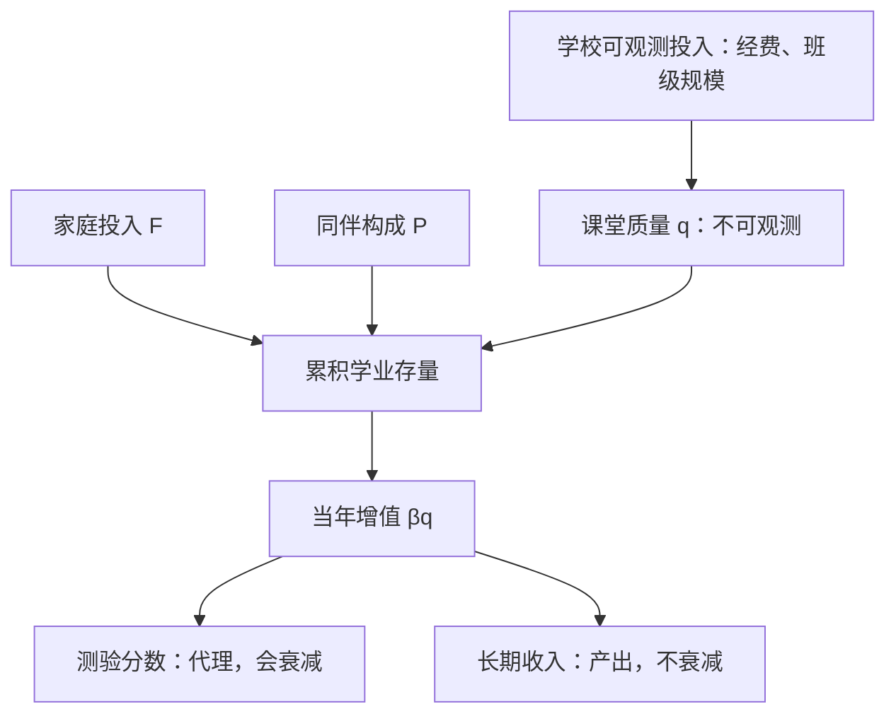
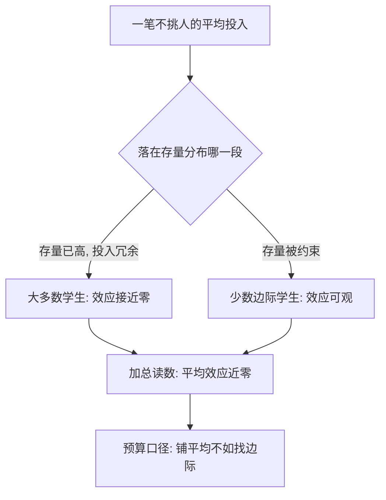

# 教育生产函数的深化

生产函数写下可以购买的投入，产出却大部分不来自它们——教育的账本上，最值钱的一栏填不进价格。

<footer>—— 据 Coleman, Equality of Educational Opportunity, 1966；Hanushek, Economic Journal 2003 整理</footer>

[上一课](/econ/env-map)把环境经济学收成一张地图：全部工具是「楔在哪、楔多深、谁付钱」的三元组，可信度靠规则化维持，共有边界是临界点、无世界政府与跨代贴现。主干课的[人力资本](/econ/human-capital-becker)把教育与培训写成可积累的资本：投资前密后疏，租期效应压出凹形的年龄–收入剖面——但那条剖面把学校当黑箱，同一年书，在不同的教室里买到的并不是同一种资本。本课是「教育经济学」的第一课，任务是打开黑箱：学校这份按年计的资本由哪些投入生产、产出该怎么记账、钱花在哪里边际上真的有效。后课的教师激励、学校选择、高等教育与技能形成，都默认已经读完本课。

## 问题

把教育写成生产函数：$Y = f(F, S, P)$，产出 $Y$ 是学业成绩，投入是家庭 $F$、学校 $S$ 与同伴 $P$。Coleman 1966 年的报告给出了第一版令人不安的读数：家庭与同伴的解释力远大于学校的可观测投入——图书馆、生均经费、实验室在方程里几乎站不住。麻烦不在「学校无用」这个标题，而在三个更深的技术缺口：产出只记分数不记长期结果；投入是流量而学习是存量，静态回归把两者搅在一起；投入还有质量维度——同样一笔经费，买到的人和物可以完全不同。[教育中的因果问题](/econ/ca-education-causal)已经把识别问题交给了准实验，本课补的是另一半：函数本身该怎么写，写错了会把政策引向哪里。

## 方法

动态口径从存量记账开始：把上一期的成绩当作本期生产的投入之一，

$$A_{it} = \alpha A_{i,t-1} + \beta q_{it} + \gamma F_i + \varepsilon_{it},$$

其中 $q_{it}$ 是当年课堂质量的投入，$\alpha$ 度量知识的留存。数字实例：设 $\alpha=0.8$——今年学的东西明年留存八成。去年存量 100、今年课堂贡献 20，今年存量就是 $0.8\times100+20=100$；若 $\alpha=0.5$，同样投入只到 70。留存率不同，同样花钱攒出的复利完全不同。这个「增值」设定（Todd–Wolpin 2003 的口径）把家庭与早期教育的积累折叠进 $A_{i,t-1}$，于是 $\beta$ 读的是当年学校这一段的边际贡献，而不是累计教育水平的总效应——两者在政策上完全是两个问题。术语翻译：「增值」就是不比水平比进步——不看期末考了多少分，看这一年从开学到学期末长进了多少。起点差异（家庭、学前教育）被折进「上一期成绩」里，剩下的才是学校这一段自己挣出来的部分。产出端同样要记账：分数是代理变量，收入才是产出；代理会衰减而效应不一定衰减，这是后面每一课都要用到的口径。

## 机制

为什么「买投入买不来质量」？Rivkin–Hanushek–Kain 2005 用德州全州面板给出了分解：教师之间的产出差大得足以重排一所学校的均值，但教龄、学历、证书这些可观测特征几乎解释不了这个差——薪级表定价的那几栏，恰好不是产出所在的那栏。直觉类比：像评估厨师却只看工龄和证书——厨房里真正的差距在火候与调味，而这两样不写在简历上。薪级表按简历定价，产出却按火候结算，错位由此而来。Hanushek 对数百项研究的元统计长期指向同一结论：师生比等资源投入的估计里，显著为正的比例停留在四分之一上下，与随机没差多少。这不是「投入都无效」，而是**平均口径**的无效：钱不挑人地铺下去，大部分落在本就有效的存量上。少数确凿的例外都在边际上——[教育中的因果问题](/econ/ca-education-causal)里的 Project STAR 把班级规模砍到 13–17 人，早期分数抬高约 0.15–0.25 个标准差；而小班的分数红利几年内消退、成年收入红利却不消退（Chetty 等 2011），说明衰减的是代理，不是效应。

平均口径为什么读出零、边际口径却读得出效果，取决于钱落在分布哪一段。

Hanushek 2003 的元统计：数百项研究中，资源类投入（师生比、生均经费、教师学历）显著为正的比例长期在四分之一上下，显著为负的也有约一成——「投入平均无效」是有完整分布支撑的结论，不是一句口号。

## 边界

第一，增值模型不是无懈可击的识别：学生与教师非随机匹配，$\beta$ 里混着分拣，干净的读数要靠随机分班的子样本来校准——本课只钉函数形式，识别口径见因果问题那课。第二，「平均无效」不构成「钱无用」的证明：生产函数说的是平均投入的零效应，下一课会看到被约束的边际（教师的进入与退出）上，钱依然有效。第三，本课的函数是削减式近似，不含治理与激励结构——学校不是一台接受投入就吐出成绩的机器，怎么让教师想教好、让学校想变好，是接下来两课的事。

## 小结

- 教育生产函数要按存量记账：$A_{it} = \alpha A_{i,t-1} + \beta q_{it} + \gamma F_i + \varepsilon_{it}$，$\beta$ 是当年课堂投入的边际效应。
- 产出有两本账：分数是会衰减的代理，收入才是产出；两者可以背离。
- 教师效应大而不可观测特征解释不了它——薪级表定价的维度不是产出的维度。
- 资源投入平均效应近零（Hanushek 元统计），边际投入可以很大（STAR）。
- 出处：Coleman 1966；Todd and Wolpin, JEL 2003；Rivkin, Hanushek and Kain, Econometrica 2005；Hanushek, Economic Journal 2003；Chetty 等, QJE 2011。
