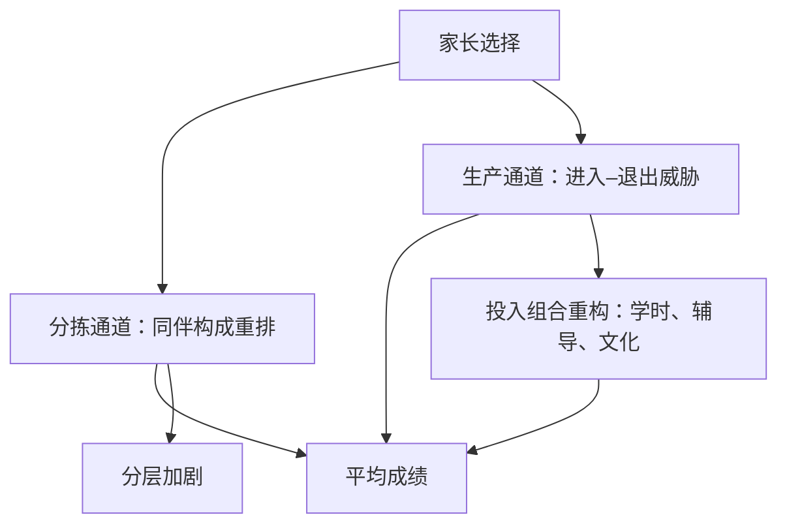

# 学校选择与竞争

择校的赌注不在家长会不会挑学校，而在学校面对失去学生时会不会变好——前者是分拣，后者才是竞争。

<footer>—— 据 Tiebout, Journal of Political Economy 1956；Hsieh and Urquiola, Journal of Development Economics 2006 整理</footer>

[上一课](/econ/ed2-teacher-incentives)把课堂质量的治理对准教师个体；本课把镜头拉到学校之间——家长能不能用脚投票，学校会不会因为丢学生而变好。先划清与既有课的分界：[学校选择](/econ/school-choice)讲座位怎么分（机制设计：DA、TTC 与策略性填报），本课讲竞争怎么生产（市场结构：代金券、特许学校与辖区分拣）；分配机制在那里已经讲完，本课只把它当作择校的运输层。

## 问题

竞争假说是一条简单的链：家长选校，好学校扩张、差学校退出，平均质量上行。链上有两个可能断开的环节。生产侧：学校是非营利组织，退出威胁弱，管理者未必有提高生产率的动机——竞争的纪律要先穿过治理才到课堂。分拣侧：择校先重排学生，再谈改变教学；同伴构成的变化会伪装成质量变化，被记在竞争的账上。用脚投票的原型是 Tiebout 1956：居民按公共品偏好分层入住辖区，教育的居住分拣是它最重的应用——学区房价就是这笔分拣的资本化。本课的问题是：把分拣剥干净之后，竞争本身还剩多少生产率效应。

## 方法

三类证据，识别强度依次排列。其一，学区内随机抽签：波士顿特许学校按超额报名抽签录取，[以决策为目标](/econ/pe-decision-target)口径下的读数是 Abdulkadiroğlu 等 2011 的 QJE 结果——「No Excuses」特许校把中学生的成绩每年抬高约 0.2 个标准差，数学效应更大。其二，全国性代金券：智利 1981 年发全民券，私立学校凭券获得公共经费——供给反应大，但识别混着分拣。其三，辖区竞争：Hoxby 2000 用地貌切割（辖区边界越碎、居民越容易用搬家投票）作为竞争强度的工具变量，得到正效应；Rothstein 2007 指出该工具违反排除约束——边界形态与人口构成相关，估计随之坍塌。

智利全民券的自然实验给出最冷静的一课：私立入学份额翻了近一倍，全国平均成绩却没有上行，分层反而加剧——择校动员了选择，未必动员了生产（Hsieh–Urquiola 2006）。

## 机制

把三条证据放回两环节的框架，读法就清楚了。智利的零效应主要断在分拣：私立扩张吸走的是本来就占优的学生，留下的公立学校同伴变差，平均上互相抵消——竞争的账本被同伴效应记账法吞掉。波士顿的大效应则主要来自生产侧的投入组合：超长学时、高强度辅导、高期望文化，这些都是上一课意义上「买得到的投入」里最贵的质量——特许校赢在把教师激励与投入组合重新配置，不在「竞争」这个抽象名词本身。Hoxby–Rothstein 之争是工具变量的纪律课：地貌不是弱工具，而是失效工具；竞争强度内生地长在人口构成上。合并的结论是：竞争有效应，但效应有条件——供给端要真的能进入和退出，指标要挂在长期产出上，否则择校只是把不平等换了一种排版。

## 边界

抽签证据的口径是局部：只对会申请特许校的家庭有效，外推到全体学生要过[外部有效性](/econ/pe-external-validity)的断点。供给有约束：好学校扩张受教师市场与场地限制，试点效应搬进全城会稀释。信息也不平等：低收入家庭排序所依赖的信息更少，选择权利的名义平等兑换不成实际平等。最后，分层有独立的规范代价——效率上得分的设计，公平上未必站得住，这是决策课口径下必须分开计价的两栏。

## 小结

- 竞争假说有两个环节：生产侧的进入退出纪律、分拣侧的同伴重排，效应要分开记账。
- 波士顿特许抽签：每年约 0.2 个标准差，赢在投入组合，不在抽象的竞争。
- 智利全民券：入学结构大变、平均成绩不动——分拣可以吞掉竞争。
- Hoxby 的地貌工具被 Rothstein 推翻：竞争强度内生，工具要过排除约束。
- 出处：Tiebout, JPE 1956；Hoxby, AER 2000 与 Rothstein, AER 2007；Hsieh and Urquiola, JDE 2006；Abdulkadiroğlu 等, QJE 2011。
