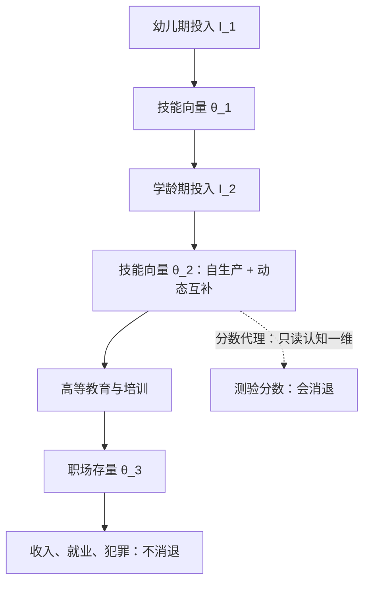
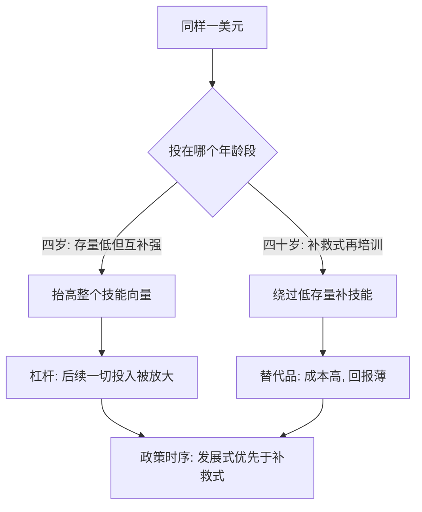

# 技能形成的一生

技能形成的经济学是时序的经济学：同样一美元，砸在四岁与砸在四十岁，买到的不是同一种技能。

<footer>—— 据 Cunha and Heckman, QJE 2007；Heckman 等, Journal of Public Economics 2010 整理</footer>

[上一课](/econ/ed2-higher-ed)把十八岁那笔投资算清；本课把时间轴拉长——技能不是十八岁一次成型的存货，而是从幼儿期一路滚动的存量。[人力资本](/econ/human-capital-becker)的租期效应早就预言投资该趁早，可经验证据凑成了三个互相打架的读数，需要一个能同时容纳它们的记忆模型。

## 问题

三个事实拼在一张桌上。其一，租期效应：同样的技能，二十五岁学有四十年收租，投资应前密后疏。其二，分数消退：早期干预抬高的测验分数，几年内衰减殆尽——Project STAR 的小班红利在高中前基本消失（[教育中的因果问题](/econ/ca-education-causal)）。其三，成年不消退：同样的干预，成年后的收入、就业与犯罪却留下了稳定差异，佩里学前班是范本。静态生产函数无法同时读这三条：分数是产出，它消退了，效应怎么可能还在？

## 方法

Cunha–Heckman 2007 的技术是本课的记忆装置：

$$\theta_{t+1} = f_t(\theta_t, I_t), \qquad \frac{\partial f_t}{\partial \theta_t} \gt 0, \qquad \frac{\partial^2 f_t}{\partial \theta_t \, \partial I_t} \gt 0.$$

技能向量 $\theta$（认知 $\theta^C$ 与非认知 $\theta^N$ 两维互相喂养）带着自生产性质：今天的存量本身就是明天的投入。术语翻译：「自生产」就是技能自己滚雪球——今天学的成为明天学习的原料：词汇多的人读得快，读得快又认识更多词。「动态互补」则说雪球越大粘得越多：存量高时，同样的练习产出更高。动态互补：存量越高，同样投入的边际产出越大。加上测量口径的关键修正——测验分数只读认知一维，而干预挪动的是整个向量，向量被生产函数存住，到成年才在收入里兑现。

## 机制

动态互补一次解掉全部三个谜。分数消退而收入不消退：消退的是认知一维的代理，被存住的是非认知维度与向量间的喂养——佩里项目里，处理组与对照的 IQ 差几年内消失，四十岁时的收入与就业差却显著，Heckman 等 2010 把它折成年回报率约 7%–10%，主要渠道正是软技能（计划、坚持、协作）压低了犯罪与提升了劳动市场表现。数字实例：年回报率 7%–10%，一美元按复利滚四十年约变成 15–45 美元——不低于股市长期年化回报，而这个项目「赚」的主要不是分数，是少犯罪、多就业省下与挣出的钱。趁早的机制不是「幼儿学得快」，而是互补：早期技能降低后期一切学习的边际成本，skill begets skill——同样的钱在后面是补救，在前面是杠杆。政策含义因此倒转常见直觉：成人再培训的高成本低回报不是执行失败，而是生产函数的性质；补救式投入买的是替代品，发展式投入买的是乘数。常见误区：「早期教育就是提前学知识」。模型里早期投入买的是整个向量——含计划、坚持、协作这些非认知技能；IQ 差几年就追平，四十年后拉开差距的是这些「软」维度。把学前班办成知识抢跑，恰好买错了维度。

佩里学前班的特别之处在于它不是靠分数赢的：随机分组的 IQ 优势在小学阶段就不再显著，收益在四十年后的税表与犯罪记录里——这是「分数是代理、向量才是产出」最完整的一份档案。

同一美元投在年龄轴的两端，走的是两条完全不同的回报路径。

## 边界

「越早越好」是准实验证据的汇总形态，不是物理常数：复制研究在不同人群里大小不一，规模化会稀释佩里式小样本项目的高强度。动态模型的识别依赖强假设——测量方程、遗漏的父母投入、非认知技能的粗糙度量都在留有余地。干预的窗口也不是唯一：青春期是另一个敏感期，证据还在追加。最后，从个体技能到[代际流动与人力资本](/econ/intergenerational-mobility)只有一步——父母投资孩子，本课的技术函数就是那道代际传送带的机械图。

## 小结

- 技术函数 $\theta_{t+1} = f_t(\theta_t, I_t)$ 的两条性质：自生产与动态互补，是全课的发动机。
- 分数消退、收入不消退：代理只读认知一维，被存住的是技能向量与非认知维度。
- 佩里项目年回报率约 7%–10%，渠道是软技能压犯罪、提就业，不是 IQ。
- skill begets skill：早期投入是乘数，后期补救是替代品——政策时序由此定。
- 出处：Cunha and Heckman, QJE 2007；Heckman 等, Journal of Public Economics 2010；Chetty 等, QJE 2011。
