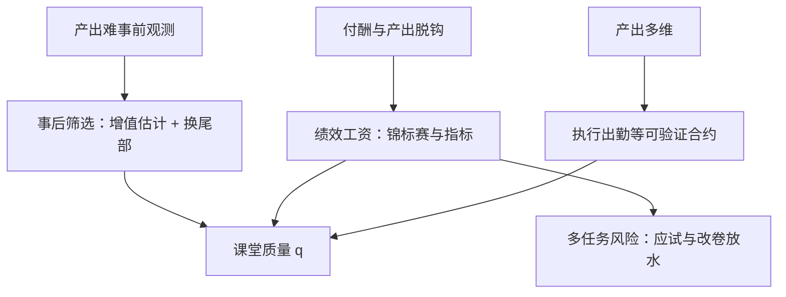

# 教师激励

<div class="epigraph">
<p>工资单按年资和学分定价，产出却按课堂里的增值记账——两张价目表之间的差，就是教师激励的全部空间。</p>
<footer>—— 据 Lavy, AER 2009；Chetty, Friedman and Rockoff, QJE 2014 整理</footer>
</div>

[上一课](/econ/ed2-production-deep)把课堂质量 $q$ 定位成生产函数里真正起作用的投入，也留下了缺口：$q$ 挂在教师身上，而学校的花名册只记人头、薪级表只认年资。本课把治理问题接过来：给定教师产出的高度异质与难以事前观测，怎么选人、怎么付钱、怎么留人。这是[道德风险与隐藏行动](/econ/moral-hazard)在教育现场的具体化。

## 问题

教师劳动市场有三重摩擦叠在一起。第一，产出难以事前观测：增值要等学生数据出来才能估，样本小、噪声大。第二，付酬与产出脱钩：单一薪级表按年资与学分加薪，而上题说过，这些可观测特征几乎解释不了增值——付钱所在的维度不是产出所在的维度。第三，产出多维：分数可测，好奇心、协作、坚持不可测。三重摩擦合起来是双向选择问题：产出高的教师拿不到溢价，会流向付溢价的行业；留下来的构成被薪级表逆向筛选。这不是「教师不敬业」的故事，而是合约结构的故事。

## 方法

治理的杠杆有三条。其一，事后筛选：估出每位教师的增值，把分布尾部的低效教师换掉。Hanushek 2011 的推算是：把最末 5%–8% 的教师换成平均教师，美国学生的国际排名能挪到接近头部国家——不新增一分预算，只动分布的尾部。这依赖增值的预测力：Chetty–Friedman–Rockoff 2014 用随机分班的子样本证明，测验口径的教师增值能预测学生成年后的大学入学与收入；按他们的折算，把末位 5% 的教师换成平均教师，一个班级一生收入的现值增加约 25 万美元。<span class="marginnote">数字实例：25 万美元摊到一个班约 25 名学生头上，是每人约 1 万美元的一生收入现值增量——来自一次不加预算的人事替换；账好算，难在解雇与工会那条政治线。</span>其二，事前与事中激励：绩效工资。Lavy 2009 在以色列用锦标赛式奖金——排名达标才拿钱——成绩显著上行，同时改卷伦理出现松动的迹象。<span class="marginnote">术语翻译：锦标赛式奖金就是「按名次发钱，不按绝对水平」——只有排名进入达标线（如前一半）的教师拿奖金。好处是免去设定绝对标准的麻烦（大家都进步时标准会失灵）；坏处是同事从合作者变成了对手。</span>其三，执行最简单的合约：让出勤先被观测。Duflo–Hanna–Ryan 2012 在印度给教室装相机、把工资与出勤挂钩，缺勤率减半，学生成绩随之上升。



<span class="marginnote">教师缺勤是低成本的第一刀：Chaudhury 等 2006 的多国调查显示，发展中国家教师缺勤率普遍落在 10%–25% 区间。缺勤先于质量——人不在教室，增值从何谈起。</span>

## 机制

绩效激励的核心难题是多任务：Holmström–Milgrom 1991 的框架说，当一部分任务可测、一部分不可测时，对可测任务付高强度激励，会把努力从不可测任务上系统性抽走——对分数的激励压低对广义技能的供给，这就是 Lavy 结果里改卷松动的那一面。<span class="marginnote">常见误区：把多任务问题读成「发奖金没用」。它说的是指标挂错位置时，激励在改写努力的方向而不是数量——Lavy 的成绩上行与改卷松动是同一枚硬币的两面；口径挂对（增值、长期结果），激励仍有空间。</span>于是激励设计变成了口径设计：指标要尽量挂在长期结果上（增值而非绝对分数），强度要给职业留出不可测任务的空间。

努力被可测指标抽走的方向，可以画成两条任务线的分岔。

```mermaid
flowchart TD
  T["教师的两类任务"] --> A["可测: 应试分数"]
  T --> B["不可测: 好奇心/协作/坚持"]
  I["对分数付高强度奖金"] --> S["努力从不可测侧流向可测侧"]
  S --> R1["分数上行"]
  S --> R2["广义技能供给被压低"]
  R1 --> D["激励设计 = 口径设计: 挂长期结果, 留不可测空间"]
  R2 --> D
```替代高能激励的是职业关注：[职业关注](/econ/career-concerns)的机制在产出噪声大、任期长的学校里依然运转——好业绩换来的是声誉与调任，市场替 principal 部分执行了激励。而尾部筛选的政治成本极高：解雇与裁撤会立即遭遇工会与家长的两面阻力，所以多数体系的实际均衡是「低付酬、低筛选、低进入质量」三件套，单独拉高其中任何一件都不成立。

## 边界

增值的估计有分拣问题：学生与教师非随机匹配，只有随机分班的子样本给出干净读数，行政上的增值分数仍是近似。绩效工资的实验多数短期、小样本，规模化后效应衰减。尾部筛选的推算还隐含一个强假设：换掉的岗位能被不低于平均的教师填补——教师供给有弹性约束，这正是劳动市场的问题，不是统计的问题。最后，本课假定学校想提高质量；若学校本身没有竞争压力，教师激励的传导会再断一截——这是下一课的事。

## 小结

- 三重摩擦：产出难测、付酬脱钩、产出多维；后果是逆向筛选而不是敬业问题。
- 三条杠杆：尾部筛选（Hanushek 2011）、绩效工资（Lavy 2009）、执行出勤（Duflo–Hanna–Ryan 2012）。
- 增值有预测力（Chetty–Friedman–Rockoff 2014），但干净的读数只来自随机分班的子样本。
- 多任务问题限制激励强度：对分数的激励会抽走广义技能的努力。
- 出处：Rivkin, Hanushek and Kain, Econometrica 2005；Lavy, AER 2009；Chetty, Friedman and Rockoff, QJE 2014；Hanushek, Economics of Education Review 2011；Duflo, Hanna and Ryan, AER 2012。
