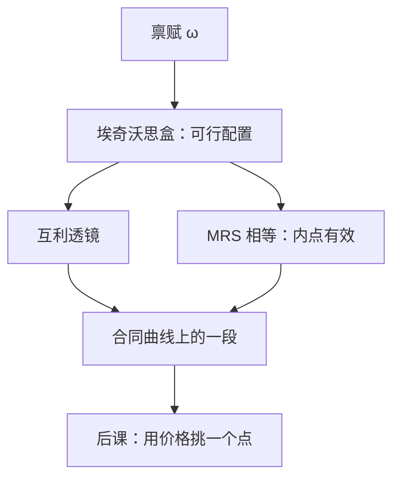

# 埃奇沃思盒与帕累托

契约曲线上的每一点，都是双方都不再愿意离开的交易；离开它，至少有一人会受损。

<footer>—— 据 Edgeworth, Mathematical Psychics, 1881；Pareto, Manuale di economia politica, 1906 整理</footer>

[上一课](/econ/hotelling)仍停在局部市场：两家厂商、一条线性城市、价格与位置。本课换坐标系。固定两种商品的总量，问两个消费者之间哪些配置还可能被双方同时改进。一般均衡课从这里起笔；后课的瓦尔拉斯价格、福利定理都默认你会盒与合同曲线，不再从「什么是交易」讲起。

## 问题

霍特林给出的是一条街上的价格，不是整份资源在人与人之间怎么分。[偏好](/econ/preference-choice)和[马歇尔需求](/econ/marshallian-demand)已经能谈一个人面对价格时选什么，但还没有第二个人，也没有「总量守恒」。缺口因此不是再写一条厂商反应函数，而是：给定禀赋 $\omega=(\omega^1,\omega^2)$ 与两人偏好，哪些配置 $(x^1,x^2)$ 是可行的，其中哪些已经无法帕累托改进。

两人、两商品的可行集可以画成矩形：横轴是商品 1 的总量 $\omega_1=\omega_1^1+\omega_1^2$，纵轴是商品 2 的总量。左下角读消费者 $A$ 的消费，右上角读 $B$ 的消费，一点同时给出两个人的束。这就是埃奇沃思盒。盒里每一点都可行；盒外意味着有人消费了不存在的商品。帕累托改进是：至少一人严格更好、无人更差。帕累托有效（Pareto efficient）配置是盒中再也找不到这种改进的点。

### 有效不是公平，合同曲线不是唯一交易

日常把「有效」读成「公平」或「大家一样多」。帕累托只禁止浪费：若能在不伤害 $B$ 的前提下让 $A$ 更好，现状就不是有效。它不比较人际效用，也不要求均分禀赋。有效配置通常是一条曲线（合同曲线），不是一个点。从初始禀赋出发，双方互利的交易落在透镜形的互利区内，最终停在合同曲线与透镜的交集上——停在哪一点，取决于讨价还价，本课不引入拍卖人。

配置 $(x^A,x^B)$ 可行当且仅当 $x^A+x^B=\omega$（免费处置时可写成不等式）。$A$ 的无差异曲线从左下往右上， $B$ 的从右上往左下。相切处 MRS 相等，那是内点有效的一阶条件；角点有效可以不相切。

## 方法

把交换经济写成：消费者 $i=A,B$，消费集 $\mathbb{R}_+^2$，理性偏好 $\succsim^i$，禀赋 $\omega^i$。配置 $x=(x^A,x^B)$ 可行若 $x^A+x^B=\omega$。称 $x$ 帕累托优于 $y$，若 $x^i\succsim^i y^i$ 对两人成立且至少一人严格。有效配置的集合是帕累托集；合同曲线是盒中帕累托集的几何名字。

内点有效的可微刻画：两人边际替代率相等，

$$
\mathrm{MRS}_{12}^A(x^A)=\mathrm{MRS}_{12}^B(x^B).
$$

否则，存在一个边际上双方都接受的交换方向。这只是切条件，不是价格。价格是后课用来实现某一切点的工具。生产可以后补：把盒的边长改成生产可能集给出的总量，埃奇沃思–鲍利盒仍然读配置，不读厂商最优。本课不引入利润、要素市场，也不把配置写成限价簿上的成交——簿是量化栏的对象。

## 机制

为什么切点有效：若 $\mathrm{MRS}^A>\mathrm{MRS}^B$，则 $A$ 比 $B$ 更愿意用商品 2 换商品 1。从 $B$ 拿走一点商品 1、补给商品 2，可以让两人同时不差、至少一人更好。相切则这个方向消失。无差异曲线若凸，切点是切，不是交；非凸时可能相切仍能被附近的平均配置改进，那是后课第二福利定理要凸性的伏笔。

禀赋点本身不必有效。两人带着各自的 $\omega^i$ 走进盒子，若无差异曲线在禀赋处相交而不相切，就存在互利交易。交易不创造商品，只重新分配；帕累托改进来自匹配不同的边际评价，不是来自「生产得更多」。这是纯交换的全部内容。

合同曲线上每一点都有效，但从给定禀赋能到达的，只是透镜与合同曲线的交集。盒的四个角附近，一人几乎拿走全部，仍可以有效——有效不禁止极端不平等。要把某一点从帕累托集里挑出来，需要额外的选择规则：竞争价格、核、或社会福利函数。本课只把集合钉住。

## 边界

两人两商品是教具。 $n$ 人 $L$ 种商品的帕累托有效仍定义为「不存在可行的帕累托改进」，几何不再是矩形。连续统、无限商品、不确定性下的或有要求权，都还是同一句话，后课再加结构。

帕累托不处理嫉妒、嫉妒无妒忌（fairness）或罗尔斯准则；那些是另外的规范。也不要把合同曲线读成「市场会走到这里」：没有价格、没有博弈，只有可行性与改进。霍特林的均衡价格是局部市场的解，本课的有效配置是一般均衡的靶子，两者不要混成一张供给需求图。

后课默认：谈到「有效配置」时，指的是这个帕累托集。瓦尔拉斯均衡要在这个集合里找一个能被预算支撑的点。

## 小结

- 一般均衡从可行配置起笔，不是从局部价格起笔。
- 埃奇沃思盒把两人两商品的可行性画成矩形；合同曲线是帕累托集。
- 内点有效当且仅当 MRS 相等；有效不是公平，集合通常不是单点。
- 价格、核、存在性都是后课的缺口；本课不写限价簿。
- 出处：Edgeworth, *Mathematical Psychics*；Pareto, *Manuale di economia politica*。
