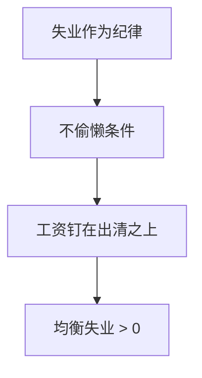

# 效率工资

工资可以高于出清水平，因为厂商买的是努力而不是工时；失业本身是不偷懒的纪律。

<footer>—— Shapiro and Stiglitz, Equilibrium Unemployment as a Worker Discipline Device, AER 1984</footer>

[上一课](/econ/search-matching-dmp)用匹配函数与空缺成本给出摩擦失业：人对岗需要时间。本课的缺口是另一条微观：即使配对瞬时、没有 $v$，只要努力不可完全观测，厂商也会把工资钉在出清之上，用失业来惩罚偷懒。Shapiro–Stiglitz 把这句话写成不偷懒条件。托宾 $q$ 下一课换对象：资本侧为何投资不能跳。

## 问题

DMP 的 $u^*$ 来自相遇技术。监督成本给出另一来源：若被抓到偷懒只是被换成下一个相同工资的工作，威胁为空。需要有**等在外面的人**，失去工作才有代价。缺口不是再画贝弗里奇，而是：工资作为激励，如何阻止劳动市场出清。Solow 早有「效率工资」的直觉（工资进生产率）；Shapiro–Stiglitz（1984）给出可计算的纪律均衡。

非自愿：愿意在现行工资工作的人找不到岗。出清会把工资压到使偷懒划算，于是厂商不肯降。这与「保留工资太高」的自愿故事不同。

## 方法

工人每期选择努力或偷懒；偷懒有被抓概率。不偷懒条件：工资至少高到使努力的现值不低于偷懒。失业池越大、再就业越难，同样工资越能约束——于是均衡必须留下足够大的 $u$。厂商一阶条件把工资接到边际产出，但劳动需求在效率工资处截断，不能沿供给曲线降到出清。

匹配与效率工资可以叠：DMP 提供再就业概率，纪律提供工资下限。本课先单独钉 Shapiro–Stiglitz，以免把 $\theta$ 与监督概率焊成一个参数。

### 不是最低工资故事

法定下限是政策。效率工资是厂商自己的最优：降薪会掉努力，单位有效劳动更贵。经验上二者都可抬 $u$，识别必须声明。本课不估计监督技术。

### 降薪为何不是厂商的第一反应

出清直觉是：失业存在则 $w$ 应降。效率工资说降薪提高偷懒或离职，单位有效劳动成本上升，厂商拒绝。

这与名义工资粘性不同：即使合同可以重签，激励约束仍禁止降到出清。后课名义粘性是另一层不能跳。

补贴工资可能破坏纪律；补贴岗位在匹配模型里更直接。两套微观不要共用同一政策按钮。

## 机制

高工资买来低离职、高努力；失业提高失去工作的成本，使给定工资更有效，于是厂商不必把工资加到无限。生产率上升时，若监督技术不变，效率工资与就业可以一起动，但出清仍被禁止。这与自然率兼容：长期仍有正的 $u^*$，只是微观换成纪律而不是匹配。

增长核算里的 $L$ 仍是在这条 $u^*$ 上使用的劳动。把效率工资当成「因此永远有需求缺口」，会把激励约束误读成 IS。周期里若解雇威胁变弱（失业下降），纪律松，厂商可能更依赖工资——定量是后课，本课只保留通道。

与 DMP 的分工：匹配给出相遇技术，效率工资给出努力技术。没有空缺成本也可以有 $u^*$；没有监督问题也可以有 $u^*$。政策若只补贴岗位创造，在纯 Shapiro–Stiglitz 里可能降低失业的纪律价值，工资与努力一起动，净效应不定。本课禁止把「降低 $u$」当成无成本的福利改进，除非已经声明努力如何维持。

礼物交换、公平工资、离职成本是效率工资的堂兄弟。主干用 Shapiro–Stiglitz 的可监督偷懒，是因为均衡失业最干净，不是否认其他激励。

## 边界

本课不把效率工资写成人事管理手册，也不接到限价簿。下一课投资的 $q$ 是资本价格，不是劳动纪律。开放经济的工资套利与 CIP 无关。发展核算里低 $A$ 可以含监督差，但不等于本课已经识别跨国 TFP。

失业金提高失业的价值，不偷懒条件要求更高的工资或更高的 $u$——与 DMP 里失业金抬保留工资同向，微观不同。本课不把福利国家写成效率工资的实证。监督技术随管理改善时，$u^*$ 可以下降，那是供给，不是需求缺口收窄。

后课默认：均衡失业可以来自匹配，也可以来自激励工资；二者都阻止瓦尔拉斯出清。下一课：资本积累若也有摩擦，投资由什么价格引导。

## 小结

- DMP 用相遇解释 $u^*$；本课用不可观测的努力。
- Shapiro–Stiglitz：失业是不偷懒的纪律，工资不能降到出清。
- 非自愿失业与自愿的保留工资不是同一句。
- 与匹配可并存，不要互相取消。
- 出处：Shapiro and Stiglitz, *AER* 1984；Solow 效率工资直觉为先声。
