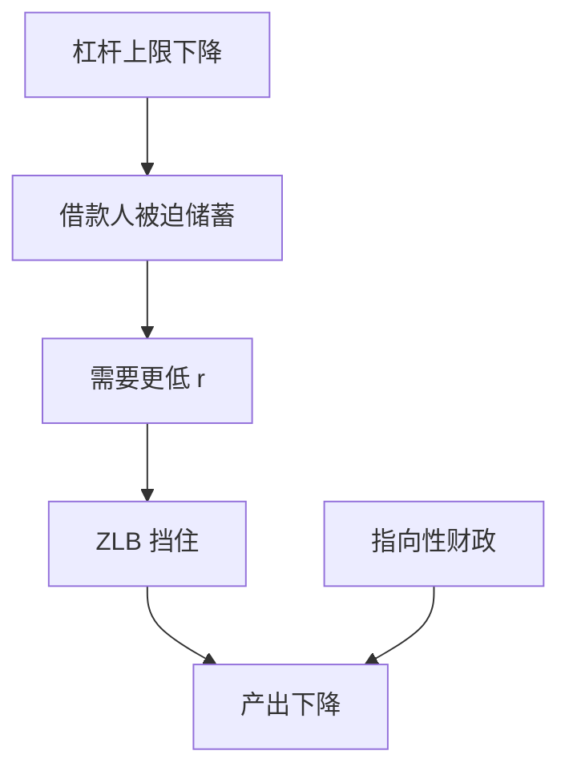

# Eggertsson–Krugman 去杠杆

借款人突然被要求降杠杆时，自然利率可以变成很大的负数；若名义利率下不去，就出现需求不足的流动性陷阱。

<footer>—— Eggertsson and Krugman, Debt, Deleveraging, and the Liquidity Trap, QJE 2012</footer>

[上一课](/econ/debt-deflation)给出名义负担与再分配。本课缺口是**现代解析装置**：两类人、外生的杠杆上限突然收紧、ZLB。不重写 Fisher 原文，不把非常规资产负债表写完。

## 问题

Mian–Sufi 的去杠杆是经验。EK：不耐心借款人受债务上限，储蓄人消费由欧拉。上限突然下降，借款人必须储蓄，加总要储蓄人减少储蓄（更低实际利率）。ZLB 挡住，产出缺口承担调整。财政乘数在陷阱里变大，因为没有利率挤出，且可能有通缩螺旋。缺口是把债务通缩与 ZLB 主干焊成可算的 NK 故事，而不是再列邮编事实。

Eggertsson and Krugman, *QJE* 2012。Guerrieri and Lorenzoni, *QJE* 2017 的异质信贷紧缩。Eggertsson–Woodford 的 ZLB 指引是货币侧姐妹。

## 方法

两期或无限期 NK，借款人约束 $b\le\bar b$，$\bar b$ 下降为实验。比较灵活价格（实际利率可充分降）与粘性价格加 ZLB。政策：政府支出、转移给借款人（HANK 财政课的指向）、通胀目标提高以降实际利率。与 GK：EK 可以没有银行，$\bar b$ 外生；把 $\bar b$ 内生接到银行净值，就是组合。

与诊断性：上限收紧若被过冲预期放大，更猛。与新闻：未来收紧的新闻今天就去杠杆。

## 机制

机制是加总储蓄意愿相对投资（或储蓄人消费）意愿的突然上升。Wicksellian 自然利率变成很大负数。NK 的缺口：名义利率不能跟。债务通缩：产出下降带来的通缩再提高实际负担，上限更紧。这把 Fisher 与 ZLB 合成一条环。

代表性 RANK 在 ZLB 也有大乘数；EK 额外说**谁去杠杆**决定要多大的负自然利率。转移给借款人比给储蓄人有效——回到财政 HANK。

Krugman 1998 的日本流动性陷阱是思想前身。本课用 2012 的债务版本。

## 边界

本课不估计美国自然利率。不把所有 ZLB 年份只归因于家庭去杠杆（也可有投资、外国储蓄）。宏观审慎的事前 $\bar b$ 管理下一课。主权去杠杆另有违约选项，后课。

后课默认：突然收紧的债务上限可把自然利率打到负区，ZLB 下财政与通胀目标的效力上升。下一课：事前限制杠杆的宏观审慎。

## 小结

- EK：去杠杆 ⇒ 负的自然利率 ⇒ ZLB 下的需求陷阱。
- 指向借款人的财政更对症。
- 可与银行净值、债务通缩叠加。
- 出处：Eggertsson and Krugman, *QJE* 2012。
