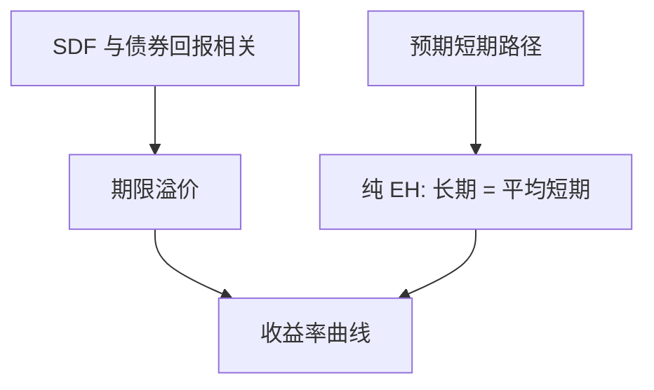

# 期限结构预期假说

长期利率是预期未来短期利率的平均；远期利率是对未来即期的市场预期。

<footer>—— 据 Fisher；Hicks, Value and Capital, 1939；对照 Cox, Ingersoll and Ross, Journal of Finance 1981 整理</footer>

[上一课](/econ/apt-as-equilibrium)（APT 作为均衡）。[CAPM 作为均衡陈述](/econ/capm-theory)。单期截面已经把风险收成对市场的 beta；本课缺口是**到期结构**：同一无违约发行人、不同期限的债券，其收益率如何被短期利率路径约束。不估计市场 beta，不把期限溢价做成第二个股票因子。金融栏主干在下一课接到限价簿之前，定价理论停在这条假说上。

## 问题

SDF 给任意支付定价，但没有单独说出「两年利率与两个一年利率」的关系。若投资者风险中性、或债券风险溢价为零，则锁定两年与「一年后再滚一年」必须无超额：长期即期利率是预期短期利率的平均，远期利率等于预期未来即期。这就是纯预期假说（EH）。

Hicks（1939）立刻加了一块流动性偏好：长期债券价格波动更大，风险厌恶者要求期限溢价，远期可以系统高于预期即期。缺口是先把无溢价版本写成无套利会计，再标明溢价从哪一类 $m$ 来。没有这条会计，收益率曲线只是一排数字。

即期 $y_n$：n 期零息的到期收益率。远期 $f_{t,t+n}$：由相邻即期锁出的、从 $t$ 到 $t+n$ 的远期利率。纯 EH：$\mathrm{E}_t[y_{1,t+n}]=f$ 的相应项。弱 EH：差额是常数期限溢价。

## 方法

一期末、无违约、可交易的折现债券价格是 $P_n=\mathrm{E}[m^{(n)}]$，其中 $m^{(n)}$ 是 $n$ 期定价核。纯 EH 相当于：用短期利率滚存的策略与直接持有长期债，期望回报相等——即 $m$ 与债券回报不相关，或投资者不要求补偿利率风险。对数线性化后常见写法是

$$
y_{nt} = \frac{1}{n}\sum_{k=0}^{n-1}\mathrm{E}_t[y_{1,t+k}] + \text{（若有）期限溢价}.
$$

Cox、Ingersoll 与 Ross（1981）警告：若干「传统」EH 在连续时间里互不等价——有的用到期收益率，有的用持有期回报，有的用远期；与 Jensen 不等式搅在一起时，不能当成同一句话。本课采用最瘦的会计版本：远期是未来即期的风险中性期望；物理期望还要乘期限风险调整。

这与 CAPM 的关系是特例套特例。若利率风险可被市场组合完全捕捉，期限溢价是债券对市场的 beta 乘市场溢价。单因子利率模型里，$m$ 由短期利率状态张成，溢价可以只随久期变。本课不选模型，只禁止把「向上倾斜的曲线」直接读成「市场预期加息」——倾斜里可能全是溢价。

## 机制

机制是滚动策略与锁定策略的替代。若明年的一年利率被预期升高，今年锁两年就必须提供与「一年后更高的再投资」相匹配的收益，否则资金涌向更便宜的那一侧，即期被抬平。风险厌恶打断替代：长期债在 $m$ 高的状态下往往价格低（紧缩、通缩，视模型而定），于是要求正溢价，远期高过预期即期。Hicks 的流动性溢价是这种协方差的早期语言，不是对交易量的描述。

[有效市场](/econ/emh)在这里的含义是：远期对预期即期的偏差若可预测，必须被记成风险调整，而不能当成免费的利率投机。可预测本身不否证有效，只否证「溢价为零」的那一版 EH。

### 纯 EH、常数溢价与时变溢价

纯 EH：一期持有长债的期望超额相对短利率为零，长收益率是期望短利率的平均。常数期限溢价只在平均上加一个不随时间变的 $\ell^{(n)}$，远期仍能预测短利率的变动方向。时变溢价离开这两句，回到一般 $0=E[m R^{e}]$：衰退里 $m$ 高、长债价格也高时，溢价可以为负。货币政策把短端当工具时，EH 是传导桥：长端应随对未来短端的预期移动。桥在溢价时变时会晃——本课标明断点，不估计溢价序列。

对数与算术、零息与附息、持有期回报与到期回报，会移动检验式。Cox, Ingersoll and Ross（1981）指出若干「等价」写法在 Jensen 不等式下并不等价。陈述假说时必须声明层级。

## 边界

不要在本栏做 Fama–Bliss 回归或宣布「EH 被拒绝」——那是债券实证，对象换成持有期超额与远期–即期利差。本课只把假说钉成均衡会计，并标明 CIR 1981 的版本陷阱。也不要把预期假说写成央行「控制长端」：政策盯的是短端，长端是预期加溢价；非常规政策对期限溢价的操作属于[零下限](/econ/zlb-unconventional)，不是 EH 本身。

下一课是金融栏收束：[到限价簿](/econ/to-limit-order-book)。曲线上的 $y_n$ 仍是理论价格；交易所里的成交是簿事件。

倒挂可以是对未来短利率下降的预期（EH 内），也可以是期限溢价骤降（EH 外）。不要用「倒挂预示衰退」代替假说。偏好栖息地（Modigliani–Sutch）说客户群盯住特定到期，替代不完全，平均关系可以扭曲——仍是均衡层面的话，不是盘口。

纯 EH 要求债券超额与 $m$ 正交。常数溢价只加一个不随 $t$ 变的项。时变溢价离开假说，不自动否定价核语言。

政策盯短端。长端是预期加溢价。非常规政策扭溢价，属于 ZLB 课，不是 EH 本身。

曲线上的 $y_n$ 仍是理论价格。成交是下一课交出的簿事件。

## 小结

- 纯 EH：长期利率是预期短期的平均，远期是预期即期。
- 期限溢价来自 $m$ 与债券回报的协方差，不是「长期更不流动」的同义反复。
- 若干传统写法在 Jensen 不等式下不等价（CIR 1981）。
- 出处：Hicks, *Value and Capital*；Cox, Ingersoll and Ross, *Journal of Finance* 1981。
