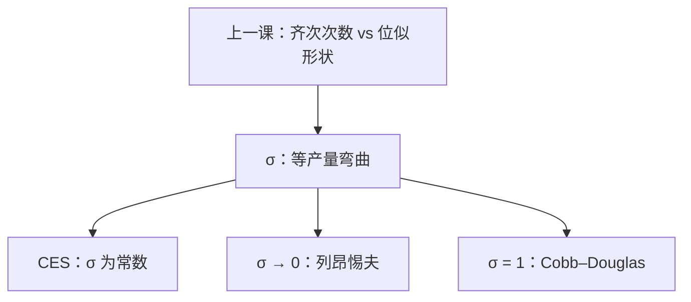

# 替代弹性

替代弹性度量等产量的弯曲：要素比例对技术替代率变动有多敏感；规模一次齐次管的是射线，弯曲是另一刀。

<footer>—— 据 Hicks, The Theory of Wages, 1932；Varian, Microeconomic Analysis 整理</footer>

[上一课](/econ/homothetic-production)（齐次生产与欧拉定理）。钉了齐次次数与欧拉分尽，并写明：位似管等产量自相似，替代弹性可以单独规定。本课不重写 $k$ 次齐次，也不把 CRS 再当锥讲一遍。[技术课](/econ/production-technology)只把 $\sigma$ 说成「弯曲」。缺口是把弯曲写成导数：$\sigma$ 是什么，CES 怎样把它钉成常数，后课成本最小化怎样把它读成要素比例对价格比的反应。

## 问题

两要素、光滑等产量。技术替代率 $\mathrm{TRS}_{jk}=\mathrm{MP}_j/\mathrm{MP}_k$ 已在技术课定义。沿同一等产量 $f(z)=q$ 移动，投入比 $z_j/z_k$ 随 TRS 变。Hicks 的替代弹性是这个对数导数：

$$
\sigma_{jk}=\frac{\mathrm{d}\ln(z_j/z_k)}{\mathrm{d}\ln\mathrm{TRS}_{jk}}\Big|_{f=q}.
$$

$\sigma=0$：比例钉死，等产量成直角。[下一课](/econ/leontief-technology)专写这个极点。$\sigma\to\infty$：直线等产量，完全替代。Cobb–Douglas 的 $\sigma=1$。缺口不是再画一次等产量，而是：**规模与弯曲正交之后，$\sigma$ 必须能从 $f$ 算出来，并且与后课的 $w$ 反应是同一数字。**

位似保证 TRS 沿射线不变，因此 $\sigma$ 可以只是「形状」的参数，不随 $q$ 改。非位似时同一弯曲在不同产量上可以变，$\sigma$ 要标在哪一条等产量上。

### $\sigma$ 还没有价格

定义写在 $(z,\mathrm{TRS})$ 上，不出现 $w$。成本最小化之后，切条件把 TRS 钉成 $w_j/w_k$，于是同一 $\sigma$ 等于 $\mathrm{d}\ln(z_j/z_k)/\mathrm{d}\ln(w_k/w_j)$。本课先承认几何定义；不要把条件需求提前解完。

CES：$f(z)=\bigl(\sum_i a_i z_i^{\rho}\bigr)^{1/\rho}$，$\sigma=1/(1-\rho)$。$\rho\to 0$ 回到 Cobb–Douglas；$\rho\to-\infty$ 是列昂惕夫。一次齐次可以与任意 $\sigma$ 搭配——上一课的正交在这里变成可调参数。

## 方法

先沿等产量参数化：保持 $q$，用 TRS 当自变量，对 $\ln(z_j/z_k)$ 求导。两要素时这就是 Hicks 的 $\sigma$。多于两要素，Allen–Uzawa 用成本函数的二阶导数定义偏替代弹性——那要等到 $c(w,q)$ 进场，本课只钉两要素教具。

CES 是把 $\sigma$ 设成常数的函数族。估计或校准生产时，先选 $\sigma$，再选规模弹性 $k$。不要用「劳动份额稳定」直接当 $\sigma=1$ 的证明：份额稳定还要位似加竞争付酬。

本课仍不把 $w$ 当选择。几何 $\sigma$ 先立住；价格反应是同一数字的对偶面，成本课才用。

## 机制

为什么弯曲叫「替代」：TRS 是沿等产量用 $j$ 换 $k$ 的技术比率。等产量越弯，同一 TRS 变动只能撬动很小的比例调整——要素彼此更难替换。直线等产量上，TRS 一超过价格比（后课），厂商跳到只用一种要素；$\sigma=\infty$ 就是这种刀刃。

与欧拉分尽的分工：一次齐次回答「按边际付酬能否分尽 $q$」；$\sigma$ 回答「要素相对变贵时，沿等产量能换多少」。Cobb–Douglas 两者同时漂亮（$\sigma=1$ 且常取 $k=1$），不代表二者是一件事。

Hicks 1932 的 $\sigma$ 为两要素。Allen 1938、Uzawa 1962 把它接到成本函数。Varian 的教具先写等产量定义，再在成本最小化后改写成价格弹性——本课停在前一半。

## 边界

不可微、折拐等产量上 $\sigma$ 不是函数，要用超微分区间。多于两要素，两两 Hicks $\sigma$ 不能任意指定，Allen–Uzawa 矩阵还有负半定约束。资本体现的技术进步会改有效投入比，看起来像 $\sigma$ 在变，其实是 $f$ 在移。

也不要把 $\sigma$ 写成宏观「资本–劳动替代」的时间序列结论：那是后课加数据。本课只给生产集语言里的定义。

后课默认：两要素 $\sigma$ 是等产量上投入比对 TRS 的弹性；CES 把它钉成常数；$\sigma=0$ 下一课单独处理。

## 小结

- $\sigma$ 是沿等产量的 $\mathrm{d}\ln(z_j/z_k)/\mathrm{d}\ln\mathrm{TRS}$，度量弯曲，不是规模。
- 位似让形状与 $q$ 脱钩；CES 把 $\sigma$ 做成参数。
- 成本最小化之后，同一 $\sigma$ 读成要素比对价格比的弹性。
- 下一课取 $\sigma=0$，等产量变成直角。
- 出处：Hicks, *The Theory of Wages*, 1932；Varian, *Microeconomic Analysis*。
