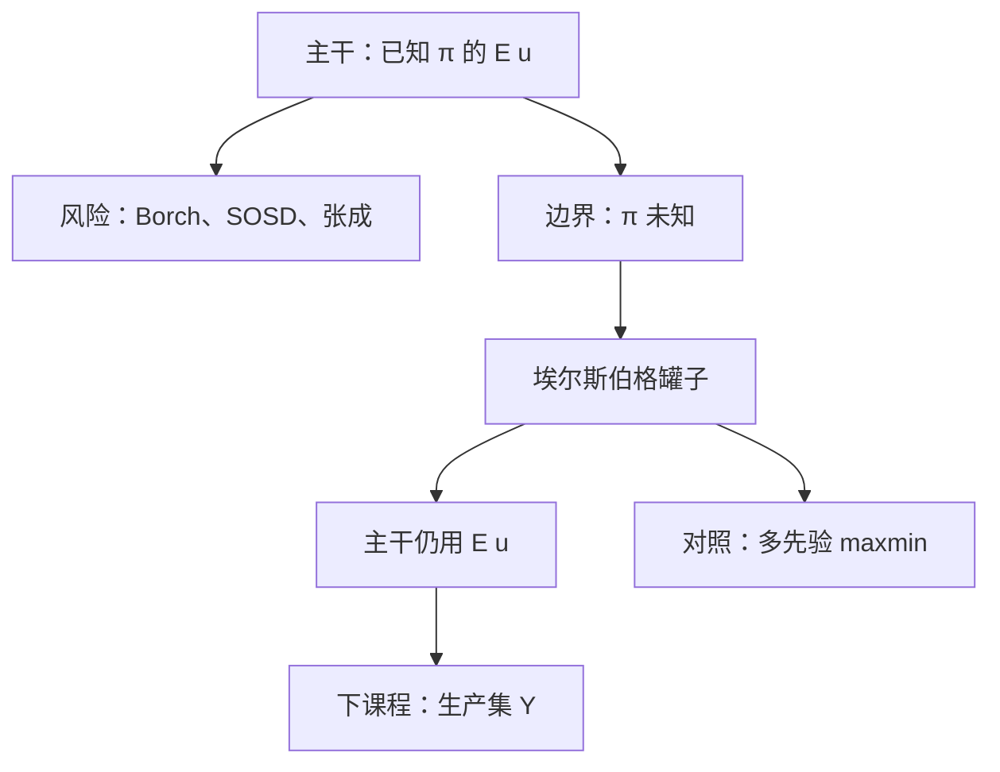

# 埃尔斯伯格与模糊

    
已知五成红球与「红球比例不告诉你」，不是同一张彩票——未知的不是风险，是概率本身。

    <footer>—— 据 Ellsberg, Risk, Ambiguity, and the Savage Axioms, Quarterly Journal of Economics, 1961 整理</footer>

[上一课](/econ/state-prices)（状态价格）。在客观 $\pi$ 与完全市场上写出 Borch 分担。本课不重写边际效用比，也不把张成再证一遍。缺口是：前面整段不确定课序都把概率当作已知数字。埃尔斯伯格的罐子表明，人会回避**未知的权重**。必须把这条边界钉死，同时声明：本栏主干仍用期望效用，后课保险、占优、或有要求权不改写成模糊模型。

## 问题

两只罐子。第一只：100 球，50 红 50 黑，概率客观。第二只：100 球，红黑比例不宣布。人通常愿意对第一只赌颜色，却不愿对第二只赌同一颜色——哪怕第二只「总有一种颜色至少一半」。这与 vNM 的客观彩票不同，也与 Savage 的主观概率不同：若存在主观 $p$，对红和对黑的选择应在两只罐子间一致，实验里不一致。

缺口因此不是再估计一条 $r_A$，而是区分：**风险**是已知 $\pi$ 上的分布，**模糊**是 $\pi$ 本身未给出。上一课的 Borch、SOSD、Arrow 证券全部吃 $\pi$。$\pi$ 一撤，那些公式没有定义，不是「风险更大」。本课只钉这一区别。

### 模糊厌恶不是更凹

把第二只罐子「当成」某条更散的分布，再用 MPS 去解释回避，是偷换对象：实验里没有给出那条 $F$。凹性在已知概率内部说话；埃尔斯伯格打在概率是否存在。阿莱打的是已知概率上的独立性；两悖论不要焊成一个「人非理性」故事。

对照一句：Gilboa and Schmeidler（1989）用一族先验上的最大最小期望效用表示模糊厌恶。本栏不把它升为新主干，只标明：若放弃单一 $\pi$，表示会改成对最坏先验取 $\min$。

## 方法

工作策略与[阿莱](/econ/allais-independence)对称：问卷当边界对照，市场理论默认客观或已估的 $\pi$。检验埃尔斯伯格只需两对赌注，不必估 $u$。若坚持单一主观概率，只能说受试者「没有一致信念」。若放弃，下一条常用弱化是多先验的 maxmin，或光滑模糊。本课不展开这些表示。

不确定课序在此结束。下一课程换对象：生产集没有概率，也没有罐子。不要把技术写成模糊的 $Y$。

本课不把模糊引进状态价格。后课一般均衡默认 $\pi$ 给定。也不把「不确定性」在奈特意义上写成新的商品。

## 机制

已知比例的罐子给出客观混合，独立性与线性权重适用。未知比例时，决策者面对的是一集可能的 $\pi$，而不是 $\Delta(X)$ 里的一个点。回避第二只罐子，等于不愿对这集里的最坏元素下注。这与风险厌恶可以共存：同一人可以对第一只罐子凹、对第二只罐子再额外要求「确定的权重」。

对后课的含义是收口。规范层：保险与最优分担继续按 $\mathbb{E}u$ 写，因为合同与证券的支付仍按可描述的状态与（估出的）概率记账。描述层：实验室对未知权重的回避，不能拿来拒绝 Borch，就像阿莱不能拿来把 $r_A$ 改成「喜欢风险」。本栏宏观与公司金融走规范层。

Ellsberg 1961 针对的是 Savage 公理，尤其是主观概率的存在，不是前景理论。引用不要把罐子写成 Kahneman–Tversky 的附录，也不要写成阿莱四张表的续篇。

## 边界

市场数据很少直接复制两只罐子。故主干保留期望效用，不是无视实验，而是对象不同：后课的或有要求权、随机折现因子都在已给出的 $\pi$ 或已估信念上工作。若某后课改用 maxmin 或鲁棒控制，必须显式声明。

也不要把模糊写成限价簿上的「不确定谁会报价」。微观结构的未知是成交机制，不是先验集。生产课序即将开始，那里的不确定性若出现，先写成状态依存的 $Y_s$，仍默认 $\pi$，不默认埃尔斯伯格。

主观概率一旦从数据里估出来，本课的罐子缺口就关了：估出的 $\pi$ 重新进入 $\mathbb{E}u$，Borch 与张成照用。本课打击的是「尚未给出权重」这一段，不是打击所有贝叶斯更新。

后课默认：工作表示仍是单一 $\pi$ 上的 $\mathbb{E}u$；未知概率是已标明的边界，不自动改写分担与占优。

## 小结

- 未知概率不是更大的风险；Borch 与 SOSD 都吃已知 $\pi$。
- 埃尔斯伯格打击主观概率的存在，不是打击凹性。
- 主干仍用期望效用；Gilboa–Schmeidler 只作一句对照。
- 不确定课序到此；下一课打开生产集。
- 出处：Ellsberg, *QJE*, 1961；Gilboa and Schmeidler, *Journal of Mathematical Economics*, 1989。
