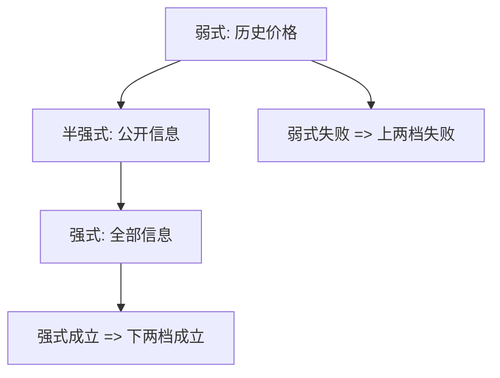

# EMH 三档

弱式、半强式、强式不是市场全知的程度计，而是信息集一层套一层：历史价格含于公开信息，公开信息含于全部信息。

<footer>—— Fama, Efficient Capital Markets: A Review of Theory and Empirical Work, Journal of Finance 1970</footer>

定位：[上一课](/econ/emh)。有效已经写成相对某个 $\mathcal{F}$：基于该集的交易无经济利润，并且检验必联合一个均衡模型。本课缺口是把 Fama 1970 的三档钉成**嵌套的信息集**，标明每一档禁止哪一类策略。不重做联合假说的哲学，不把异象表当分层。

## 问题

上一课用 $\mathcal{F}$ 概括「可用信息」，三档只点到名。操作上必须回答：技术分析、公告研究、内幕交易，各自对应哪一个 $\mathcal{F}$，以及否证一层是否拖垮另一层。Fama 的答案是集合的包含：

$$
\{\text{历史价格与成交}\} \subset \{\text{公开信息}\} \subset \{\text{全部信息}\}.
$$

弱式相对最小的集：价格已含自身的历史。半强式相对公开公告。强式相对私人信息。包含关系意味着：强式成立则半强、弱式成立；弱式失败则半强、强式失败。反过来不成立——强式可以单独失败。

缺口是把包含写进课，而不是把三档当成并列的三种「有效程度」。

公开信息不是「报纸上有」。它是不需成为内部人就能合法使用的信息：公告、报表、法规披露。私人信息是尚未进入该集的观察，包括内幕与某些做市商的订单流。

## 方法

弱式。策略只使用过去的价格与成交。自相关、滤嘴、季节、技术图形，都属于这一档的候选。拒绝弱式，是说这些变量在**经风险调整后**仍有经济利润。未调整的动量可以是时变溢价，上一课已经禁止把随机游走等同于有效。

半强式。策略使用已公开的公告：盈余、拆股、并购、宏观数据。事件研究看调整后价格是否在公告附近一步到位。残差用哪一个模型来算，仍是联合假说——本课不估计窗口。

强式。策略使用私人信息。内部人盈利在多数法域被观测到，强式从一开始就更像对照边界。它的用处是标明：优序与 IPO 诅咒依赖这一层失败，同时可以依赖半强式（公告被立即写入）。

公司金融的接缝已经在 EMH 课出现过：MM 的公平价格是半强式；发股柠檬是强式失败。三档嵌套使这两句可以同时真。

## 机制

机制仍是竞争与套利，对象换成信息成本。更小的 $\mathcal{F}$ 更便宜：历史价格几乎免费，故弱式最接近「利润被压到近零」。公开公告有阅读与处理成本，半强式允许一小层补偿。私人信息的生产成本与法律成本最高，强式最难成立——Grossman–Stiglitz 的缝在这一层最宽。

否证的方向沿包含走。发现只用历史价格就能赚经调整的利润，三档一起倒。发现只有内部人能赚，半强式可以仍站着。因此「市场无效」不是合法结论：必须说清是哪一个 $\mathcal{F}$ 被拒绝，以及联合的是哪一个 $m$。

### 三档不是 CAPM 的三个版本

把「相对市场指数没有 alpha」叫成半强式，是把均衡模型偷换成信息集。半强式允许 $m$ 不是市场线性；CAPM 失败可以是 $m$ 形状错了，不是公告写入慢。横截面与因子，见 [/quant/capm](/quant/capm) 与 [/quant/ff3](/quant/ff3)，本课不重跑。下一课把「调整」收成 $m$，三档才有严格的利润定义。

Fama 1970 的经验部分按三档组织文献，不是按因子。把规模、价值、动量塞进「弱式失败」，是用后几十年的特征改写 1970 年的信息集。

## 边界

不要把弱式写成「价格不可预测」：有风险溢价时均值可预测。不要把强式写成「没有人赚钱」：补偿信息成本的租金可以存在，仍与工作版本的有效兼容。也不要把某只股票的事后泡沫当成三档的否证——有效是事前相对 $\mathcal{F}$ 的陈述。

本课不估计 beta，不排序组合。后课默认：三档是嵌套信息集；强式失败与半强式成立可以并存。随机折现因子下一课给出利润的定价核定义。

包含是单向的。不要把三档画成并列开关。

技术分析属于弱式的候选策略。它失败或成功，先要联合一个风险调整，不能单独判决。

## 小结

- 弱 / 半强 / 强对应历史价格、公开信息、全部信息，且嵌套。
- 强式成立 ⇒ 下两档成立；弱式失败 ⇒ 上两档失败。
- 联合假说仍在：没有 $m$ 就没有「超额」。因子表不在本栏。
- 出处：Fama, *Journal of Finance* 1970。
