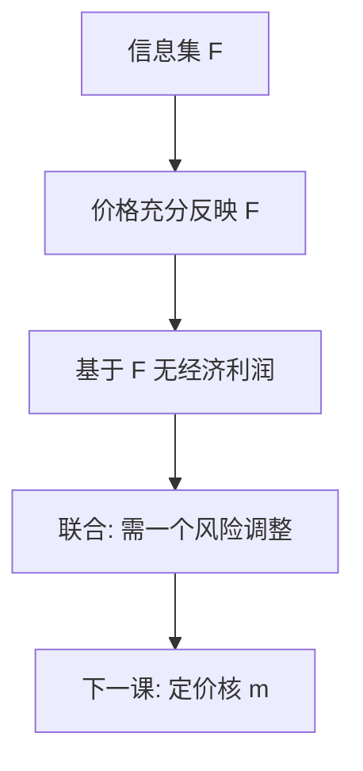

# 有效市场假说

价格充分反映可用信息时，基于那类信息的交易不能赚取经济利润。

<footer>—— Fama, Efficient Capital Markets: A Review of Theory and Empirical Work, Journal of Finance 1970</footer>

定位：[股利与自由现金流](/econ/dividend-fcf)。公司金融已经把收益流切成债、股、股利；本课缺口换成这些要求权的**价格**：信息进来之后，价格是否已经把它写进去，以至按该信息交易不再有超额利润。资产定价理论单元从这里起，不再写资本结构目标。后课默认：有效是相对某个信息集的陈述，不是「价格永远正确」。

## 问题

上一课的现金流还没有贴现核。若价格只是「有人报价」，公司金融的切片无法接到均衡回报。Fama（1970）把问题收成可操作的三层：弱式——价格是否已含历史价格与成交；半强式——是否已含公开公告；强式——是否已含私人信息。每一层都是相对一个信息集 $\mathcal{F}$ 的命题，不是形而上学的「市场全知」。

Samuelson（1965）给出理论核：若价格被「正确预期」，折现后的价格是鞅，价格变动不可被已有信息预测。缺口是把这句话从数学接到可检验的信息分层，并且承认检验必须联合一个均衡模型——否则「超额收益」没有定义。这正是后课 [SDF](/econ/stochastic-discount-factor) 要补的：没有定价核，有效只是口头。

Fama 的「充分反映」是条件期望：基于 $\mathcal{F}$ 的预测误差对 $\mathcal{F}$ 不可预测。弱/半强/强是 $\mathcal{F}$ 越来越大。强式几乎被内幕交易否证；它的用处是标出边界，不是经验默认。

## 方法

把有效写成：不存在只使用 $\mathcal{F}_t$ 的交易策略，其经风险调整的期望利润为正。未调整的「明天涨不涨」可以可预测，只要可预测的部分是风险溢价。因此有效市场假说（EMH）从来不是单独可证伪的：它与「用哪一个均衡模型来调整风险」绑在一起。Fama 1970 的综述已经把这一点说成联合假说，后文的异象首先是对某模型的拒绝。

三层对应三种廉价信息。弱式针对技术分析：自相关、滤嘴、季节。半强式针对公告研究：盈余、拆股、并购，看调整后价格是否在公告日附近一步到位。强式针对内幕与做市商的私人信息。本课只钉分层与联合假说，不做事件研究的标准误。

公司金融与 EMH 的接缝：MM 与股利无关性都假设发行按「公平价格」；公平价格就是半强式对公开信息成立。优序则预设价格对**私人**信息尚未充分反映——否则发股没有柠檬折价。两套课不打架：一个用强式失败来解释融资顺序，一个用半强式来约束公开信息下的策略。

## 机制

机制是竞争与套利，不是神秘的集体智慧。若某公开信号下价格偏低，持有该信息的人买入，价格被抬到使边际投资者不再获得超额利润。交易成本、卖空限制、以及风险无法被充分分散，都会留下一层「经济利润为零」与「价格等于完全信息价值」之间的缝。Grossman 与 Stiglitz（1980）把缝写成均衡：若价格已经完全揭示，就没人愿意付成本去生产信息，于是价格不能完全揭示。EMH 的工作版本因此是「相对信息生产成本，利润被压到近零」，不是字面的完全揭示。

### 联合假说如何接到后两课

拒绝「经 CAPM 调整后 alpha 为零」可以是市场对公开信息反应慢，也可以是 $m$ 不是市场线性。Fama 1970 已经把这句话写在综述里。下一课用 SDF 把「调整」收成 $m$；再下一课把 $m$ 特化成 CAPM。量化栏检验的是特化之后的映射，不是 1970 年的信息分层本身。本课禁止用异象表改写弱/半强/强。

事件研究是半强式的标准操作：公告附近的残差若一步到位且此后无漂移，公开信息被写入。残差用哪一个模型来算，仍是联合假说。本课不估计窗口与标准误。

## 边界

不要把随机游走等同于有效：有风险溢价时，可预测的均值变动与有效可以并存。也不要把某只股票的事后泡沫当成否证——有效是事前相对 $\mathcal{F}$ 的陈述。行为金融的系统偏误，是在联合假说里攻击「投资者用的模型」，本课不展开。

本课不估计 beta，不写横截面异象。风险调整的一般语言是下一课的随机折现因子；把 CAPM 当成唯一调整、再宣布市场无效，是把联合假说里较弱的那一半误当成 EMH 本身。

强式从一开始就更像对照：内部人盈利在多数法域被观测到，不等于半强式失败。公司金融的优序依赖强式失败（经理有私人信息），同时依赖半强式（发行公告被立即定价）。两层一起用，不是自相矛盾。

后课默认：有效相对信息集，检验必联合均衡模型。弱 / 半强 / 强不是「市场全知」的程度计。下一课把风险调整收成 $m$；没有 $m$，超额没有定义。异象表不在本栏重跑。

弱式最接近与量化栏的分界。历史价格仍能预测，要么是时变溢价，要么是可交易惯性。本课不把动量当成已经判决的无效。

随机游走不是有效的同义词。有风险溢价时，可预测的均值变动与有效可以并存。

Fama–French 因子表是对均衡模型的增补，住在量化栏，不是对 1970 年信息分层的改写。

## 小结

- 有效是相对信息集：基于该集的交易无经济利润。
- 弱 / 半强 / 强对应历史价格、公开信息、私人信息。
- 检验必联合一个均衡模型；没有定价核就没有「超额」。
- 出处：Fama, *Journal of Finance* 1970；Samuelson, *Industrial Management Review* 1965；Grossman and Stiglitz, *AER* 1980。
