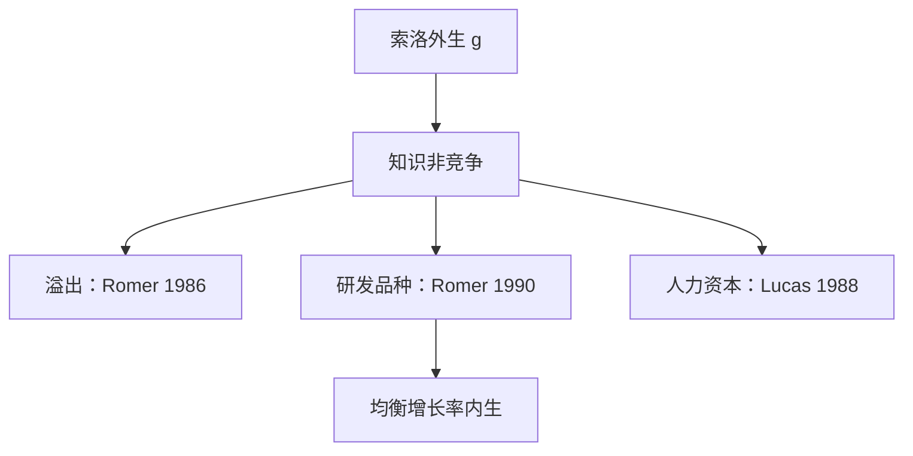

# 内生增长：人力资本与 R&D

若知识可以积累且报酬不递减到零，长期增长率就不再是模型外的 $g$，而由研发与人力资本的资源配置决定。

<footer>—— Romer, Increasing Returns and Long-Run Growth, JPE 1986；Endogenous Technological Change, JPE 1990；对照 Lucas, JME 1988</footer>

[上一课](/econ/olg-diamond)（OLG 与动态无效率再访）。在外生 $g$ 下选资本密度。黄金律与修正黄金律都把人均增长当成技术的礼物。本课的缺口是：$A$ 若也是生产出来的，递减报酬还能否关掉增长引擎。Romer 与 Lucas 给出两条主干：知识溢出与人力资本积累；Romer 1990 再把研发写成故意的垄断竞争。收敛核算是下一课对跨国含义的缺口。

## 问题

索洛里 $\dot{A}/A=g$ 给定。经验上研发支出、教育年限与增长相关，模型却无法让政策进入 $g$。若把 $A$ 写成 rival 的普通资本，报酬递减会把它送回索洛稳态。缺口是找到一种**非竞争**的知识：一人使用不妨碍另一人，从而社会报酬可以递增。

Lucas（1988）让人力资本 $h$ 靠学习时间积累，人均产出可以随 $h$ 永续增长。Romer（1986）让知识作为生产的副产品溢出。Romer（1990）把新品种中间品的发明写成研发部门，增长取决于研发劳动力份额与专利带来的垄断租。本课钉结构，不估计跨国回归。

AK 模型 $Y=AK$ 是刀刃：资本报酬恰好恒定。它可以当教学极限，不是经验上「资本份额为 1」。Romer 的要点是知识的非竞争性，不是把 $K$ 改名。

## 方法

知识运动的示意：$\dot{A}=\eta L_A A^\phi$。$\phi=1$ 时增长率与研发规模成正比，有强规模效应；$\phi<1$ 时需要人口增长才能维持 $\dot{A}/A$ 不掉到零（半内生）。产品种类扩张使最终产品部门看起来像报酬递增，但每种中间品的生产仍可有递减。

人力资本：$\dot{h}=h\cdot u\cdot \psi$，学习时间 $u$ 牺牲当前生产，换未来 $h$。平衡增长路径上消费、产出、$h$ 同速。教育政策改变 $u$，从而改变增长率——这是对索洛「$s$ 只改水平」的翻转，前提是积累对象没有递减到零。

社会最优研发通常大于分散均衡：溢出与垄断使私人回报低于社会回报。这是增长课里的市场失灵，与前面庇古税同一逻辑，对象换成知识。

### 不要把内生增长写成「政策万能」

增长率对税率、专利长度、教育补贴敏感，是模型比较静态。把它读成发展中国家只要加一项补贴就能复制前沿 $g$，忽略了模仿、制度与 $A$ 的可获得性。下一课用发展核算把 $K$、$h$、$A$ 拆开。竞争性要素支付会耗尽产出，若仍有递增，知识不能按边际产品付酬——于是需要垄断或补贴。

## 机制

非竞争性使同一想法可以同时进入许多生产函数，社会生产可能对知识递增。竞争性要素支付会耗尽产出，若仍有递增，知识不能按边际产品付酬——于是需要垄断、补贴或公共研究。Romer 1990 用专利把租交给发明者，发明的激励与静态扭曲绑在一起。

平衡增长要求参数满足刀刃或人口配合，否则模型要么爆炸要么回到外生。这是理论代价：内生 $g$ 换来了对规模与政策的强预测，经验上规模效应被质疑，才有半内生修正。本课保留「$g$ 可被资源配置移动」这一句，细节版本留给文献。

黄金律在内生增长里要重写：计划者同时选消费、研发与教育时间，修正黄金律变成对知识影子价格的欧拉，而不只是 $f'(k)=n+g+\delta$。分散均衡的 $g$ 通常低于计划者，因为溢出。专利长度在激励与垄断扭曲之间权衡，不是越长越好。

规模效应：人口越大，$L_A$ 越大，$g$ 越高。半内生把 $\phi<1$，长期 $g$ 仍跟人口增长走。经验上跨国 $g$ 并不随人口线性上升，所以本课不把「加人」当增长政策。

## 边界

内生增长不解释短期失业，也不给货币角色。创新过程被写成平滑的 $\dot{A}$，没有熊彼特式的企业微观结构。量化栏的价格发现与此无关。模仿与技术扩散可以使后发经济的 $A$ 跳升，那是发展核算里 $A$ 的水平，不是把索洛 $g$ 再外生化一遍。

后课默认：长期人均增长可以来自 $h$ 与研发，而不是只来自外生 $g$。下一课问各国水平差有多少是 $K$、多少是 $A$。

## 小结

- 索洛的 $g$ 外生；知识非竞争时增长可内生。
- Lucas 走人力资本，Romer 走溢出与研发品种。
- 分散研发通常不足；专利是激励与扭曲的捆。
- AK 是教学极限；规模效应在经验上要打折。
- 跨国水平分解是发展核算的缺口。
- 出处：Romer, JPE 1986 与 1990；Lucas, JME 1988。
