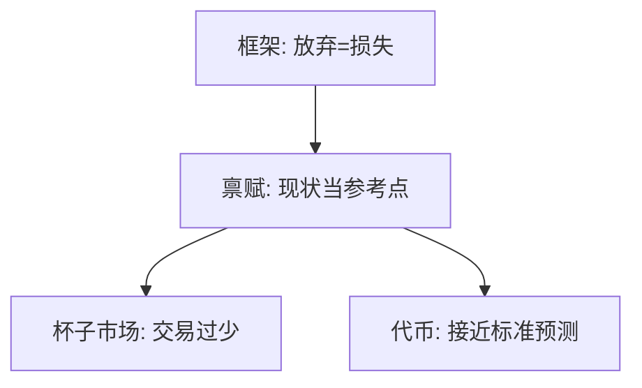

# 禀赋效应

一旦杯子在手里，卖价就跳起来；WTA 与 WTP 的缺口不是收入效应能单独撑住的。

<footer>—— Thaler, Toward a Positive Theory of Consumer Choice, 1980；Kahneman, Knetsch and Thaler, Experimental Tests of the Endowment Effect and the Coase Theorem, JPE 1990</footer>

[上一课](/econ/framing-effects)把「放弃」编成损失。本课缺口是现场：随机发给一半人杯子，交易远少于科斯无成本预测。不重写科斯定理的法律侧，只问评价缺口。

## 问题

标准需求：无收入效应时，买价与卖价应对同一件物品重合。Thaler（1980）称之为禀赋效应。Kahneman、Knetsch 与 Thaler（1990）用杯子与代币：代币（诱导价值）交易接近预测，杯子（消费体验）交易过少，WTA/WTP 显著大于 1。损失厌恶对「放弃禀赋」编码为损失，对「得到」编码为收益，$\lambda$ 直接给出缺口。缺口是把参考点钉在现状禀赋上，而不是重导斯勒茨基方程。

List（2003）发现有经验的卡片交易者缺口缩小。禀赋效应可以是对不熟悉物品的谨慎，而不全是稳定的 $\lambda$。

## 方法

实验室：随机禀赋、匿名双边市场、比较消费物品与诱导价值代币。预测：若只是交易成本或误解，代币也应失败；若是损失厌恶作用于消费物品，则只有杯子失败。现场：房屋卖家锚定买入价，亏损时要价更高——与处置效应同一编码，股票课再写。

## 机制

机制是现状参考点。科斯定理假设评价不依赖初始分配（无收入效应且无禀赋依赖）。禀赋效应使评价依赖分配，谈判集缩小，即使交易成本为零也可能不交易。这不是对科斯法律命题的全面否证，是对其偏好前提的限制：权利分配改变 $v$ 的参考点。

与家庭组合：已持有的股票被赋予更高评价，该卖的不卖。与住房：卖家把买入价当参考，房价下跌时成交量萎缩。本课只给评价机制。

科斯定理在无交易成本时预测初始分配不影响最终配置。KKT 的杯子实验把这句话的偏好前提拆开：分配改变参考点，$v$ 随之变，即使配对交易被组织起来，成交仍少于诱导价值代币。代币证明市场规则本身能工作；消费物品失败，指向损失厌恶而非「被试不会交易」。List 的经验交易者缩小缺口，说明 $\lambda$ 对不熟悉物品更强，不是对所有商品的结构常数。

## 边界

收入效应、谈判技巧、实验中的「应得」情绪都会抬高 WTA。重复市场与专业经验削弱效应，说明它不是对所有商品的结构参数。本课不把 $\lambda$ 从杯子校准到股权溢价。也不把做市商存货当成禀赋效应——存货模型在量化栏。

后课默认：禀赋效应是损失厌恶加现状参考点；过度自信改的是信念，不是 $v$ 的斜率。

代币市场接近预测、杯子市场交易过少，指向消费物品上的损失厌恶，而非被试不会交易。

科斯无成本预测依赖评价不随分配变；参考点随禀赋变之后，这句话的偏好前提失败。

本课不把杯子校准进股权溢价，也不把做市商存货写成禀赋。

## 小结

- WTA–WTP 缺口在消费物品上显著，诱导价值代币上弱。
- 现状当参考点使科斯式无成本交易预测失败。
- 不重写斯勒茨基；缺口来自参考依赖，不是替代矩阵。
- List：有经验的交易者缺口缩小。
- 卖家锚定买入价与处置效应同一编码。
- 出处：Thaler 1980；Kahneman, Knetsch and Thaler, *JPE* 1990。
