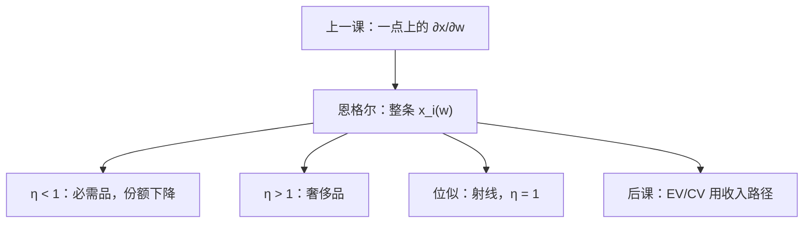

# 恩格尔曲线

价格钉住之后，需求对财富的整条路径才叫恩格尔曲线。局部的正常或劣等，只是这条路径在一点的斜率。

<footer>—— 据 Engel, Die Productions- und Consumtionsverhältnisse des Königreichs Sachsen, 1857；Working, Statistical Laws of Family Expenditure, QJE, 1943 整理</footer>

[上一课](/econ/giffen-inferior)把 $\partial x_i/\partial w$ 的符号收成正常、劣等，并标明吉芬是收入项压过替代。本课不重写斯勒茨基恒等式，也不再证明吉芬必须先劣等。缺口是：符号是一个点上的导数，后课份额、加总、福利比较要的是**整条收入路径**。固定 $p$，把 $x_i(p,w)$ 看成 $w$ 的函数，就是恩格尔曲线。Engel 的经验规律与 Working 的份额形式，都是这条路径的形状约束，不是另一种偏好公理。

## 问题

上一课只问 $\partial x_i/\partial w$ 正还是负。同一商品可以在低收入劣等、高收入正常，也可以始终正常但弹性从大于一变成小于一。把这些写成「有时吉芬」，会把路径与一点的切线混起来。缺口是对象升级：恩格尔曲线 $w\mapsto x_i(p,w)$，以及支出份额 $\omega_i(p,w)=p_i x_i(p,w)/w$。

Engel 定律：食品份额随总支出下降——食品是必需品，收入弹性小于一。Working 把份额写成财富的仿射函数 $\omega_i=\alpha_i+\beta_i\log w$，是可估的恩格尔形状，不是从效用推出来的定理。本课要的是：局部符号如何嵌进这条路径，以及位似把路径收成过原点的射线。

### 收入扩张路径不是马歇尔曲线

收入扩张路径（IEP）是 $w$ 变动时 $x(p,w)$ 在商品空间里扫出的轨迹。恩格尔曲线是 IEP 在单一坐标上的投影。马歇尔需求曲线钉住 $w$ 动 $p$，二者正交。上一课的吉芬是马歇尔曲线向上；本课的劣等是恩格尔曲线局部向下。不要把两条曲线画成一张。

必需品：收入弹性 $\eta_i<1$，份额随 $w$ 下降。奢侈品 $\eta_i>1$，份额上升。加总 $\sum_i\omega_i\eta_i=1$，不能所有商品都是奢侈品。

## 方法

固定 $p$，对 $w$ 求导或直接画 $x_i(w)$。位似：$x(p,w)=w\,x(p,1)$，恩格尔是过原点的直线，所有 $\eta_i=1$，Engel 定律被关掉——上一课已经用这一点排除劣等。拟线性：非计价物的恩格尔是水平线，$\eta_i=0$（计价物内点），份额随 $w$ 下降。CES、Cobb–Douglas 都在位似刀上，恩格尔是射线。

Working 形式允许 $\beta_i\neq 0$，份额随 $\log w$ 动，对应非位似。它仍是描述，不一定可积回某一 $u$；后课可积性会问整条 $x(p,w)$，不只问一条恩格尔。本课不估计 $\beta_i$。

两商品时，IEP 与预算线的交点随 $w$ 外移。劣等段上，该商品的恩格尔向下，另一商品必须「更正常」，瓦尔拉斯定律才能保住。$n$ 种商品时，几种同时弯曲完全可以。份额语言与[Cobb–Douglas](/econ/ces-cobb-douglas)的恒定份额对照：那里 $\eta_i=1$，本课允许 $\eta_i$ 随 $w$ 变。

## 机制

财富增加沿 IEP 走，不沿无差异面。相对价格没变，动的是规模与结构。非位似时，结构随 $w$ 变：先满足必需品，再进入奢侈品，这正是 Engel 看到的食品份额下降。Working 用半对数份额把这条弯曲写成可估的直线，方便加总比较，并不声称 $\beta_i$ 是偏好参数。

与吉芬的接口：吉芬要劣等**且**占预算够大。恩格尔曲线告诉你劣等发生在哪一段 $w$、那一段的份额够不够大。一点上的符号表没有这段几何。涨价比较静态仍回斯勒茨基；本课只提供收入方向的全局图。

家庭规模、相对价格都会扭曲线。Engel 的原始表是支出与食品，不是现代 $x(p,w)$ 的 $ceteris\ paribus$。引用定律时当定性，不当恒等式。

## 边界

角点：低收入时某些 $x_i=0$，恩格尔先贴轴再离开，弹性在进入点没有定义。加总家庭的「市场恩格尔」混合了偏好与收入分布，不必像任何一个人。Gorman 加总要求恩格尔仿射且斜率可加，那是后课；本课只承认个人路径可以弯。

也不要把恩格尔写成限价簿上的存量–收入关系。这里 $w$ 是消费者财富，没有报价。跨期、劳动收入若被塞进静态 $w$，曲线会吸收储蓄与工资，对象切错。

Working 之后 Leser 把份额对 $\log w$ 的仿射叫 Working–Leser 形式，几乎同一条线。它便于估 $\beta_i$，仍不保证可积。下一课的 EV/CV 夹缝方向，读的正是本课的 $\eta_i$：正常则两条货币度量分道，位似射线则分道方式更整齐，拟线性水平恩格尔则重合。

后课默认：谈到收入效应，可以把它升成整条恩格尔曲线；位似等于射线，Engel 定律需要非位似。下一课的等价与补偿变化，正是沿不同财富路径读货币度量。

## 小结

- 恩格尔曲线是固定价格下需求对财富的路径；正常/劣等是一点的斜率。
- 必需品份额下降、奢侈品份额上升；位似把所有弹性钉成 $1$。
- Working 份额对 $\log w$ 仿射，是可估形状，不是新公理。
- 吉芬仍要劣等且份额够大；路径告诉你发生在哪一段。
- 出处：Engel, 1857；Working, *QJE*, 1943；Varian；Mas-Colell, Whinston and Green。
