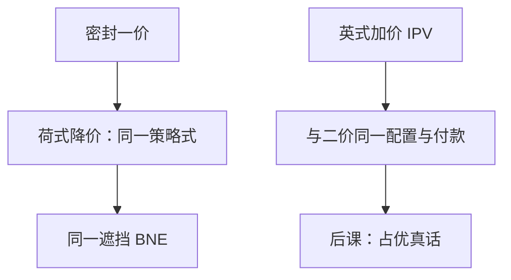

# 英式与荷式拍卖

荷式降价与第一价格密封是同一场博弈；独立私值下，英式加价与第二价格密封策略等价——规则换皮，均衡策略可以原样搬。

<footer>—— Vickrey, Journal of Finance, 1961；Krishna, Auction Theory</footer>

[上一课](/econ/ipv-first-price)给出密封一价的对称 BNE：遮挡函数依赖 $F$ 与 $n$。缺口是现场常见的是公开时钟，不是信封。降价拍卖（荷式）与加价拍卖（英式）看起来完全不像密封，是否要另解一套微分方程？策略等价说：不必。本课钉「同一策略式」与「IPV 下英式对二价」，不把占优真话写成定理——那是下一课维克里。

## 问题

荷式：价格从高往下走，第一位喊「停」的人按当前价得物。每人的策略是一个停止价 $b_i$。支付：停的人付 $b_i$，其余付零。这与密封一价的策略集、支付函数相同——只是物理上别人看得见时钟，却看不到别人的信封；在同时「选一个数」的意义上，信息集并不比密封多。故荷式的 BNE 就是上一课的 $b(v)$，不是新均衡。

英式（按钮 / 时钟）：价格往上走，未退出者都还在；最后留下的人按别人退出的价（第二高退出价）付款。IPV 下，别人的退出只告诉你他们的估值下限，不改变你对自己 $v$ 的评价。占优策略是「价格碰到 $v$ 再退」。配置与付款等于：最高估值者得物，付第二高估值——与二价密封同一结果。

### 策略等价强于收入相当

策略等价：两个博弈的策略空间与支付函数一致（或差一个一一对应），均衡集相同。荷式 $=$ 一价是这种。收入等价只说期望付款相同，策略可以完全不同——那是后课后一课的包络，本课不预支。英式与二价在 IPV 下策略等价（按钮模型）；口头英式若能看见是谁退出，共同价值里就不再等价，本课先锁 IPV。

Vickrey 1961 已经把四种经典拍卖放在同一张桌子上。Krishna 的教具把「按钮英式」写成退出价向量，便于和密封二价逐点对上。口头加价若允许跳价、合谋信号，策略空间更大，等价要加限制。

## 方法

对象：对称 IPV、风险中性、单物品、无保留价。先把荷式写成同时选 $b_i$ 的策略式，引用上一课的遮挡公式。再把英式写成「退出点 $=v_i$」，只陈述结果与二价相同；占优论证留给下一课。比较：公开与否在 IPV 一价 / 荷式里不提供新信息，因为赢不更新自己的 $v$。

四种名称对应两场博弈。先问策略式是否相同（本课），再问期望收入是否相同（后课包络）。人数一变只改一价 / 荷式的 $b(\cdot)$，英式的「退到 $v$」不动。

## 机制

荷式时钟不泄露对手的停止点——第一个停就结束，其余人的数从未显示。故「公开」没有信息含量，博弈缩回密封一价。英式相反：价格路径公开显示谁已退出。IPV 下这条路径只筛选「谁还在」，不改变你的价值数字，所以最优仍是按自己的 $v$ 停；付款由对手的 $v$ 钉住，自己的嘴只当门槛。

一价 / 荷式里，同一个数字既当门槛又当付款，必须遮挡。英式把付款钉在别人退出价上——会计已经接近二价。本课只要读者承认：换场地不等于换博弈；先核对策略式，再决定要不要重算 $b(v)$。

按钮英式（价格连续上升，未按退出者仍在）与口头英式不同：后者允许跳价、从场外进场、用举手节奏发信号。IPV 教具用按钮，才能与密封二价一一对上。荷式若允许「看到别人犹豫再决定」，策略空间也会膨胀，不再等于密封一价。等价定理的前提是策略式真的相同，不是拍卖行的名字相同。

### 四种经典拍卖的位置

对称 IPV、风险中性：荷式与一价同一均衡；英式与二价同一均衡。两组之间期望收入是否相同，是收入等价的句子，本课不证。人数、分布一变，遮挡函数变，但荷式仍跟着一价变，不必对时钟另建模型。

风险厌恶会改变一价 / 荷式的遮挡，不改变英式「退到 $v$」的占优（论证不对期望积分）。关联价值下英式的公开退出有联动价值，荷式没有——赢家诅咒课再写，本课 IPV 最瘦。

## 边界

保留价、进入费改边界，不改「荷式 $=$ 一价」的策略式。多物品、组合、软收盘网上英式超出本课。也不要把时钟写成连续簿的价格优先；这里没有队列，只有一次拍卖。

软收盘、最低加价、卖方保留价隐藏，都会让「英式 $=$ 二价」出现缝：跳价与信号重新进入策略空间。本课按钮模型是为了把等价钉死；现场规则一松，就要回到策略式核对，不能凭拍卖名称套公式。

后课默认：IPV 下荷式沿用一价遮挡；英式沿用「按 $v$ 退出」。下一课把二价密封的占优真话补成证明。

## 小结

- 荷式与密封一价是同一策略式，遮挡公式原样用。
- IPV 英式与二价策略等价：最高估值者得物，付第二高。
- 策略等价是博弈相同；收入等价是后课的期望。
- 公开时钟在 IPV 荷式里不提供额外信息。
- 出处：Vickrey, *Journal of Finance*, 1961；Krishna, *Auction Theory*。
