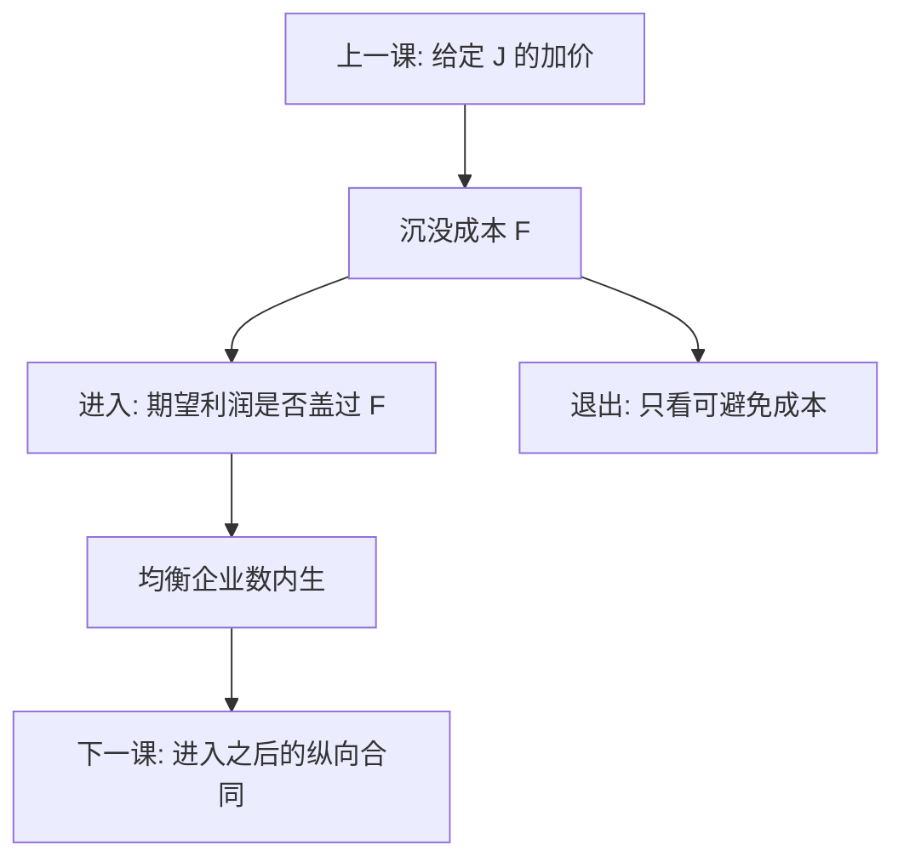

# 进入、退出与沉没成本

沉没成本把进入变成不可逆投资：事后即使利润薄，也不必退出；事前则要求足够的预期利润来覆盖那笔沉没。可竞争市场的「打了就跑」在这里失效。

<footer>—— Dixit 不可逆投资；Sutton, Sunk Costs and Market Structure, 1991；Bresnahan and Reiss, Entry and Competition in Concentrated Markets, JPE 1991；对照 Tirole 进入壁垒章</footer>

[上一课](/econ/differentiated-pricing)在给定品种集 $J$ 上写出 Bertrand 加价。本课缺口是 $J$ 从哪来：谁愿意付沉没成本进来，谁在需求下降时仍不走。微观[可竞争市场](/econ/contestable-markets)用自由进入把 $p$ 压向平均成本；那里的进入是可逆的。本课把沉没加上，进入变成期权，市场结构由「覆盖沉没的预期利润」内生决定。后课纵向约束会改变进入之后的合同；本课先钉水平方向的进出。

## 问题

固定成本若在退出时能全额收回，在位与潜在进入者面对同一长期成本，打了就跑可以约束在位。沉没则不可收回：厂房、广告存量、研发、渠道。进入决策看的是进入前的期望贴现利润是否盖过沉没；退出看的是可避免成本，沉没已与决策无关。于是出现滞后：需求变差，在位仍生产，潜在者仍不进——两道门槛不对称。缺口不是再画 AC 曲线，而是：**静态定价课把 $J$ 当数据，政策（合并、管制、补贴）会改变进入博弈，反事实必须重解谁在场。**

Bresnahan–Reiss 用「第 $n$ 家进入时市场多大」反推竞争如何侵蚀利润。Sutton 把内生沉没（广告、R&D）与外生沉没分开：市场规模变大时，内生沉没可以阻止集中度下降。

### 沉没不是会计折旧

折旧是分摊已发生支出的记账。沉没是决策的不可逆：钱出去了，下一期不能当成机会成本。广告的会计寿命可以很短，若品牌资本带不走，对进入仍是沉没。反过来，可转售的通用设备会计上是固定成本，经济上近乎可回收。用折旧年限当进入壁垒，会把 IO 做成会计。

Dixit–Pindyck 把进入写成实物期权：等待会获得关于需求的信息，沉没越大、不确定性越大，进入门槛越高。本课用离散进入博弈的语言，不把连续时间期权公式重推一遍。

## 方法

两阶段：先同时或序贯选择进入（付 $F$ 沉没），再在在位集合上玩上一课的定价博弈，利润反推到进入。自由进入均衡：进入者期望利润 $\approx F$，潜在的下一家 $<F$。Bresnahan–Reiss：把市场大小 $S$ 与均衡企业数 $N$ 的阶梯关系估出来，识别「竞争对加价的压缩」。Sutton 下界：外生沉没下集中度随 $S$ 下降；内生沉没下可以不下降。

动态：在位可以容量、合同、产品扩散来影响 $F$ 或进入后利润。本课只要求反事实合并若改变利润，就可能改变未来的 $N$，静态模拟会漏这一项。

## 机制

不可逆使「在场」本身有选择价值。需求高涨时，进入一拥而上；需求回落时，产能留着——集中度与加价的时间序列会滞后于需求。内生沉没把竞争从价格赶到广告与研发：市场越大，竞赛越烧钱，剩下的企业不必更多。这解释为什么有些行业规模扩张后仍是寡头，SCP 的「大市场更竞争」在此失效。

与可竞争对照：可竞争靠可逆进入惩罚偏离；沉没让惩罚变慢，在位的加价可以在一段时间内不引来进入。限制进入定价、掠夺，都要在沉没背景里才有策略空间——后课掠夺会用到。

Bresnahan and Reiss, *JPE* 1991 用职业服务的地方市场：第二家进入对加价的压缩往往大于第五家。边际进入的竞争效应递减，是结构估计的典型矩。

## 边界

本课不估完整动态寡头（Ericson–Pakes）的计算细节。不写公司法上的破产程序。量化栏的进入退出交易策略不是这里的产业进出。纵向一体化与排他合同会内生地改变 $F$ 与进入后利润，交给下一课，不在水平进入里提前写完。

后课默认：$J$ 可以动；静态加价是进入博弈的第二阶段。合并模拟若假设 $N$ 不变，要声明这是短期。

## 小结

- 沉没使进入门槛与退出门槛不对称，$J$ 对需求滞后。
- 可竞争的打了就跑依赖可逆进入，此处失效。
- 内生沉没可以阻止「市场变大则集中度下降」。
- 政策反事实往往要重解谁在场，不只重解价格。
- 出处：Sutton 1991；Bresnahan and Reiss, *JPE* 1991；Dixit；Tirole。
