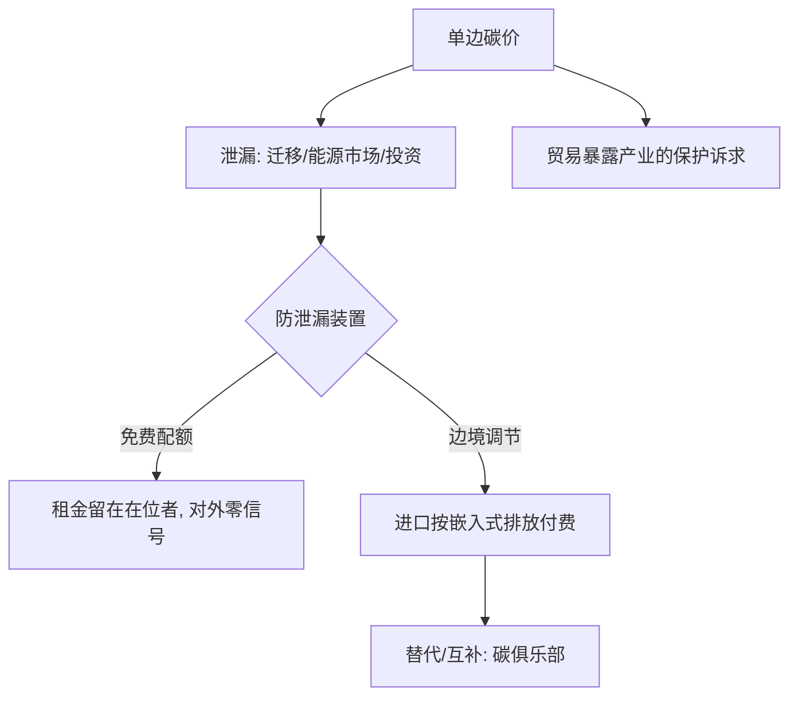

# 碳边境调节

碳价改不了物理，但能改选址：单边定价把排放推过国境，边境税试图让影子价格跟着货物过境。

<footer>—— 据 Nordhaus, American Economic Review, 2015（气候俱乐部）与欧盟 CBAM 条例（2023/956）整理</footer>

[上一课](/econ/env-power-markets)把市场边界画在联络线上，跨区靠耦合出清；碳政策的边界画在国境上就没这么干净——单边碳价只在本辖区有效，排放会从缺口迁走。[庇古税与碳定价](/econ/pigouvian-carbon-price)的边界里点过一句「碳价管不住泄漏」，本课把泄漏通道数清，再写边境税这一装置的设计、原理与代价。

## 问题

泄漏有三条通道。生产迁移：钢、水泥、铝、化肥这类碳密集品，贸易成本低于碳成本差，碳价使产地外迁——辖区排放降了，全球排放没降，只剩生产的地理重排。能源市场通道：单边碳价压低世界化石燃料的需求与价格，未覆盖辖区面对更便宜的燃料，反而烧得更多。投资通道：新产能的选址天然绕开碳价。三通道之外还有一层政治：贸易暴露产业要求对等保护，否则碳价在国内先站不住。缺口因此是：把影子碳价延伸到口岸，又不违反贸易规则、不把气候政策做成变相关税。

## 方法

EU CBAM 的口径：进口商按嵌入式排放（申报或默认值）购买证书，证书价格锚定国内碳价的拍卖均价；原产地已付的碳价可抵扣；覆盖从钢、水泥、铝、化肥、电力、氢起步；与免费配额互斥——免费配额按计划退坡，两套防泄漏装置并存就是双重保护。设计轴有三问：排放怎么测（默认值防造假，但一刀切惩罚低碳出口商）；下游产品覆不覆盖（不覆盖则从下游进口即可绕开）；出口退不退税（不退，退税更近似出口补贴）。替代与互补的组织形式是碳俱乐部（Nordhaus 2015）：集团内互免、对外统一门槛，用贸易结构把参与变成占优策略。

## 机制

CBAM 对全球排放为什么强于免费配额：免费配额只保护国内在位者，对外国生产者零信号；CBAM 把碳价第一次写进进口品价格，出口国的产业链被间接定价——政策信号越境，这正是争议的核心：贸易伙伴视其为单边措施，辩护者援引贸易规则的环境例外，最终裁决未出，这本身就是边界的一部分。免费配额为什么必须退场：并存则国内成本与进口成本持续不对称，庇古课还说过免费发放是把租金送在位者。数据为什么先行：过渡期先申报、后缴费，是把嵌入式排放的核证系统先逼出来——没有 MRV 的边境税只是一张关税表。

EU 的 CBAM：2023 年 10 月进入过渡期（只申报），2026 年起正式征收，同期免费配额线性退坡——顺序不能反：先有嵌入式排放的数据系统，再谈收钱。

## 边界

默认值定得粗惩罚低碳出口国、定得细纵容造假，粗细是分摊争议的技术面具。「共同但有区别的责任」的公平争议没有消失：碳密集出口多是发展中国家，边境成本落在谁的产业链上要明说。下游与间接排放覆盖不足，留下资源转运与轻加工改税目的规避通道。历史泄漏的实证幅度比口号温和（证据口径见 [环境政策的实证证据](/econ/ca-env-policy-evidence)），CBAM 是预防性装置而非补救装置；把预防说成已发生的损害，是政策辩论里最常见的偷换。

## 小结

- 泄漏有三条通道：生产迁移、能源市场、投资选址；幅度常被夸大，通道是实的。
- CBAM 按嵌入式排放收费、锚定国内碳价、可抵扣原产地碳价；与免费配额并存即双重保护。
- 免费配额对外零信号，CBAM 把碳价写进进口价——信号越境既是价值也是争议。
- 设计轴三问：排放怎么测、下游覆不覆盖、出口退不退。
- 碳俱乐部用贸易结构改变参与激励，是口岸机制的组织化替代。
- 出处：Nordhaus 2015；EU CBAM 条例（2023/956）口径；实证幅度见环境政策证据课。
