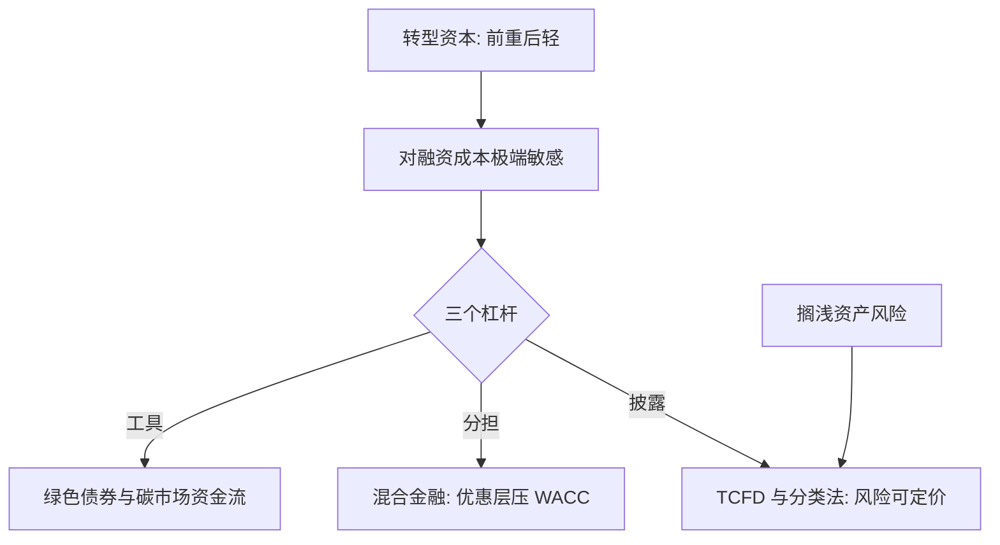

# 气候金融

转型是提前花的资本开支：技术决定度电成本的下限，贴现率决定谁能等到那一天。

<footer>—— 据 Nordhaus 2017 的贴现口径与 TCFD 2017 年披露建议整理</footer>

[上一课](/econ/env-subsidy-design)给补贴立了账本：补哪个失灵、何时退、谁搭了便车。账本往下追问一层就是金融：转型是先花几十年资本开支、后收几十年损害减少——谁来垫资、按什么利率垫，常常比技术本身更决定项目生死。贴现率的伦理之争在 [庇古税与碳定价](/econ/pigouvian-carbon-price) 已读，本课把它换成资本成本口径，写气候怎样被写进资产负债表。

## 问题

转型资金有两个特征。前重后轻：资本开支前置、现金流长而薄，对融资成本极端敏感——同一座电站，融资成本差两三个百分点，度电成本差出一截；政策反复等于给所有绿色资产加风险溢价，[能源转型经济学](/econ/env-energy-transition)的期权逻辑在此变成 WACC。风险错配：气候损害与转型风险落在没有定价话语的主体——未来世代、发展中国家；公共资金的可信度本身是金融变量：发达国家 2009 年承诺每年动员 1000 亿美元气候资金，OECD 口径到 2022 年才首次兑现。缺口因此是：给全球量级的投资需求，找到能落地的风险定价与风险分担结构。

## 方法

三个杠杆。披露：TCFD（2017 年建议）把治理、战略、风险管理、指标四支柱做成报告口径，分类法给「绿色」下可核验的定义——信息先于定价，不可见的风险不可定价。风险分担：混合金融用优惠资本做第一损失层，改写项目的风险收益轮廓，直到机构资本进得来——目标不是压名义成本，是压加权平均资本成本。工具化：绿色债券锁定用途并要求报告（欧洲投资银行 2007 年首只气候意识债券起步）；碳拍卖收入与国际转让把碳价变成资金流；搁浅资产风险从学术口径进入信用分析（Carbon Tracker 2011 的不可燃碳估算），央行网络 NGFS（2017 年成立）把气候情景做成压力测试条目。

## 机制

披露为什么是定价的前置：气候风险原本是所有组合的共同噪声，价格无法区分好坏持仓；披露让风险可比较、可交易，资本才开始向低风险者集中。混合金融为什么动 WACC 而非名义成本：回报按资本结构分层，优惠层吸收首损，商业层的风险溢价随之下降——同一笔优惠预算，垫在资本结构里比贴在电价上撬动更多资本。搁浅资产为什么是系统问题而非公司问题：碳预算收紧使减记集中在少数资产负债表上，一致预期的突然反转才是监管者担心的形态——个体理性（先卖）合成集体踩踏。

OECD 口径：发达国家动员的气候资金 2022 年首次越过 1000 亿美元线（约 1159 亿）——从承诺到兑现十三年；对融资成本敏感的项目，承诺的可信度本身就是补贴。

## 边界

「绿色」标签的可核验性有限，漂绿是分类法要长期治的病。额外性原则上可定义、实操上难验证：「没有这笔钱项目就做不成」的反事实不可观测。担保与优惠资金带来道德风险，适应资金长期落后于减缓。贴现率的伦理没有技术答案，只有明示假设的纪律。气候金融不是第二财政：它能改风险的分布与时间形态，改不了损害函数的形状；把金融工具当成减排本身，是这一课最贵的误会。

## 小结

- 转型资金前重后轻：融资成本与政策可信度是项目生死的一阶变量。
- 信息先于定价：披露与分类法把气候风险从共同噪声变成可交易的信息。
- 混合金融压的是 WACC：优惠层做首损，同一预算撬动更多资本。
- 工具化渠道：绿色债券锁用途，碳价收入与国际转让把碳价变成资金流。
- 搁浅资产从公司问题变成系统问题，靠披露与情景测试提前显影。
- 出处：TCFD 2017；Carbon Tracker 2011；OECD 气候资金口径；EIB 2007。
