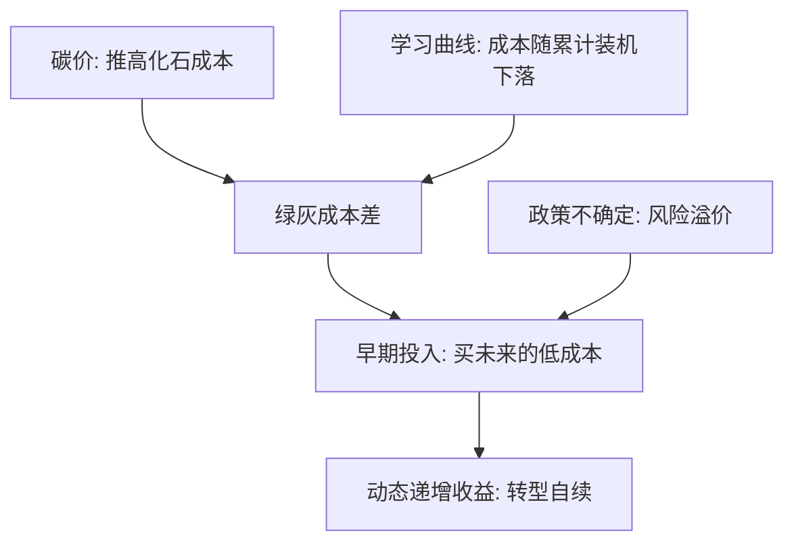
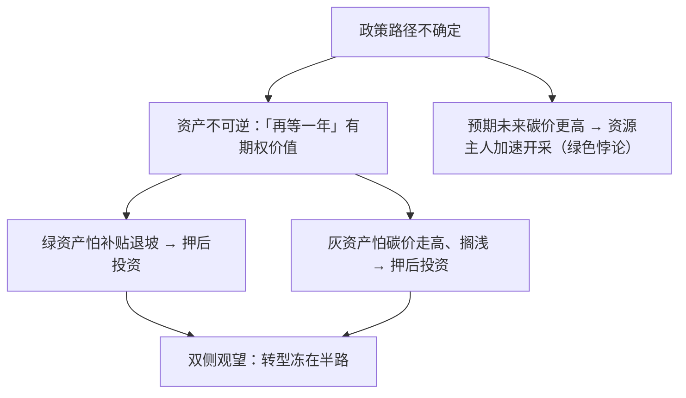

# 能源转型经济学

减排成本曲线不是常数：装机每翻一番，成本沿一条幂律下落——转型买的不是当期减排，是一条会移动的曲线。

<footer>—— 据 Wright, Journal of the Aeronautical Sciences, 1936 与学习曲线文献整理</footer>

[上一课](/econ/env-ets-deep)把帽子的稀缺性做可信、把价格稳进区间；但整套数量工具都在替一条给定的 MAC 收盘，它假定减排成本不随政策变。本课的核心事实是 MAC 会动：清洁技术成本随累计经验沿学习曲线下落，光伏组件学习率约两成，2010—2020 年组件价格下降约九成。碳价与学习曲线的相对速度，决定转型是「政策逼出来的永久成本」还是「政策启动后自续的过程」。

## 问题

静态庇古逻辑里减排是纯成本，最优碳价等于边际损害。若减排成本本身随累计装机下降，早期减排买到的不只是当期损害减少，还有未来成本曲线的下移——静态最优不再是动态最优。缺口有两层。其一，知识外溢：干中学的收益大半落在对手与后来者身上，私人学习激励小于社会最优，市场自发走得太慢。其二，长期资产的不可逆与政策不确定互相放大：电站寿命几十年，碳价路径不稳，绿灰两侧的投资都加装风险溢价——灰资产怕搁浅，绿资产怕退坡，谁都不敢先动。

## 方法

学习曲线写成 $C(X)=C_0\,(X/X_0)^{-\lambda}$，$X$ 是累计装机，每翻一番成本降到 $2^{-\lambda}$。政策含义有三。第一，最优路径是投资问题而非当期配置问题：早期单位成本高于化石，社会最优先亏后赚，跨期权衡要按整条路径算。第二，两个失灵配两个工具：碳价管排放外部性，学习政策管知识外部性；只给一个会错位——没有碳价的学习补贴是在错误的边上楔入（补贴课细说）。第三，平准化度电成本（LCOE）只算电厂自己的账：波动电源的备用、电网与消纳成本不在 LCOE 里，报价低不等于系统便宜，整合成本是下一课的题。

术语翻译：LCOE（平准化度电成本）是把建站到退役的全部花费按总发电量摊平后的「每度电账面成本」。它只算电厂自己的账：没风没太阳时的备用、电网与消纳的钱不在里面——组件报价低，不等于系统便宜。

## 机制

学习使干预自续的机制是动态递增收益：成本是累计经验的函数，政策性需求转化为经验，把曲线上任意起点之后的未来成本永久压低——先发优势变成路径依赖，临时政策足以把系统从一个均衡推到另一个。这是上一课「承诺机制」的反面：帽子靠规则防松，学习靠规则防退。政策不确定为什么同时冻住两侧：资产不可逆使「再等一年」有期权价值，波动越大越值得等；转型的期权逻辑在气候金融课还会以资本成本的面目回来。搁浅资产是同一枚硬币的反面：碳预算约束意味着已探明化石储备的一部分永远不能烧，账面价值与使用约束之差要有人减记——这一笔在金融课变成系统风险。

学习率是最被低估的参数：光伏组件约 20%/翻倍，据此 2010—2020 年组件价格下降约九成。「太贵」是关于累计装机的陈述，不是关于技术的终审判决。

数字实例：学习率 20% 意思是累计装机每翻一番、成本降到原来的八成。翻五个跟斗（装机 32 倍），成本约为起初的 $0.8^5 \approx 0.33$——降到三分之一。所以「现在太贵」必须先问：现在累计装机是多少。

## 边界

学习曲线是经验规律不是定律：Wright 的口径来自飞机机身工时，外推到材料受限、土地受限的技术会失灵；曲线外推也会被电网与资源瓶颈截断——下一课的物理约束。绿色悖论提醒方向可能反向：预期未来碳价走高，资源主人的最优反应是当下加速开采（Sinn 2012）。补贴的退坡与寻租政治留到补贴课。本课不写确定性路线图：学习率外推是规划口径，任何「某年成本必然降到多少」的句子都该附带它的 $2^{-\lambda}$ 与不确定性。

常见误区：把学习曲线当成「某年成本必然降到多少」的物理定律。它是经验规律：材料涨价、土地受限、电网瓶颈都可能掐断下落；引用任何学习率，都要附带它的统计口径与不确定性区间。

## 小结

- 减排成本随累计经验下落：转型是动态问题，早期成本买的是曲线位移。
- 知识外溢使市场学得太慢：碳价与学习政策各治一个失灵，缺位会错位。
- 政策不确定抬高双侧期权价值，同时冻住灰绿投资；搁浅资产是同一约束的减记面。
- LCOE 不是系统成本：整合成本是电力市场设计的入口。
- 学习率外推有边界：材料、土地、电网与绿色悖论都可能改写方向。
- 出处：Wright 1936；Sinn 2012；成本数据口径据行业统计整理。
