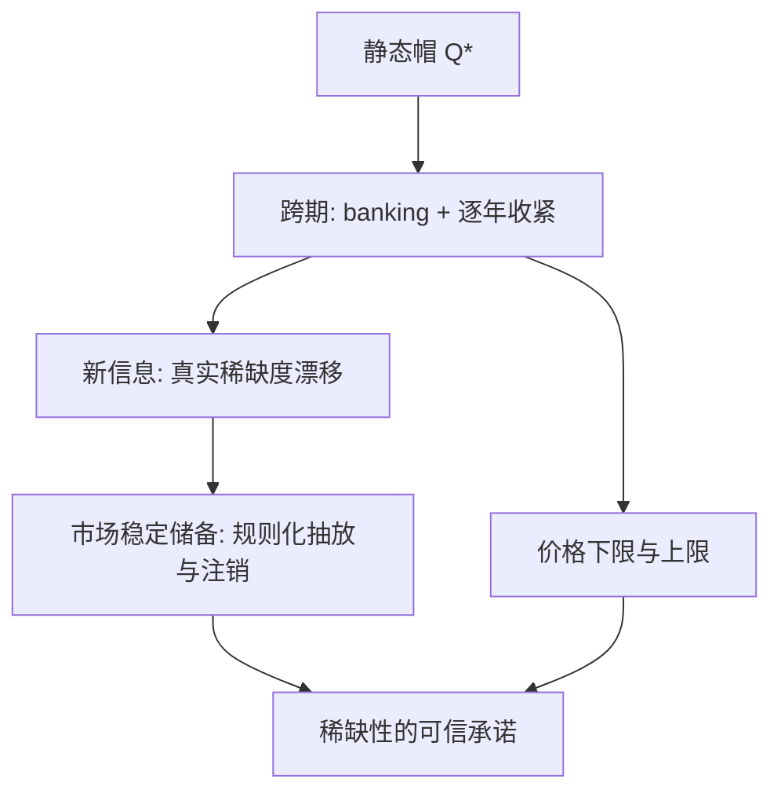

# 排放交易体系的深化

帽子好定，稀缺难信：许可体系的深水区不是总量怎么算，而是让市场相信十年后的帽子还在。

<footer>—— 据 Montgomery, Journal of Economic Theory, 1972；Roberts &amp; Spence, Journal of Public Economics, 1976 整理</footer>

[上一课](/econ/ec-map)把「经济数据与计算」收束：构念、覆盖、偏校、复现、成本五问缺一即零，识别的语言归计量、工程的接口归计算机栏，乘积才是可信实证。[总量管制与许可证](/econ/cap-and-trade)的纸面设计假定帽子一次选定、竞争市场自动对齐 MAC；真实体系要活几十年，难题从「帽子选多少」变成「稀缺性能不能跨年可信」。本课是「环境与能源经济学」的第一课，后面六课默认读完本课：先看帽子在日历里如何失守，再看把它钉回规则的三件装置。

## 问题

Montgomery 的均衡是一次性的。放进日历，三件事坏掉。其一，信息按年到达：选帽时对减排成本的猜测逐年修正，2006 年春欧盟公布 2005 年核证排放，超发一目了然，第一期配额价格从约 30 欧元跌向近零——帽子的真实稀缺度是核证数据的函数，不是立法文本的函数。其二，政府不可承诺：成本冲击一来，放松帽子在政治上总是诱人的，市场一旦预期「帽子会松」，长期减排投资就没有对手盘。其三，纯数量工具把全部成本冲击倒进价格：价格是投资信号，波动过大本身就是政策失败。缺口因此不是重选 $Q^\*$，而是给帽子装上跨期的承诺与稳定装置。

## 方法

三件装置。跨期银行：许可可跨期持有，把单期帽连成跨期路径，企业自己选择何时减排；帽子的长期形状靠线性缩减系数逐年收紧（EU 从每年 1.74% 收到 4.3%）。自动调节：市场稳定储备（MSR，2019 年运行）盯流通配额总量——高于 8.33 亿吨时每年按流通量的固定比例抽入储备，低于 4 亿吨时向拍卖放回，储备中超额部分自 2023 年起注销；「改总量」从立法程序搬进预置规则。价格保险：设价格下限与上限，区间内仍钉数量、触界后转钉价格——Roberts 与 Spence 1976 年提出的混合工具，Weitzman 判据在两个极端各取一半。

## 机制

MSR 为什么能救价格：它改变的不是当期供给，而是对「总量将如何演化」的预期——企业预期的是规则而不是下一次政治博弈；承诺机制从「承诺不动」换成「承诺怎样动」，这是后面几课补贴退坡、财政承诺反复出现的同一族机制。collar 为什么不等于背叛数量工具：环境目标的确定性只在区间内被让渡，触界即恢复；让渡换来的是价格无限波动的政治风险出清。分配侧的深化同样通过激励反馈进排放：祖父制把租金给在位者并惩罚新进入者；基准制按效率分配，但基准若按期下调，就把「补贴减排」变成「补贴产量」；电力部门拿免费配额却按机会成本定价，把配额租金转进电价——免费分配与竞争市场的联合产物，不是意外。

EU ETS 的每次收紧都是对着一次事故的修补：2006 年核证数据揭出超发、第一期价格归零；MSR 的 8.33 亿与 4 亿吨阈值、2023 年起的注销，都是把「政治修正」改写成「规则修正」的尝试。

## 边界

MSR 不创造减排，只重排减排的时间路径，注销是唯一真正缩帽的动作。强度帽随产量浮动，价格信号天然更弱——上一课的斜率判据在这里变成制度差异。监测与核证是体系的底座：数据造假直接改写帽子的真实稀缺度，MRV 的行政能力是不进公式的前置条件。市场势力可囤积配额操纵价格；价格下限在政治压力下被击穿时，规则与政治谁赢是开放问题。泄漏与抵消本课只立门牌：跨境那半留给碳边境调节课，补贴与抵消质量的纠缠留给补贴课。

## 小结

- 真实 ETS 的核心难题是跨期可信：帽子是核证数据与承诺规则的函数，不是立法文本的函数。
- banking 把单期帽连成跨期路径；线性缩减系数收紧帽子；MSR 把总量修正规则化。
- 价格 collar 区间内钉数量、触界转价格，是 Weitzman 判据的混合实现。
- 分配规则通过激励反馈进排放：祖父制、基准制、免费配额的机会成本转嫁各有一条暗道。
- MSR 只重排时间，注销才缩帽；MRV 与市场势力是公式之外的前置条件。
- 出处：Montgomery 1972；Roberts &amp; Spence 1976；Weitzman 1974 见上一课；EU ETS 制度事实据官方口径。
