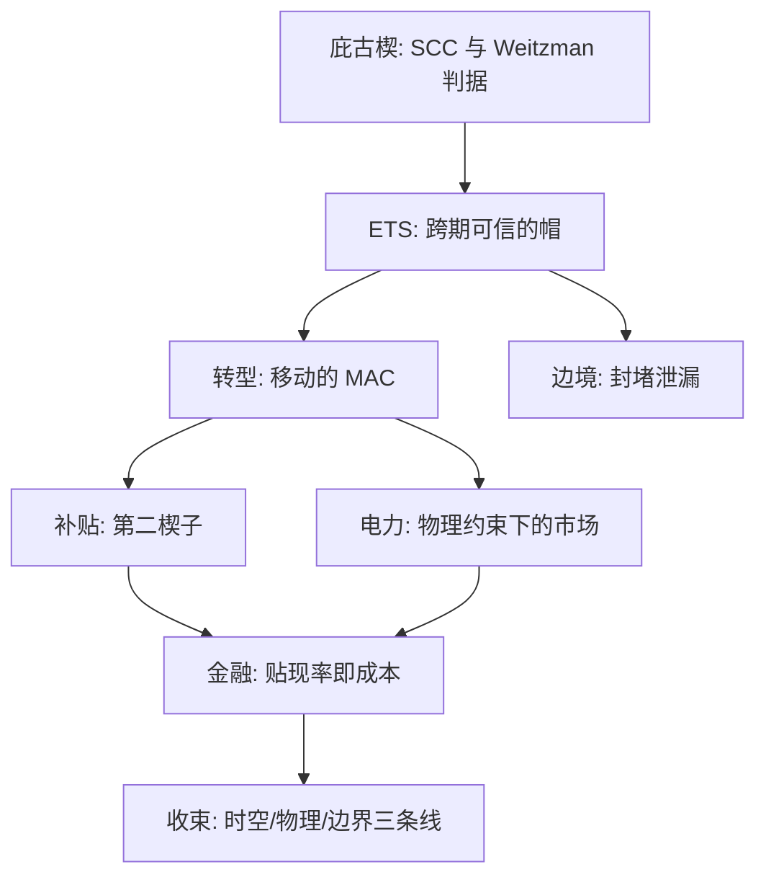

# 环境经济学收束

外部性课程的终点是一个没有世界政府的公共品问题：所有工具都在境内生效，而损害在全球积累。

<footer>—— Coase 1960；Weitzman 1974；Nordhaus 2017 的共同追问</footer>

[上一课](/econ/env-climate-finance)把贴现率从模型参数换成资本成本，工具箱到此装满。本课收束：把七课连成一张地图，看哪些问题是同一个问题的不同投影、哪些边界是全课程共有的。本课程到此收束。

## 问题

回望课程，环境经济学的全部工具都在回答同一个三元组：楔在哪（价格还是数量）、楔多深（SCC 或帽高）、谁付钱（分配、边境与金融）。[庇古税与碳定价](/econ/pigouvian-carbon-price)给了一阶答案；本课程把这个答案放进日历、放进电网、放进贸易与资本市场。收束不是复述各课，是找到把七课串起来的最小骨架——找不到骨架，七课只是七篇独立的综述，后面的任何加深都无处挂靠。

## 方法

三条线。时空线：静态庇古楔（碳价等于当期边际损害），经跨期可信的帽（[排放交易体系的深化](/econ/env-ets-deep)），到移动的 MAC（[能源转型经济学](/econ/env-energy-transition)）——同一个楔子的时间维度逐课展开。物理线：学习曲线把成本打下去，电网物理把市场设计重写（[电力市场设计](/econ/env-power-markets)）——抽象的减排成本落到具体的出清价。边界线：泄漏把政策推到口岸（[碳边境调节](/econ/env-cbam)），政治把第二楔子推上桌（[补贴的设计](/econ/env-subsidy-design)），金融把贴现率推成成本（[气候金融](/econ/env-climate-finance)）——每一课的边界都是下一课的问题。

## 机制

这套工具族为什么自洽：它们都在把同一个外部性的影子价格写进某个决策者的约束——碳价写进边际成本，帽子写进稀缺租，边境写进进口价，披露写进资本成本；差别只在写入的位置与可信度。可信度为什么是全课程的公共参数：帽子要 MSR 与规则化退坡才可信，补贴退坡要写进法条才可信，千亿美元的资金承诺要十三年才兑现——[科斯定理](/econ/coase-theorem)的交易成本口径换了名目仍在场。实证为什么不能缺席：泄漏幅度、学习率、绿色溢价、融资成本差，每个参数都是经验问题，证据口径见 [环境政策的实证证据](/econ/ca-env-policy-evidence)——工具选得再对，参数错了照样错。

收束检查清单：见到任何气候政策，先问四件事——楔在价格还是数量；时间上可不可信；边界上封没封住；钱由谁的贴现率决定。

## 边界

全课程共有的边界三条。非凸与临界点：越过不可逆阈值后边际工具失去定义，SCC 应作为厚尾分布报告（Weitzman 2009 的警告），点估计的确定性是假的。无世界政府：气候是全球公共品（[公共物品](/econ/public-goods)的极端形态），一切工具都只能是主权国家的自选动作加协调，边境调节与碳俱乐部是对这一事实的让步，不是解决。跨代分配：贴现率的伦理没有技术答案，只有明示假设的纪律——Nordhaus 2017 展示过参数差零点几个百分点、结论翻几倍的杠杆。这三条边界不因工具进步而消失，只会随着损害逼近而变窄。

## 小结

- 全部工具是同一个三元组：楔在哪、楔多深、谁付钱；差别只在写入位置与可信度。
- 时空线、物理线、边界线把七课连成一张地图，每课的边界是下一课的问题。
- 可信度是公共参数：帽子、退坡、资金承诺都靠规则化维持，靠政治自觉必输。
- 三条共有边界：非凸临界点、无世界政府、跨代贴现的伦理。
- 本课程到此收束：后遇加深课题，回到这张地图找挂靠点。
- 出处：Pigou 1920；Coase 1960；Weitzman 1974、2009；Nordhaus 2017；实证口径见各课所引。
