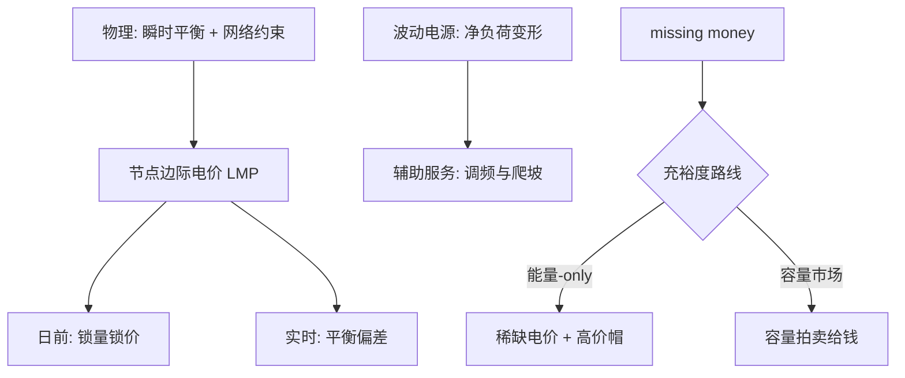

# 电力市场设计

电力被物理绑在瞬时平衡与网络约束上：市场设计的任务不是给电定价，而是给「即时、就地、随时可调」分别定价。

<footer>—— 据 Schweppe 等《Spot Pricing of Electricity》1988；Wilson, Econometrica, 2002 整理</footer>

[上一课](/econ/env-energy-transition)把风光成本沿学习曲线打到平价，却留了一句：LCOE 便宜不等于系统便宜。本课把电网当成受物理约束的市场来解剖——电几乎不可大规模储存、频率必须实时平衡、潮流沿网络定律走——三个物理事实决定价格该怎么出、还缺什么产品。转型改变的不是电的物理，而是净负荷的形状：市场设计必须跟着重写。

## 问题

现货电价不是普通商品价格：每个节点、每一小时都可能是一个独立市场。缺口三个。其一，missing money：峰机一年只有几百小时出清，若能量价格停在平均成本附近，容量投资的钱在能量市场里收不回来——投资信号缺一块。其二，波动电源重塑净负荷：午间光伏把净负荷压出深谷、日落后爬坡陡增（鸭式曲线），系统缺的不再是「发电量」而是「随叫随到的灵活性」，而灵活性在传统产品表里没有价签。其三，稀缺定价的政治脆弱：价格尖峰正是容量回收的机制，但 2000—01 年加州危机之后各地压低价格帽，等于亲手砍断自己需要的投资信号。

## 方法

三件套。节点边际电价（LMP）：按边际机组出清，阻塞时节点价差出现，输电约束被写进价格；金融输电权与差价合约把位置风险变成可对冲的金融品——现货定价口径来自 Schweppe 等 1988，Wilson 2002 把整个架构写成协调问题。双结算：日前市场锁量锁价，实时市场只平衡偏差，预测误差单独定价。资源充裕度两条路线：能量-only（ERCOT 把能量价格帽放到失负荷价值 VOLL 的数量级，9000 美元/MWh）让稀缺电价养容量；或容量市场（PJM）拍卖「可用容量」直接给钱。灵活性产品化：调频、爬坡、备用逐个开列产品，把「随时可调」标成可交易品。

## 机制

稀缺电价为什么是可靠性的价格形态：可靠性是电网内的公共品——谁都享受不停电、无法排除搭便车者（[公共物品](/econ/public-goods)的题内之义）；稀缺电价把「不停电的边际价值」写回能量价格，砍掉它，容量投资只剩行政目标，市场退化成计划。碳价与电力市场为什么是叠加而非并列：ETS 抬高化石机组的边际成本，merit order 重排；上一课的近零边际成本电源进一步压低出清价——missing money 加重、峰谷价差重排，转型直接改写市场设计参数，这是两门课的接口。价帽压太低为什么必然换来非价格配给：出清改由滚动停电完成，稀缺以最贵的方式回到系统。

同一台燃气峰机，在 9000 美元/MWh 帽下靠稀缺小时回收投资，在低帽下靠容量拍卖拿钱——ERCOT 与 PJM 的路线之争，本质是「信价格」还是「信行政目标」。

## 边界

容量市场可能双重支付，也常被批评为给本该退出的旧机组续命——拍卖设计决定它是保险还是福利。节点定价在阻塞严重的区域制造本地市场势力；分区定价简化了结算，却把阻塞成本摊平、误导选址。价格尖峰的公平问题应交给配电价与定向转移处理，而不是压帽价。配电侧的分布式资源、储能与需求响应正在改写产品表，本课停在批发侧。跨区互联与市场耦合解决一部分平衡问题，但政策的国境线是另一回事——碳政策的边界漏洞，下一课的题。

## 小结

- 物理三事实（瞬时平衡、网络约束、难储存）是市场设计的一阶输入，不是摩擦。
- LMP 把阻塞写进价格，双结算分离预测误差，金融衍生品管位置与价格风险。
- missing money 是能量市场的结构性缺口：能量-only 靠稀缺价帽，容量市场靠拍卖给钱。
- 可靠性是公共品，稀缺电价与容量机制是它的两种定价形态；压帽价换来停电配给。
- 碳价与波动电源通过 merit order 与出清价改写设计参数，转型与市场设计互相推进。
- 出处：Schweppe 等 1988；Wilson 2002；Joskow 2006。
