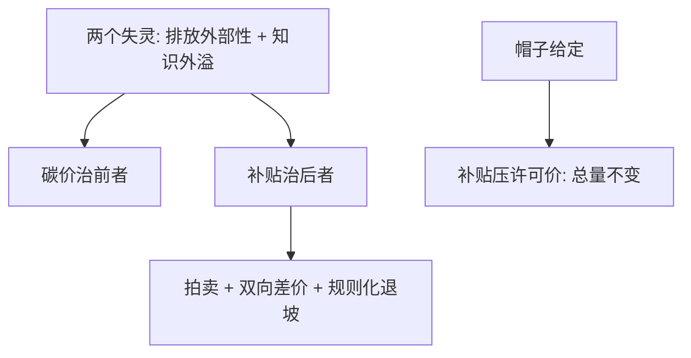

# 补贴的设计

税收要人掏钱，补贴只要财政掏钱：政治更爱后者，经济只要求它补对外部性，别把本来就会发生的事再补一遍。

<footer>—— 据 Pigou, The Economics of Welfare, 1920 与 Weitzman, Prices vs. Quantities, 1974 整理</footer>

[上一课](/econ/env-cbam)把价格侧的防泄漏补到口岸，「收钱」的楔子齐了：税、帽、边境调节都往污染方向加价。可政策实务里最常见的楔子是「发钱」：补贴让受益者看得见、让反对者有得谈。本课沿用 [死重损失的度量](/econ/deadweight-loss-measure) 的三角形与 [能源转型经济学](/econ/env-energy-transition) 的学习曲线，把补贴从口号还原成参数：补哪个失灵、补多少、用什么工具、何时退。

## 问题

补贴最常犯的错是一次治两个病。排放外部性应由碳价治，知识外溢应由学习政策治；若碳价缺位而用从量补贴顶上，等于在错误的边上楔入：每单位清洁产出都拿钱，边际内项目——没有补贴也会建的项目——一起领赏，财政成本按总装机而非增量计，被系统性低估。更隐蔽的是帽子给定时的错觉：总排放钉在帽上，补贴压低许可需求，许可价随之下跌，未受补贴的行业反而减得更少——总量一吨没少。缺口因此是：给补贴找到它真正治的失灵，以及一个写下来就不许赖掉的退出时间表。

## 方法

参数化：从量补贴 $s$ 把清洁技术的私人成本压低 $s$，其社会价值来自两处——碳价缺位时的边际损害项，加上学习外溢的动态项（装机翻倍带来的成本下降被未来所有项目共享）；碳价已在时第一项归零，补贴只剩学习理由。工具族按「补什么」分：按装机补（投资补贴）、按发电量补（生产抵免或固定上网电价）、差价合约（行权价双向结算：市价高于行权价时企业退钱）、拍卖分配（让竞争报出真实成本）。四条设计纪律：拍卖定成本，结算双向对称，退坡写进规则——随累计装机走、不随预算年走，只补增量。

## 机制

帽子给定为什么补贴不减总量：配额市场均衡要求许可价等于边际减排成本，被补贴部门少要配额，价格下落，其余部门把省下的配额用掉——负担重排，帽子未动；绿色部门拿到份额，最脏的免费配额行业反而扩张，这条机制有正式论证（Böhringer 与 Rosendahl 2010）。退坡为什么必须规则化：退坡是补贴的政治逆过程，指望预算年届时的立法自觉，等于指望帽子自我收紧——上一课 MSR 的同一招：把「怎样动」预先写进规则，预期才不崩。双向差价为什么优于单向：对称结算把超额收益还给财政与消费者，市价高企时不必临时加钱，横财与兜底一起治。

英国海上风电差价合约：早期轮次出清价约 110—120 英镑/MWh，2022 年轮次约 37 英镑/MWh（2012 年不变价）——拍卖加双向结算同时完成成本发现与横财回收。

## 边界

补贴占住财政与注意力，错误的补贴比没有补贴更贵。退坡常被投资者当作违约，规则化只降低、不消除这一风险。上游材料瓶颈会把补贴转成供应商租金；跨境的补贴摩擦会引来反补贴税——与上一课的边境机制在同一张桌子上相遇。补贴不是碳价的替代品：两个失灵各配一个工具，缺谁谁失灵；把补贴当万能钥匙的政治惯性，是这门课要对抗的第一直觉。

## 小结

- 补贴要指名它治的失灵：顶替碳价是在错误的边上楔入，边际内横财被系统性漏算。
- 帽子给定时不减总量：许可价下跌、负担重排，只有帽子收紧才谈得上额外减排。
- 工具族按「补什么」选：装机、发电量、差价、拍卖各有信息与横财含义。
- 四条纪律：拍卖定成本、双向结算、退坡随累计装机规则化、只补增量。
- 出处：Pigou 1920；Böhringer &amp; Rosendahl 2010；英国 CfD 数据据官方轮次口径。
