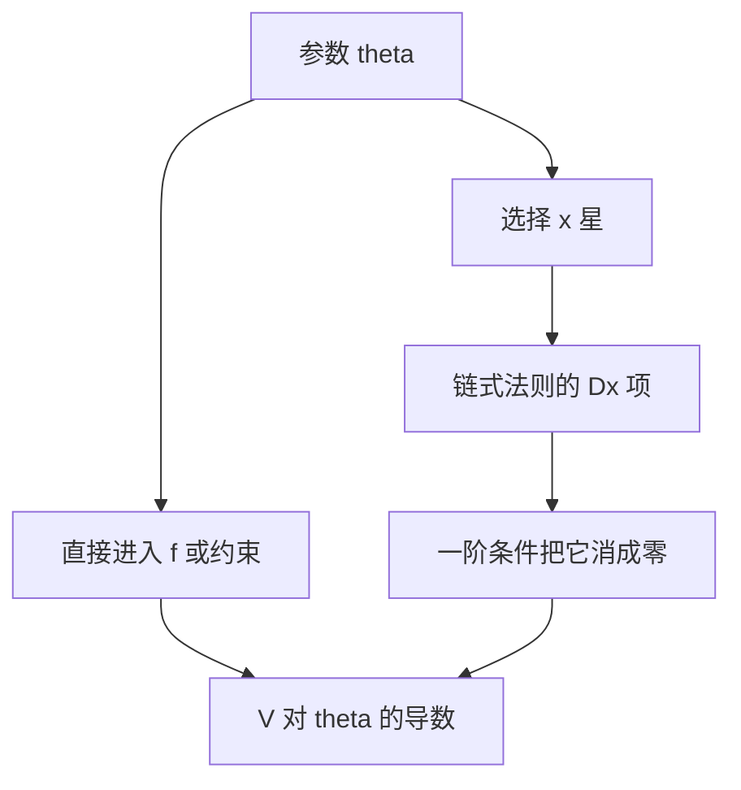

# 包络定理

参数进入目标与约束；最优值对参数的导数，只走「直接」通道，选择变量的一阶移动被一阶条件消掉。

<footer>—— 据 Mas-Colell, Whinston and Green 数学附录；Milgrom and Segal, "Envelope Theorems for Arbitrary Choice Sets," Econometrica, 2002 整理</footer>

上一课[KKT 条件](/econ/kkt-conditions)给出 $x^*(\theta)$ 与乘子。比较静态常先问最优**值** $V(\theta)=f(x^*(\theta),\theta)$ 怎么变，而不是 $x^*$ 本身。缺口是：链式法则里 $Dx^*$ 那一项，在最优处恰好被一阶条件乘成零。本课只钉这条捷径。$x^*$ 如何随 $\theta$ 动，交给下一课隐函数。

## 问题

无约束时 $V(\theta)=f(x^*(\theta),\theta)$，$\nabla_x f(x^*,\theta)=0$，故
$V'(\theta)=f_\theta(x^*,\theta)$。
约束在时，对 Lagrange $\mathcal{L}(x,\lambda,\theta)$ 同样：$V'(\theta)=\partial\mathcal{L}/\partial\theta$ 在最优处取值。预算 $w$ 进入约束不进入 $u$，于是间接效用对 $w$ 的导数就是乘子 $\lambda$——Roy 恒等式的前一半材料。价格进入约束，$V$ 对 $p$ 的导数带 $-x^*$，这是后课[Roy 恒等式](/econ/roy-identity)与[谢泼德引理与霍特林引理](/econ/shephard-hotelling)要引用的包络，本课不把那些恒等式证一遍。

机制选择、拍卖里类型 $\theta$ 进入代理人目标，包络给出信息租金对类型的积分。后课[可实施性与包络](/econ/implementability-envelope)会用；这里只准备「值函数导数 = 直接偏导」。

### 包络不是「忽略约束」

说「不必算 $dx^*/d\theta$」容易听成约束不重要。约束仍然决定 $x^*$ 站在哪、乘子是多少；只是在已经最优的点上，沿可行流形移动 $x$ 不改变值的一阶。若你在非最优点用同一公式，漏掉的 $f_x\cdot x_\theta$ 并不为零。包络是最优处的恒等式，不是随便一个可行点的近似。

Milgrom–Segal 把可微选择放松成绝对连续的值函数：选择集可以离散。机制设计常用这版；光滑微观主干用经典可微版就够。

## 方法

写 $V(\theta)=\max_x\{f(x,\theta):x\in\Gamma(\theta)\}$。在内点、LICQ、$x^*$ 局部 $C^1$ 时，
$DV(\theta)=f_\theta(x^*,\theta)+\lambda\cdot\Gamma_\theta$ 的精确形式由 $\partial\mathcal{L}/\partial\theta$ 给出。约束集不随 $\theta$ 变时，只剩 $f_\theta$。Hotelling：$\pi(p)=\max_y p\cdot y-c(y)$，$\partial\pi/\partial p_i=y_i^*$。Shephard：支出函数对价格的导数是希克斯需求。两条都是包络，差在最大化还是最小化、参数进目标还是进约束。

值函数继承凸性：上一课上境图说过，一族仿射的上包络仍凸。因此利润对 $p$ 凸、支出对 $p$ 凹（最小化），即便 $y^*$ 不可微——值函数几乎处处可微，不可微点对应需求集值。包络的集值版用次梯度：$\partial V(\theta)$ 含直接偏导的凸包。

## 机制

最优处，选择已经把所有能改善的方向用尽。参数微扰时，决策者会调整 $x$，但调整的一阶收益为零——这正是 FONC/KKT。剩下的只是「同一选择下参数自己改写目标或可行集」。直观：价格涨一点，厂商可以改产量，但在原最优产量上，改不改产量对利润的一阶效果一样，因为边际利润已经是零；于是利润增量就是旧产量乘价格增量。

这条机制失败的典型场景：角点刚要离开、有效约束集合跳变。那时 $V$ 仍连续（Berge），但导数左右不一，包络取一侧或用次微分。比较静态若只关心符号，次梯度版本往往够用。

间接效用 $v(p,w)$ 对 $w$ 的包络是 $\lambda$，对 $p$ 的包络含 $-x$。两者合在一起才是 Roy；本课只给工具，不写需求恒等式。

## 边界

本课不求 $Dx^*/D\theta$ 的符号，那是隐函数与比较静态两课。也不把包络写成「所有参数导数都等于乘子」——只有约束里的那些参数才是。不要在此重写效用表示或风险态度。下一课打开被消掉的那一项：选择本身如何动。

后课默认：最优值对参数求导走 $\partial\mathcal{L}/\partial\theta$；Shephard、Hotelling、Roy 都是本课的实例，证明时不再从链式法则重推。

## 小结

- 最优处 $V'(\theta)$ 等于直接偏导（含乘子对约束参数的那一项）。
- $Dx^*$ 的一阶贡献被 FONC/KKT 消掉。
- 值函数继承凸/凹；不可微点对应集值需求。
- 机制设计里类型的包络给出信息租金。
- 下一课：[隐函数定理](/econ/implicit-function)。
- 出处：MWG 数学附录；Milgrom and Segal, *Econometrica* 2002。
