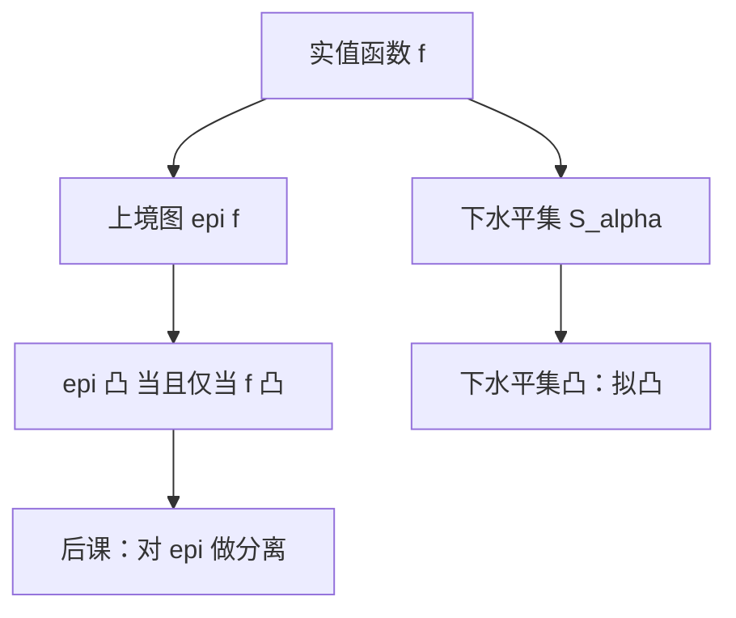

# 上境图与下水平集

函数凸当且仅当上境图凸：把弯曲的函数值问题，送回上一课已经会的点集几何。

<footer>—— 据 Boyd and Vandenberghe, Convex Optimization, 第 3 章；Rockafellar, Convex Analysis, 1970 整理</footer>

上一课[凸函数与凹函数](/econ/convex-concave-fn)用弦定义了凸。计算上有时更顺手的是集合：把函数抬到一维，看「图的上方」是不是凸集。缺口不是再写一遍弦不等式，而是上境图与下水平集这两套语言，以及它们怎样把后课的分离定理接到函数上。

## 问题

函数 $f:C\to\mathbb{R}$ 的**上境图**（epigraph）是
$\operatorname{epi} f=\{(x,t)\in C\times\mathbb{R}: t\ge f(x)\}$。
图在下面，竖直方向往上的半边都算进去。$f$ 凸当且仅当 $\operatorname{epi} f$ 作为 $\mathbb{R}^{n+1}$ 的子集是凸集。凹函数看**下境图** $\{t\le f(x)\}$，或直接对 $-f$ 取上境图。

**下水平集** $S_\alpha=\{x:f(x)\le\alpha\}$。凸函数的每个下水平集都凸；反过来不真——拟凸函数也有凸下水平集，但不必凸。拟凸比凸弱，正好对应「水平集形状对、函数值弯曲不对」。最大化问题里对称的对象是上水平集 $\{f\ge\alpha\}$：凹与拟凹。

### 上境图不是无差异曲线

无差异曲线是效用的水平集，画在商品空间里。上境图多一维，多出来的坐标是函数值本身。把两者画在同一张两商品图上会混：无差异曲线谈的是偏好序，上境图谈的是某一个实值函数的几何。后课效用还没有出场；本课的 $f$ 可以是成本、利润、支出，不必是 $u$。

闭上境图 $\Leftrightarrow$ $f$ 下半连续。Weierstrass 的下半连续版：下半连续函数在紧集上达到最小。最小化成本时，这个方向才是对的。

## 方法

点态上确界：$f(x)=\sup_{s\in S} f_s(x)$。每个 $f_s$ 凸则 $f$ 凸，因为上境图是各 $\operatorname{epi} f_s$ 的交，凸集对交封闭。利润函数 $\pi(p)=\sup_x\{p\cdot y(x)-c(x)\}$ 是一族仿射函数的上包络，故对价格凸——这是后课[谢泼德引理与霍特林引理](/econ/shephard-hotelling)的几何前半段。本课不写包络定理，只指出上境图对交封闭给出「包络仍凸」。

下水平集给出约束集合。$\{x:g(x)\le 0\}$ 在 $g$ 凸时是凸集。KKT 里不等式约束常假设 $g_j$ 凸，可行域才凸，一阶条件才充分。等式约束 $h(x)=0$ 两边都不是水平集的凸形状能保证的：只有仿射 $h$ 保住凸可行域。这是后课[拉格朗日乘子](/econ/lagrange-multiplier)把等式限制在线性预算上的几何理由。

## 机制

分离超平面作用在点集上。要把「点 $x_0$ 不在凸函数 $f$ 的图的下方」写成价格，最干净的办法是在 $\operatorname{epi} f$ 里分离 $(x_0,f(x_0))$ 的下方点。得到的法向量拆成对 $x$ 的部分和对 $t$ 的部分：前者是次梯度，后者归一化成 $1$。次梯度不等式 $f(y)\ge f(x)+g^\top(y-x)$ 就是这条分离的坐标写法。下一课把分离本身讲清楚；本课只准备被分离的那个集合。

水平集管可行性，上境图管目标值。一个凸规划可以同时读成：在凸下水平集（约束）上，求上境图最靠下的点（目标）。两套集合都凸时，支撑超平面存在，影子价格才有几何。

拟凸最小化仍可能有「看起来像切点、其实不是全局」的麻烦，因为拟凸不管函数值的弦。充分性要凸目标，不只是凸水平集。

## 边界

本课不把 Fenchel 共轭写成教材：共轭的上境图是支撑函数的几何，后课对偶会用到支出函数，但不在这里展开 Young 不等式。也不把水平集读成无差异曲线族——那要等到[连续性](/econ/continuity-preference)之后。下一课对不相交凸集动手，给出支撑价格。

后课默认：说函数凸，可改口说上境图凸；说约束 $g\le 0$ 给出凸可行域，默认 $g$ 凸。

## 小结

- 上境图凸 $\Leftrightarrow$ 函数凸；这是把函数送回点集几何的桥梁。
- 下水平集凸是拟凸，弱于凸；最大化对应上水平集与拟凹。
- 点态上确界保凸，解释利润、支出作为包络的凸性。
- 不等式凸约束给出凸可行域；非线性等式会毁掉凸。
- 下一课：[分离超平面](/econ/separating-hyperplane)。
- 出处：Boyd and Vandenberghe, *Convex Optimization*；Rockafellar, *Convex Analysis*。
