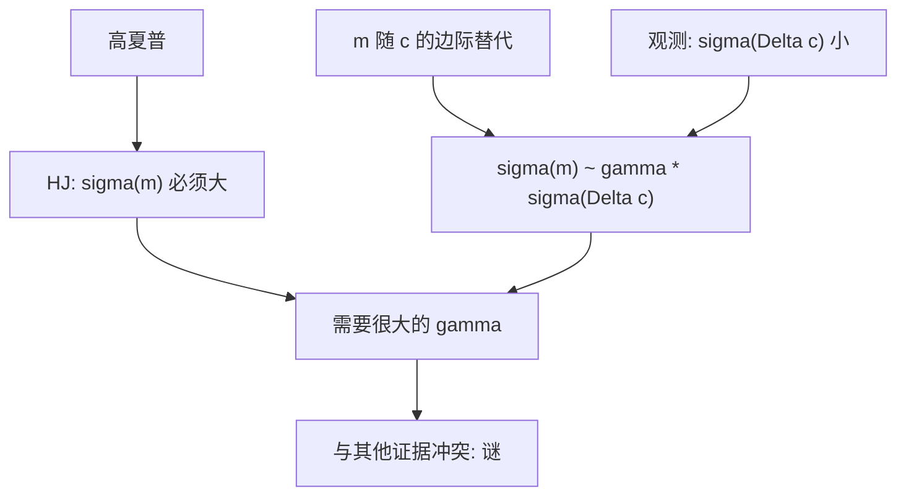

# 股权溢价之谜

用观测到的消费增长去生成随机折现因子，要匹配股票对国债的超额，需要的风险厌恶远高于其他证据所能接受的。

<footer>—— Mehra and Prescott, The Equity Premium: A Puzzle, Journal of Monetary Economics 1985</footer>

定位：[上一课](/econ/hansen-jagannathan)。HJ 界已经要求 $\sigma(m)$ 不能低于可交易夏普所暗示的水平。本课缺口是把代表性消费者的 $m=\beta u'(c_{t+1})/u'(c_t)$ 放进这道界：消费增长太平，除非相对风险厌恶极大。不重推 Cauchy–Schwarz，不把谜写成「股市永远涨」。

## 问题

[跨期欧拉](/econ/consumption-euler)给出资产定价核。CRRA 下 $u'(c)=c^{-\gamma}$，于是 $m$ 的波动大约是 $\gamma$ 乘以消费增长的波动。美国人均消费增长的标准差远小于股票超额收益的标准差；股票相对短期国债的平均超额又很大。Mehra 与 Prescott（1985）在 Lucas 树经济里校准：要同时匹配无风险利率与股权溢价，$\gamma$ 会落到两位数，与微观、与无风险利率之谜（高 $\gamma$ 会把 $r_f$ 推得太高，除非再调时间偏好）冲突。

缺口是 HJ 的会计翻译成偏好语言：夏普要求 $\sigma(m)$ 大，消费路径给不出这么大的 $\sigma(m)$，除非 $\gamma$ 大得难以置信。这是代表性主体、时间可分 CRRA、用总量消费当 $c$ 的失败，不是对「存在 $m$」的否证。

无风险利率之谜是孪生兄弟：高 $\gamma$ 使预防性储蓄强，压低 $r_f$；要再匹配水平，往往需要 $\beta>1$ 或负的时间偏好。Weil 把两谜并读。本课以溢价为主，利率只作为同一核的另一约束。

## 方法

代表性主体、完全市场、外生消费（或 Lucas 树的股息等于消费）。股权是对总消费的要求权，国债近似无风险。欧拉给出

$$
\mathrm{E}[R^e] \approx \gamma\,\mathrm{Cov}(\Delta c, R^e)
$$

（对数近似）。消费与股票回报的协方差受 $\sigma(\Delta c)$ 限制，历史 $\sigma(\Delta c)$ 小，于是要么溢价小，要么 $\gamma$ 大。Mehra–Prescott 用马尔可夫消费增长匹配一阶与二阶矩，把「大」写成明确的校准：常规 $\gamma$ 产生的溢价只有几个基点到很小的百分数，与历史股权溢价不在同一量级。

HJ 语言更短：历史夏普要求 $\sigma(m)/\mathrm{E}[m]$ 高；CRRA 的 $\sigma(m)\approx\gamma\sigma(\Delta c)$，观测到的 $\sigma(\Delta c)$ 把 $\gamma$ 顶上去。两句话是同一缺口。

候选出路（习惯、长期风险、罕见灾难、不完全市场）都是改 $m$ 的形状或改谁的 $c$ 进 $m$，不是改 HJ 会计。本课不展开修补菜单。

## 机制

机制是总量消费作为边际价值的代理太平滑。家庭层面的消费更抖，但不能自动进 $m$：能被保险的特异风险在完全市场里被消掉，剩下的共同部分才定价。若市场不完全，特异风险可以进入个别欧拉，加总消费不再是正确的 $c$——那是另一模型，不是 Mehra–Prescott 的设定。谜首先判决的是「用总量 $c$ 的 CRRA 代表性主体」。

股权溢价是对「在消费差的时候仍必须持有总风险」的补偿。总量消费差得不够多，补偿就不够大。股票价格波动本身很大，但若这些波动不与 $c$ 对齐，进不了 $m$。这就是「与 $m$ 的协方差，不是方差」在宏观数据上的刺。

### 谜不是 CAPM 横截面

Mehra–Prescott 比较的是股票与国债的**时间序列溢价**，不是个股 beta 的斜率。市场 CAPM 可以在截面上失败或成功，与这个谜独立：它可以有一个够大的 $\mathrm{E}[R_m]-r_f$，却仍然没有消费解释。截面与因子见 [/quant/capm](/quant/capm)；本课禁止用 Fama–French 表改写 1985 年的校准。下一课 [CCAPM](/econ/ccapm) 把同一 $m$ 写成消费 beta，实证薄弱仍换栏。

样本起点、生存偏差、事先溢价是否等于事后均值，都会改变「谜有多大」。Mehra–Prescott 的定性结论对常规 CRRA 足够稳：量级对不上。本课不争论基点。

## 边界

不要把谜写成「股票风险被误定价，快买」。它可以是模型错、也可以是灾难风险被样本低估。也不要把高 $\gamma$ 当成已经接受的偏好参数——那会与无风险利率、与微观风险厌恶一起炸。本课停留在：总量 CRRA 核进不了 HJ 可行域，除非 $\gamma$ 离谱。

后课默认：股权溢价之谜是消费核的波动不够。存在 $m$ 仍然成立；失败的是 $m\propto c^{-\gamma}$ 这一特化。消费 CAPM 下一课把特化写成 beta 语言。

代表性主体加平滑的 $c$，给不出股票债券的夏普。这是偏好与加总的失败，不是信息分层的失败。

习惯形成与长期风险改的是 $m$ 对哪一段消费敏感。那是修补，不是 1985 年的谜本身。

## 小结

- HJ 要求 $\sigma(m)$ 大；CRRA 的 $\sigma(m)$ 被 $\sigma(\Delta c)$ 限制。
- Mehra–Prescott：常规风险厌恶产生不了历史股权溢价。
- 谜针对总量消费核，不自动否定有效，也不等于 CAPM 截面检验。
- 出处：Mehra and Prescott, *JME* 1985；Hansen–Jagannathan 界为会计入口。
