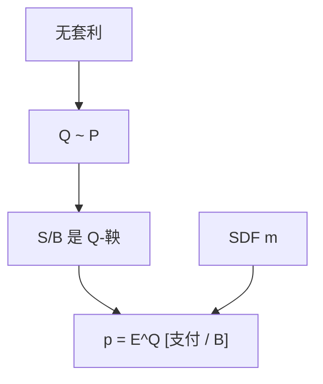

# 等价鞅测度

换一套与原来等价的概率，折现资产价格变成鞅：定价是取期望，不是改偏好。

<footer>—— 据 Harrison and Kreps, JET 1979；Harrison and Pliska, Stochastic Processes and their Applications, 1981</footer>

[上一课](/econ/ftap)给出存在性：NA ⇔ 有一个（或一凸集）定价核。本课缺口是把核写成**概率** $\mathbb{Q}$：在 $\mathbb{Q}$ 下，用计价账户折现后的价格过程是鞅。不重做分离超平面，不把 $\mathbb{Q}$ 说成市场上真有一群风险中性的人。

## 问题

状态价格 $q_s$ 归一化成 $\mathbb{Q}(s)=q_s/\sum q$，一期定价变成 $p=B^{-1}\mathrm{E}^{\mathbb{Q}}[x]$。多期需要过程：选一个严格正的计价账户 $B$（通常是货币市场），要求 $S/B$ 在 $\mathbb{Q}$ 下是鞅，即 $\mathrm{E}^{\mathbb{Q}}[S_{t+1}/B_{t+1}\mid\mathcal{F}_t]=S_t/B_t$。等价：$\mathbb{Q}\sim\mathbb{P}$，同一零测集——否则某个 $\mathbb{P}$ 下可能发生的状态在定价里被抹掉，与 $q\gg 0$ 冲突。

缺口是记账：同一线性泛函，可以叫 $m$、可以叫 $q$、可以叫 $\mathbb{Q}$。换名不是换理论。[SDF](/econ/stochastic-discount-factor) 的 $m$ 与密度过程满足 $m_{t,t+1}=(B_t/B_{t+1})(Z_{t+1}/Z_t)$，$Z$ 为 $\mathrm{d}\mathbb{Q}/\mathrm{d}\mathbb{P}$ 的密度。本课钉 $\mathbb{Q}$ 这一端。

「风险中性测度」是俗称：$\mathbb{Q}$ 下投资者像风险中性那样用 $B$ 折现，并不意味着 $\mathbb{P}$ 下的人风险中性。风险厌恶被写进 $\mathbb{P}\mapsto\mathbb{Q}$ 的倾斜。

## 方法

有限树：在每个节点解局部正价格，归一成条件概率，再拼成 $\mathbb{Q}$。布朗模型：Girsanov 把漂移从 $\mu$ 扭到 $r$，波动不变；市场完全时扭法唯一，不完全时扭法有一整族（未定权益对应的风险市场价格自由）。计价账户可换：用某交易资产当 numéraire，得到另一套等价鞅——价格比对该 numéraire 是鞅。换 numéraire 不改变可复制权益的价格，改变的是计算便利。

不要把 Girsanov 写成「估计漂移」。$\mu$ 在 $\mathbb{P}$ 下是真实期望，定价不需要它——这正是对冲定价的要点。均衡要 $\mu$，因为 $m$ 来自消费；FTAP 只要 $\mathbb{Q}$。后文 Lucas 树会把两者焊回同一 $m$。

## 机制

机制是改变概率权重：倒霉状态在 $\mathbb{Q}$ 下更重，等价于 $\mathbb{P}$ 下 $m$ 更大。鞅的意思是：用 $\mathbb{Q}$ 看，任何可交易资产在补偿计价增长之后没有超额；有超额的方向会被复制成套利。动态就是把这句话放进每个条件信息集——与 [EMH](/econ/emh) 的「经风险调整后不可预测」同构，FTAP 提供调整所用的测度。

不完全：许多 $\mathbb{Q}$ 都让可交易的 $S/B$ 成为鞅，但对不可复制的 $x$，$\mathrm{E}^{\mathbb{Q}}[x/B]$ 随 $\mathbb{Q}$ 变，故无唯一价格。这不是市场无效，是张成不足，接 [不完全市场](/econ/incomplete-markets-gei) 的精神。

等价不允许把 $\mathbb{P}$ 的零事件标成正概率。那样会给不可能的状态定价，或把可能的状态标成套利。奇异性是定价失败，不是「另一种信念」。

## 边界

本课不引入随机利率下的远期测度细节，后文期限结构会按需取 numéraire。也不要把 $\mathbb{Q}$ 估计成历史频率——历史是 $\mathbb{P}$。下一课问动态完备：多少资产、怎样再交易，才能让 $\mathbb{Q}$ 唯一、复制可行。

后课默认：EMM 是与 $\mathbb{P}$ 等价、使 $S/B$ 为鞅的概率。定价是 $\mathbb{Q}$–期望。$m$ 与 $\mathbb{Q}$ 是同一泛函的两个写法。

## 小结

- 等价：同一零测集；鞅：折现价格无 $\mathbb{Q}$–超额。
- 风险厌恶在 $\mathbb{P}\to\mathbb{Q}$ 的倾斜里，不在「市场上有风险中性的人」。
- 完全则 $\mathbb{Q}$ 唯一；不完全则价格区间。
- 出处：Harrison and Kreps, *JET* 1979；Harrison and Pliska, 1981。
