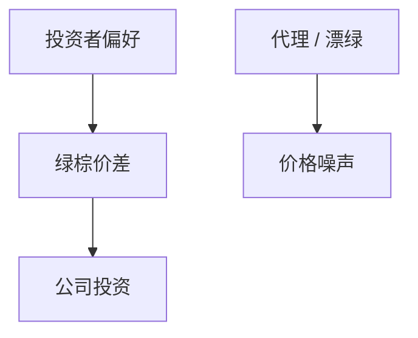

# ESG 理论

若一部分投资者对绿色或社会属性有偏好，资产价格可以含非金钱收益；这不等于「ESG 提高了所有人的 $\alpha$」。

<footer>—— 对照 Pástor, Stambaugh and Taylor 的可持续投资均衡；Oehmke and Opp 对公司激励</footer>

[上一课](/econ/cash-holdings)把现金当治理与摩擦下的存量。缺口是目标函数本身：股东是否只最大化财务价值。本课钉 ESG 作为偏好与约束，家族企业下一课才讲控制权结构。不把量化栏的 ESG 因子辩论再写一遍，只给公司金融一侧的均衡语言。

## 问题

Hart–Zingales：若股东在商品市场也有社会偏好，最大化利润不必是一致的目标。Pástor–Stambaugh–Taylor：绿资产被偏好持有，预期金钱回报可以更低（持有人消费了「温暖」）。若把 ESG 写成无成本的 alpha，会与「谁在出钱买偏好」矛盾。缺口是分清偏好、风险管理、与代理（经理用 ESG 掩盖绩效）。

Friedman 的股东价值是基准对照，不是本课要重判的道德。Hong and Kacperczyk 的罪股溢价是价格含义的早期证据线。

## 方法

两块：偏好（效用含 $E,S,G$ 属性）与生产（减排成本、诉讼）。均衡：绿资本成本下降，棕资本成本上升，激励真实投资直到边际成本等于价差。约束型 ESG（排除）改变风险分担，可能提高被排除资产的预期回报。治理：披露与评级是噪声信号，评级分歧本身是识别问题（后课实证识别）。

## 机制

价差是偏好强度 × 资本供给弹性。若绿技术供给很快，价差消失，金钱 alpha 也消失——这是成功，不是因子失效。漂绿使信号与真实 $E$ 脱钩，价差变成营销均衡。

## 边界

本课不评估某评级商。量化课的 ESG 因子是收益侧；这里是目标与资本成本。下一课金字塔控股是另一类「谁的偏好进目标函数」。

## 小结

- ESG 首先改变谁的偏好进入目标，其次才可能改变 alpha。
- 绿资本成本下降是机制，不是免费午餐。
- 出处：Pástor–Stambaugh–Taylor；Hart–Zingales；Hong–Kacperczyk 罪股。
