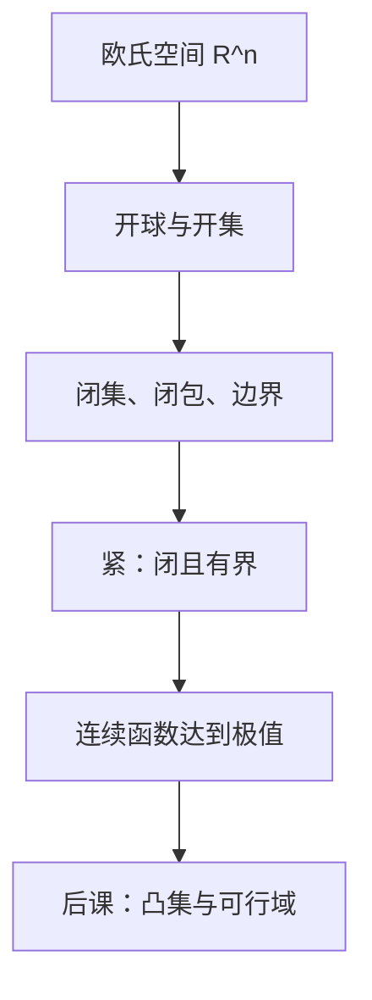

# 欧氏空间与开集

消费束、价格、资本存量都先是 $\mathbb{R}^n$ 里的点；「附近」必须先写成开球，连续与紧才能开口。

<footer>—— 据 Rudin, Principles of Mathematical Analysis, 第 2 章；Ok, Real Analysis with Economic Applications, 2011 整理</footer>

本课是金融栏第一课，也是「数学与优化基础」的第一课。后面的凸集、分离、KKT、不动点、贝尔曼与条件期望，以及微观主干的连续偏好与闭预算，都默认已经会在 $\mathbb{R}^n$ 里说开集、闭集、收敛与紧。后课默认已经读完本课。不要从偏好或效用起笔：排序还没出场，舞台是空间。

## 问题

一个消费计划是 $n$ 个非负数，一个价格是 $n$ 个正数，一个宏观状态可以是资本与生产率的一对。它们都是向量。若只把向量当成「一列数字」，「价格微调时需求怎么变」「最优是否存在」没有共同语言：前者要连续映射，后者要闭集上的极值。两者都依赖**开集**。

$U\subset\mathbb{R}^n$ 为开集，若每个 $x\in U$ 都有 $\varepsilon\gt 0$ 使开球 $B_\varepsilon(x)=\{y:\|y-x\|\lt \varepsilon\}$ 仍在 $U$ 内。闭集是开集的补。内部、边界、闭包由开集生成：$\operatorname{int} A$ 是含于 $A$ 的最大开集，$\bar A$ 是含 $A$ 的最小闭集，$\partial A=\bar A\setminus\operatorname{int} A$。序列 $x_k\to x$ 当且仅当每个含 $x$ 的开集最终吞掉整个尾段。

### 开不是「可以买到」

数学开集只谈邻域。预算 $\{x:p\cdot x\le w\}$ 作为制度约束可以很「开」——你能买附近的束——但它是闭半空间：边界上的花光预算点属于集合。不要把开集读成可达，也不要把闭集读成禁止。后课[预算集与马歇尔需求](/econ/marshallian-demand)会用闭性保证极限仍可行；本课只把词汇钉死。

本课只取 $\mathbb{R}^n$ 的欧氏拓扑。无穷维商品空间、弱* 拓扑不在主干。换拓扑时邻域会变，「开集决定收敛」这条骨架不变。

## 方法

欧氏范数 $\|x\|=(\sum_i x_i^2)^{1/2}$ 给出度量 $d(x,y)=\|x-y\|$。所有范数在有限维等价：开集族相同，连续性不依赖于你用 $\ell_2$ 还是 $\ell_\infty$。这是后课敢直接写 $x_k\to x$ 而不声明范数的原因。

紧集：每个开覆盖有有限子覆盖。在 $\mathbb{R}^n$ 里，Heine–Borel 说紧 $\Leftrightarrow$ 闭且有界。Weierstrass：连续实函数在非空紧集上达到最大与最小。价格 $p\gg 0$ 时，预算与 $\mathbb{R}_+^n$ 的交可以紧化——有界来自 $x_i\le w/p_i$，闭来自闭半空间与闭象限的交。没有紧，后课「最优非空」缺舞台。

连续映射 $f:X\to Y$：开集的原像是开集；等价于保序列极限。后课把偏好的上优集写成闭集，就是在用这套语言，不在本课引入 $\succsim$。

## 机制

非负象限 $\mathbb{R}_+^n$ 是闭集：非负序列的极限仍非负。开正象限 $\mathbb{R}_{++}^n$ 是开集，内部点可以沿坐标微移仍保持严格为正。后课若写 $p\gg 0$，是在开正象限里说话，才能用 $w/p_i$ 给出预算的界。

收敛把「附近」操作化。需求对价格连续，意思是 $p_k\to p$ 时 $x(p_k)\to x(p)$。对应（集值）的上半连续要把开集换成「不含极限点的开集最终也不含尾段」，那是[上半连续对应](/econ/uhc-correspondence)的缺口；本课只准备单值连续。

边界点是麻烦的几何位置：每个邻域既碰集合内又碰集合外。角点解、互补松弛，后课都会落在边界上。

## 边界

本课不讲一般拓扑空间，不证 Tychonoff，不把度量空间的完备性铺成教材。完备会在[压缩映射](/econ/contraction-mapping)里以 Banach 空间的形式回来，那时默认 $\mathbb{R}^n$ 已经完备。排序、效用、需求都还没有对象。下一课只问：哪些子集允许「平均仍在里面」。

后课默认：对象住在 $\mathbb{R}^n$；开、闭、内部、紧、序列收敛按本课使用。

## 小结

- 金融栏从 $\mathbb{R}^n$ 的开集起笔；「附近」是开球，不是直觉。
- 闭集含极限；紧在有限维等于闭且有界，给 Weierstrass。
- 连续映射保极限；后课的连续偏好与连续需求都靠它。
- 开集不是制度可达，闭预算仍可购买边界点。
- 下一课：[凸集与凸组合](/econ/convex-set-combo)。
- 出处：Rudin, *Principles of Mathematical Analysis*；Ok, *Real Analysis with Economic Applications*。
