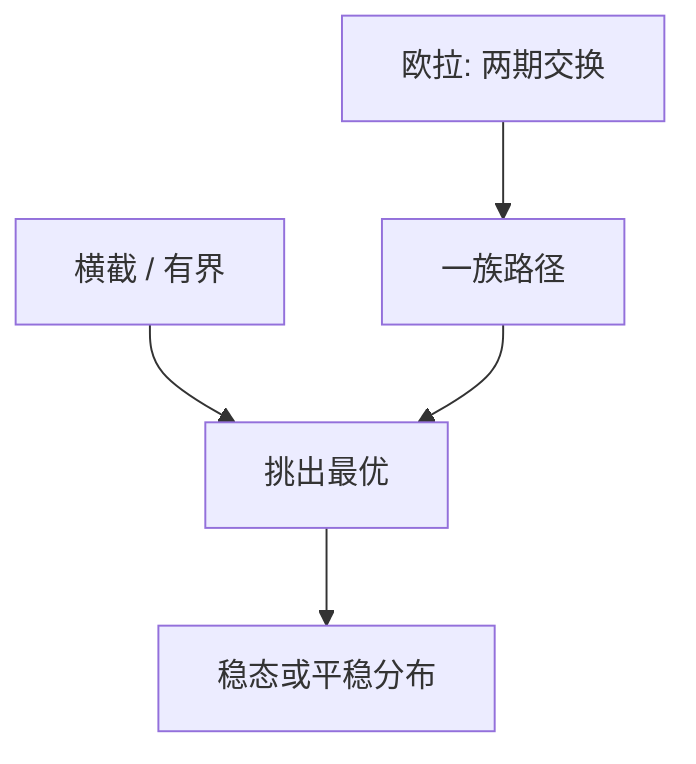

# 欧拉方程与横截条件

欧拉管相邻两期的交换；横截管「无穷远的资本不值钱」。少一条，庞氏或爆炸路径会混进一阶条件。

<footer>—— Ramsey, A Mathematical Theory of Saving, Economic Journal 1928；Stokey and Lucas, Recursive Methods, 第 4 章；对照 Weitzman 对横截的讨论</footer>

[上一课](/econ/vfi-pi)用迭代算出 $V$ 与 $g$。许多宏观模型并不显式存 $V$，而是写欧拉再拼一个边界。本课缺口是：**欧拉不是全部一阶条件**。内部解的相邻交换加上横截（TVC），才对应最优路径。不重做网格算法。

## 问题

包络把 $V'(k)$ 换成 $u'(c)$，相邻两期给出

$$
u'(c_t)=\beta\mathrm{E}_t\bigl[u'(c_{t+1})(1+r_{t+1})\bigr].
$$

这与 [跨期欧拉](/econ/consumption-euler) 同一条，只是现在 $r$ 可以是资本边际产出。序列问题还有「不要在无穷远处留下正值资本」：典型 TVC 为 $\lim_{t\to\infty}\mathrm{E}[\beta^t u'(c_t)k_{t+1}]=0$。欧拉加上资本积累，通解常含爆炸项；TVC 把它关掉，留下稳定流形上的路径。缺口是钉这条分工，而不是再推一次边际效用比。

确定性 Ramsey 的横截与横截条件在无限期规划里几乎等价于「影子价格与存量的积贴现后趋于零」。理性泡沫课已经从资产价格写过爆炸解；这里是实物资本的同一逻辑。

## 方法

内部解：对 $k_{t+1}$ 变分，得到欧拉。约束解：欧拉变不等式，与 KKT 乘子一起。TVC 不能从有限期的终端条件 $k_{T+1}=0$ 直接「令 $T\to\infty$」而不加正则——存在反例使欧拉路径满足极限形式却非最优。实践中：线性化后丢掉不稳定根，等于强加有界性，常与 TVC 对齐。随机情形写期望形式。政府债务的横截下一单元才接到可持续性，本课先用私人资本。

与贝尔曼的对齐：最优政策自动满足欧拉（内部）与 TVC（正则下）。从欧拉反推 $V$ 不是本课任务；从欧拉求解路径是后课线性化与扰动的入口。

## 机制

机制是变分只比较「挪一单位到下一期」。无穷远的挪动不在相邻比较里，必须另加。庞氏：永远滚债务、永远不还，可以满足一期一期的欧拉，却把资源从无穷远偷到今天。TVC 禁止这种偷。资产定价里排除泡沫，宏观里排除爆炸资本，是同一个「影子价格乘存量要贴现掉」的要求。

代表性个体完全市场下，加总欧拉即总量欧拉。异质加约束时，欧拉只在不受约束的人身上成立，加总不再是单一 $u'(C)$——那是 HANK 的缺口，本课先把代表性内部解写清。

Cass–Koopmans 与 Ramsey 计划者：欧拉给出 $c$ 相对 $k$ 的斜率，TVC 加鞍点稳定给出从 $k_0$ 出发的唯一正向路径。Blanchard–Kahn 是这条几何的线性随机版。

## 边界

本课不线性化、不谈根的计数。也不把 TVC 写成「债务必须还清」的道德：它是最优性条件，开放经济与Overlapping generations 里可以有不同的可行庞氏区，后课主权债再碰。连续时间对应 $\lim e^{-\rho t}u'(c)k=0$，不重推。

后课默认：内部路径 = 欧拉 + 横截/有界；约束路径另标乘子。下一课把非线性欧拉收成对数线性，为 BK 准备方程组。

## 小结

- 欧拉刻画相邻交换；横截关掉爆炸与庞氏。
- 有界性在线性系统里常替代显式 TVC。
- 值函数方法隐含这两条；方程方法必须分开写。
- 出处：Ramsey 1928；Stokey and Lucas with Prescott 1989。
