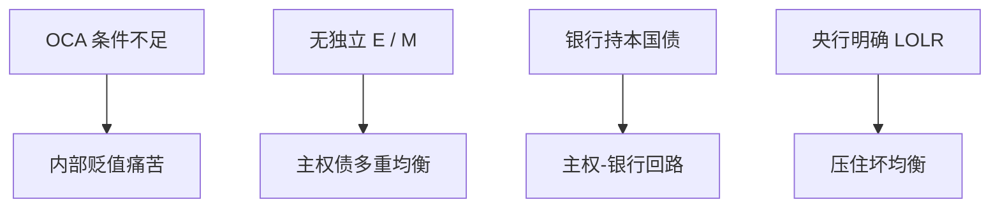

# 欧元区危机

没有独立汇率、没有各自的最后贷款人时，主权债可以有多重均衡：利率升验证不可持续。这是第二代加第三代，发生在 Mundell 的同盟里，而不是拉美钉住。

<footer>—— De Grauwe 欧元区作为非最优货币区的脆弱性；Lane 欧元区危机综述；Shambaugh 同盟内突然停止</footer>

[上一课](/econ/sovereign-wealth-funds)写债权国官方组合。本课换债务国在货币同盟内：欧元区危机。美元互换线下一课写国际美元流动性。主干[货币同盟](/econ/monetary-union)与[原罪](/econ/original-sin)已经给零件；本课钉 2010–12 的机制，不编年。

## 问题

成员国无独立 $E$、无独立 $M$，主权债以共同货币发行，但没有共同财政、危机前没有明确的央行购债承诺。De Grauwe：这使主权像新兴市场——可能失去市场准入——即使没有原罪意义上的外币债（债是欧元，居民收入也是欧元，但国家不能印）。多重均衡：高利率使债务路径不可持续，预言自我实现。希腊财政基本面差（第一代味道），西班牙、爱尔兰是私人杠杆与银行（第三代），主权–银行回路把两边锁死。缺口不是再讲 OCA 清单，而是：同盟把贬值工具拿走之后，突然停止发生在主权债市场。

TARGET2 余额是支付系统里的官方替代流，危机时边缘国央行负债升。它是症状与缓冲，不是原因本身。

## 方法

对照三角：同盟是「开放 + 钉死 $E$」的极限，独立货币已交。调整靠内部贬值（工资物价）、要素流动、或财政转移——OCA 说后两样要够。危机显示不够时，剩下的是违约、援助、或央行当最后贷款人（OMT、「whatever it takes」）。银行：本国主权债集中持有，主权毛利率升摧毁银行资本，银行紧缩摧毁财政——回路。

与三代：灰色区 + 净值（银行）+ 部分财政算术。突然停止在资本账户开放的同盟内以「停止买边缘国债」的形式出现。

## 机制

机制是缺失的最后贷款人与缺失的内部调整工具。金本位类比常被提起：固定平价、黄金约束、内部通缩。欧元把平价永久化。承诺购债把坏均衡拿掉（第二代政策），不自动修银行与财政（第三代零件仍要重组、联盟）。劳动流动与工资弹性不够时，失业集中在边缘——Mundell 1961 的预言，不是事后诸葛亮。

与全球失衡：欧元区内部经常账户（德顺差、南逆差）是同盟内的「失衡」，没有各自 $E$ 来调 $q$，只能调相对成本。贸易课的 SS 在这里是北南工资与失业，不是两国货币。

Lane：危机前是私人资本流，不是财政为主（希腊除外）。把所有边缘都写成「财政挥霍」会误导西班牙、爱尔兰。

## 边界

本课不预测某国利差。不写具体援助条件清单。下一课美元互换线：欧元区银行的美元融资是另一条腿，2011–12 与 2008 一样要美联储流动性。不要把本课写成反欧元政论；OCA 是条件，条件可以内生改善（Frankel–Rose），危机说明事前不够。量化栏主权 CDS 不在此重做。

后课默认：货币同盟内主权可有多重均衡，因无独立印钞与汇率；银行回路是第三代。LOLR 承诺改均衡集合。内部失衡要相对成本调整。美元流动性下一课。

## 小结

- 同盟拿走 $E$ 与各自 $M$，主权债可有自我实现的停止。
- 希腊偏财政；爱西偏私人杠杆与银行；回路锁死。
- OCA 流动与转移不足时，调整是失业。
- 央行明确 LOLR 压坏均衡；结构零件仍要修。
- 出处：De Grauwe；Lane；Shambaugh；Mundell 1961 对照。
