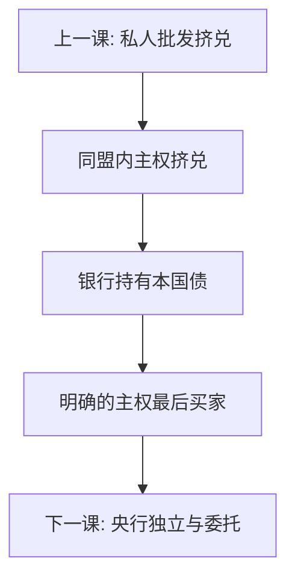

# 欧债危机

货币同盟拿走汇率与本国最后贷款人，主权债可以有多重均衡：利差升则路径不可持续。银行持有本国债，把主权挤兑写成银行资本空洞，再写回紧缩。

<footer>—— De Grauwe 欧元区脆弱性；Lane 欧元区危机综述；Shambaugh；对照主干课欧元区危机与 OMT；Eichengreen</footer>

[上一课](/econ/gfc-shadow-banking)的挤兑对象是私人批发债。本课缺口是 2010–12：挤兑对象换成同盟内主权债。主干[欧元区危机](/econ/eurozone-crisis)已写无独立 $E$、无独立 $M$、无共同财政。经济史对照课把它放进序列：金本位是金属枷锁，东亚是原罪，2008 是影子链，欧债是**共享货币但不共享主权预算**。希腊有财政第一代味道，西班牙、爱尔兰是私人杠杆经银行变成主权——不要写成「南欧懒惰」。后课用央行独立性收束整条史。

## 问题

成员国发欧元债，收入也是欧元，却不能印欧元。De Grauwe：这使发达经济体的主权行为像新兴市场，可能失去市场准入。多重均衡：高利率验证不可持续。银行持有本国主权，利差升摧毁资本，信用紧缩摧毁财政，回路锁死。缺口不是再列 OCA 清单，而是：**2008 的银行资本空洞在同盟里变成主权利差，因为缺一个对主权的明确最后买家。** OMT 与「whatever it takes」把这一支补上，利差压缩——这是机制证据，不是名人名言。

TARGET2 余额是支付系统里的官方替代流，症状兼缓冲，不是原因本身。

### 欧债不是「南欧懒」

单位劳动成本与财政纪律的差异是事前漏洞，解释不了利差在几周内的非线性跳升，也解释不了为何爱尔兰、西班牙在危机前财政数字并不像希腊。懒惰叙事会漏掉银行–主权回路与同盟设计。紧缩的乘数在利差高企时更差，主权课与乘数课已经给语言：巩固可能抬高 $b$ 的分子分母比。

Lane 的综述把跨境资本流、银行杠杆与突然停止放在欧元区内部。这是第三代在货币同盟里的版本：错配不一定是外币，可以是「不能印的本币」。

## 方法

对照四次危机。(1) 金本位：保平价必须紧缩。(2) 东亚：保钉住与救美元债不能兼得。(3) 2008：救影子链需要印中心货币。(4) 欧债：救主权需要一个能印欧元的机构明确承诺。政策实验是 OMT：承诺改变均衡选择，不一定要实际买完。财政联盟、银行联盟是把担保从国家挪到同盟，减少回路。希腊式财政漏洞与爱尔兰式银行漏洞可以共存于同一利差跳升，识别要分两层冲击，不能用一个道德残差吸收。

不要用债务/GDP 排序当危机预测：意大利 $b$ 高但回路与市场深度不同。阈值课已经警告过。救助贷款若附加过急的名义紧缩，乘数在利差高企时把分母打穿，$b$ 短期上升，市场读成承诺失败——乘数课与可持续课在同盟里叠在同一张表上。OMT 是切换均衡的句子，不是财政转移的替代，也不能替代银行联盟的硬约束。

## 机制

机制是货币主权缺失下的多重均衡。金本位下黄金是硬约束；欧元下规则与政治是软约束，直到被市场测试。银行监管允许主权债零风险权重，把回路写进制度。与地方财政软约束对照：成员国预期「同盟会救」，事前杠杆；不救则均衡跳到坏的一侧。OMT 把救助写成有条件的货币承诺，边界立刻变成独立性问题——下一课。

2008 互换线救的是美元腿；OMT 救的是欧元主权腿。欧洲银行可以两条腿同时瘸，国际金融课已分开写。内部贬值（工资物价）是 OCA 留下的调整阀，速度慢于名义汇率，于是失业承担了本该由 $E$ 承担的一截——这是同盟相对东亚钉住的额外刚性，不是文化。

Shambaugh 把危机写成同盟内突然停止。突然停止文献从新兴市场迁到欧元区，关键迁移是「本币不能印」。

## 边界

本课不重写主干欧元区危机的全部 TARGET2 会计，不提供主权债交易步骤。救助条件的法律文本不是机制核。经济史倒数第二课到此：下一部把独立央行如何从这些危机里长出来，以及独立与最后贷款人如何互相限制。后课默认：欧债用同盟设计 × 银行回路 × 多重均衡读；禁止文化懒惰论当主因果。量化栏的主权 CDS 基差是价格症状，本课不搬定价公式，以免吞并微观结构。

## 小结

- 共享货币、不共享财政，使主权可被挤兑。
- 银行持有本国债，把利差写成资本与紧缩回路。
- OMT 类承诺切换均衡，是机制证据。
- 与金本位、东亚、2008 对照的是约束形态，不是道德。
- 内部贬值慢于名义汇率，失业承担了本该由 $E$ 承担的调整。
- 出处：De Grauwe；Lane；Shambaugh；主干欧元区危机课。
