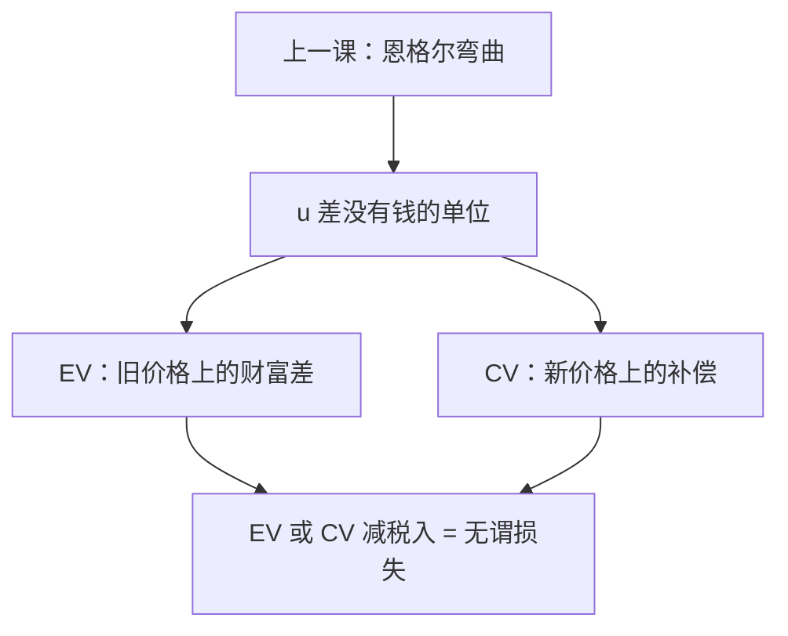

# 等价变化与补偿变化

价格变了，效用的差没有单位。Hicks 用支出函数把同一变化收成两笔钱：按旧价格算的等价，与按新价格算的补偿。

<footer>—— 据 Hicks, Value and Capital, 1939；Varian, Microeconomic Analysis 整理</footer>

[上一课](/econ/engel-curves)把财富路径收成恩格尔曲线，并标明收入弹性决定份额如何随 $w$ 走。本课不重画 IEP，也不把 Engel 定律再写一遍。缺口是：价格变动的福利不能用「买了多少」或恩格尔斜率来读。效用是序数，$u_1-u_0$ 没有钱的单位。必须用支出函数把变化收成货币度量：等价变化（EV）与补偿变化（CV）。后课无谓损失的严格写法，就是这两笔钱减税收人。

## 问题

价格从 $p^0$ 变到 $p^1$，财富 $w$ 不变，效用从 $u^0=v(p^0,w)$ 到 $u^1=v(p^1,w)$。马歇尔剩余积分 $\int x_i\,\mathrm{d}p_i$ 路径依赖，且混进收入效应——上一课的恩格尔弯曲正是这笔污染。缺口不是再估一条需求，而是两句定义：

EV：在**旧**价格下，多少财富变化与这次价格变动等价。$v(p^0,w-\mathrm{EV})=v(p^1,w)$，即

$$
\mathrm{EV}=e(p^0,u^0)-e(p^0,u^1)=w-e(p^0,u^1).
$$

CV：在**新**价格下，多少补偿能回到旧效用。$v(p^1,w+\mathrm{CV})=v(p^0,w)$，即

$$
\mathrm{CV}=e(p^1,u^0)-e(p^1,u^1)=e(p^1,u^0)-w.
$$

涨价伤害时，两笔都为正的「愿意支付 / 需要补偿」口径；符号约定随课本，本课以支出差为准，不靠口头「正负」。

### 马歇尔三角夹在两者之间

希克斯需求积分给出 CV 或 EV（视积分上下限用 $u^0$ 还是 $u^1$）。马歇尔需求积分夹在中间，当且仅当收入效应为零时三者重合。恩格尔若是水平（拟线性非计价物），夹缝消失。上一课弯曲的恩格尔，正是 EV、CV、马歇尔剩余分道的几何。

正常品涨价：要维持旧效用，新价格下需要的补偿（CV）大于在旧价格下愿意放弃的等价（EV 的伤害口径）。劣等则相反。夹缝的方向读的是恩格尔斜率。

## 方法

工具就是已经有的 $e$ 与 $h$。单价格变动时，

$$
\mathrm{CV}=\int_{p_i^0}^{p_i^1}h_i(p,u^0)\,\mathrm{d}p_i,\qquad
\mathrm{EV}=\int_{p_i^0}^{p_i^1}h_i(p,u^1)\,\mathrm{d}p_i
$$

（其余价格钉住；符号随涨跌）。多价格时路径无关，正因为[斯勒茨基矩阵对称](/econ/slutsky-symmetry)。用马歇尔 $x_i$ 积分则路径有关，不能当福利。

税收：消费者面对 $p+t$，EV（或 CV）是税的货币负担；国库收到 $t\cdot x$。二者之差是无谓损失。小税、收入效应可忽略时，Harberger 三角形逼近这个差。本课只钉身份，测量留给后课。

本课不引入等效收入的人际加总。Gorman 不成立时，把各人 EV 相加没有代表消费者。也不把 EV 写成限价簿上的成交剩余。

## 机制

为什么要两笔：旧价格与新价格是两套尺子。EV 问「这件事相当于在今天的价格里穷了多少」；CV 问「若价格已经变了，要补回多少才能回到昨天的无差异面」。恩格尔弯曲意味着同一效用差在两套尺子上的钱不同——正常品在高价格下更「贵」地买回效用。拟线性把收入效应关掉，两把尺子重合，马歇尔剩余合法。

与需求定律的分工：吉芬、劣等管的是数量比较静态；EV/CV 管的是同一变动的**钱**。数量向上倾斜不阻止 CV 可算：希克斯需求仍向下，积分仍有定义。福利用 $h$，不用马歇尔 $x$。

Hicks 的补偿是效用补偿，不是斯勒茨基的「原束仍买得起」。一阶上二者相同；有限变化必须用 $e$，否则原束补偿有一阶误差。

## 边界

角点、不可微处用支出函数的差，不必走积分。数量配额、新品引入，$e$ 仍定义，马歇尔曲线可能不存在。等价收入只在确定消费上；风险下要用期望支出或确定等价，那是不确定课序，本课不预支。

也不要把 EV 当「愿意支付」的问卷调查结果。显示偏好恢复的是序数 $u$，货币度量还要选定参考价格。参考价格一换，EV 与 CV 对调角色。

后课默认：价格变动的货币福利是 EV 或 CV，不是马歇尔面积；二者在零收入效应时重合。无谓损失是这笔钱减去转移，不是另起一种剩余。

## 小结

- EV 用旧价格的支出差，CV 用新价格的支出差；效用差本身没有单位。
- 马歇尔剩余夹在两者之间；恩格尔弯曲则分道，拟线性则重合。
- 税的 DWL 是 EV 或 CV 减去国库收入。
- 积分路径无关靠 $S$ 对称；不要用马歇尔导数做福利积分。
- 出处：Hicks, *Value and Capital*, 1939；Varian, *Microeconomic Analysis*。
