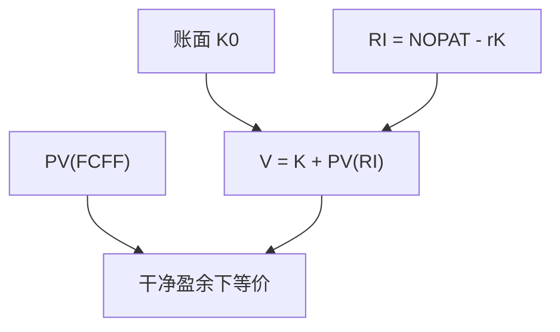

# EVA 与剩余收益

    
剩余收益把会计账面改写成「超过资本成本的利润」；在干净盈余下，其现值加上账面等于自由现金流折现，不是另一套企业价值。

    <footer>—— 据 Edwards and Bell, The Theory and Measurement of Business Income, 1961；Ohlson, Earnings, Book Values, and Dividends in Equity Valuation, Contemporary Accounting Research 1995；Stern Stewart 的 EVA 操作定义 整理</footer>

[上一课](/econ/multiples-valuation)把倍数当成 DCF 的简写。本课缺口是会计路径：剩余收益（RI）与经济增加值（EVA）如何与 FCFF 折现等价，从而把「增长是否创造价值」写成每期的 $(\mathrm{ROIC}-r)\times$ 资本。不重做倍数选可比，不把绩效薪酬提前写成治理单元。

## 问题

DCF 的终值对 $g$ 敏感，因为早期 FCF 常为负（再投资）。账面已经记录了累计投资。剩余收益 $RI_t=\mathrm{NOPAT}_t-r\times K_{t-1}$，企业价值

$$
V_0=K_0+\sum_t\frac{RI_t}{(1+r)^t}
$$

在干净盈余（账面变动 = 盈余 − 净股利/净支付）下与 DCF 等价。Ohlson（1995）在线性信息动态下给出权益口径的解析形式。Stern Stewart 把税后经营利润减资本费用标成 EVA，用作内部绩效。缺口是：资本预算可以用 RI 把价值创造从「遥远的正 FCF」前移到每期是否赚过 WACC，而不是再发明一个接受规则。

等价不是「EVA 更真」。会计折旧快，早期 RI 低、后期高，现值仍应等于 DCF。操纵折旧可以改各期 EVA，改不了在干净盈余下的总值——除非同时改了现金流。

## 方法

资本 $K$ 用净经营资产（与 FCFF 课一致），$r$ 用 $r_U$ 或 WACC（与杠杆口径一致）。接受项目：投入 $\Delta K$，未来 RI 现值大于零，即 NPV>0。内部考核若按单期 EVA，会惩罚回收期长、早期折旧重的好项目——这是 IRR 陷阱的会计版：把跨期可加的现值切成可能误导的单期比率。

Ohlson：若剩余收益服从自回归，价值是账面加 RI 的资本化，参数由持续性决定。超额 ROIC 的持续性，就是上一课终值里「壁垒多久」的会计语言。

Brealey–Myers 对 EVA 的态度：作为向经理解释「资本不是免费」的语言有用；作为与 DCF 竞争的估值方法，没有新信息。本课采用这句，并把 Ohlson 当作会计理论的许可证，而不是咨询产品说明。

## 机制

机制是会计恒等式。FCFF = NOPAT − $\Delta K$；代入 $V=\mathrm{PV}(\mathrm{FCFF})$ 并利用 $K_t=K_{t-1}+\Delta K_t$，代数上得到 $V=K_0+\mathrm{PV}(RI)$。所以「EVA 估值」若用同一 $K$、同一 $r$、同一 NOPAT，必然还原 DCF。差异只来自：用错资本（漏表外）、用错 $r$、或不干净盈余。

与倍数：P/B = $1+\mathrm{PV}(RI)/K$。高 P/B 是高剩余收益的资本化，不是「市场喜欢账面」。上一课的 EV/EBIT 高，对应高 ROIC 或低 $r$ 或高增长；RI 路径把这三条拆开。

### 单期 EVA 不是 NPV

经理任期短时，会砍研发、少提存货准备，做高当期 EVA，损害 $V$。这是治理课薪酬的对象。资本预算仍用现值。Tirole：可验证的会计信号会被操纵；合同应意识到度量与价值的错位。

Edwards–Bell 早已把经济利润与会计利润的差写成资本费用。Ohlson 把它接到权益定价。Stern Stewart 是商标化的操作包（若干会计调整）。本课用剩余收益理论，不把商标当文献。

## 边界

不要用 EVA 替代 APV 去处理复杂债务路径：资本费用用 WACC 时，仍要求稳定结构。也不要把剩余收益模型写成已经识别了错误定价——那是后课实证识别与量化栏。本单元仍在「把项目折成今天的钱」。

后课默认：干净盈余下 RI 与 DCF 等价；单期 EVA 可误导。下一课：当「现在不投」本身有价值时，DCF/RI 的马歇尔触发不够，要实物期权估值。

## 小结

- 剩余收益现值加账面 = DCF（干净盈余）；EVA 是同一资本费用语言。
- 单期 EVA 会惩罚长周期项目、并被会计选择扭曲；接受规则仍是 NPV。
- 超额 ROIC 的持续性 = 终值壁垒的会计写法。
- 出处：Edwards and Bell 1961；Ohlson, *CAR* 1995；Brealey, Myers and Allen。
