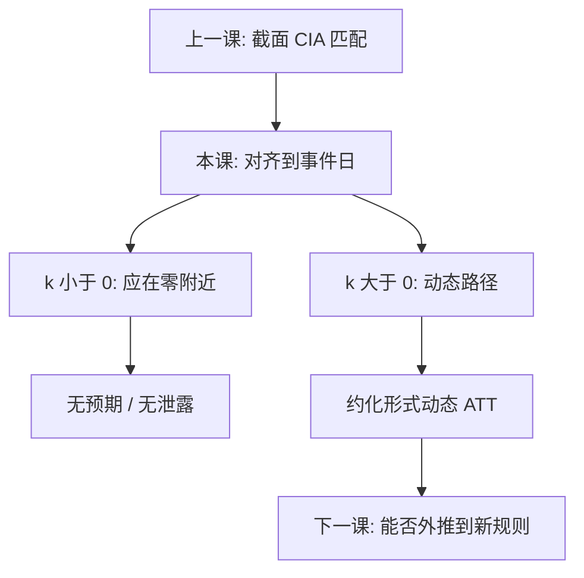

# 事件研究

把日历对齐到事件日，估计的是一条相对路径：前期该在零附近，后期才是动态效应。路径能画出来，不等于反事实已经被识别。

<footer>—— MacKinlay, Event Studies in Economics and Finance, Journal of Economic Literature 1997；对照 Angrist and Pischke；Sun and Abraham 对交错采纳事件系数的分解</footer>

[上一课](/econ/matching-propensity)在可观测 $X$ 上重建截面对照：CIA 加重叠，给出支撑上的 ATT。本课不重估倾向得分，也不把平衡表再做一遍。缺口是时间锚定：政策、判决或公告落在已知日期，能否用事件前后的窗口读「异常路径」？匹配回答谁和谁比；事件研究回答相对 $t=0$ 哪一段动了。后课[结构对约化形式](/econ/structural-vs-reduced)会问这条路径能不能外推到从未发生的规则；本课先钉约化形式事件系数本身要什么。

## 问题

相对事件日 $k$，常见回归是

$$
Y_{it}=\alpha_i+\lambda_t+\sum_{k\neq -1}\beta_k\mathbf{1}\{t=e_i+k\}+\varepsilon_{it},
$$

省略 $k=-1$ 作参照。$\beta_k$ 是「相对事件前一期」的平均差。要把它读成动态处理效应，至少要：无预期（$k\lt 0$ 时 $\beta_k\approx 0$）、窗口内无重叠混淆事件、处理时点不是结果自己选出来的。匹配的 CIA 是截面选择；这里的平行趋势是**反事实 $Y(0)$ 在事件对齐后仍与对照同走**。预趋势可以证伪，不能证实——与 DiD 同一句，只是展示改成路径。

金融传统里，MacKinlay 的异常收益 $AR_{it}=R_{it}-\mathbb{E}[R_{it}\mid\mathcal{I}_{t-1}]$，CAR 是窗口求和。信息含量检验问的是公告是否未预期；政策事件研究问的是干预的动态 ATT。同名，对象不同，识别句却共用「预期与混淆」。

### 前期系数为零不是识别证明

把事件图上 $k\lt 0$ 的置信区间盖住零，写成「所以平行趋势成立」，是把必要诊断当成充分条件。检验功效可以很低；预期若刚好在 $k=-1$ 才进入，参照期本身已污染。金融里提前泄露会把效应提前打进价格，政策里会把行为提前打进 $Y$——前期不零，往往是设计坏了，不是「还有一个负效应」。

资产定价的事件研究用市场模型估预期收益；劳动与公共财政用 TWFE 事件虚拟变量。本课两种都点，后文默认政策路径，金融 CAR 只作对照，不进限价簿。

## 方法

金融：估计窗拟合市场模型，事件窗算 $AR$/$CAR$，横截面或时间聚类 SE。政策：两期两组时事件系数退回 DiD；交错采纳下，Sun–Abraham 等指出 TWFE 的 $\beta_k$ 可能是已被处理队列对尚未处理队列的污染加权。干净做法是队列特定路径或填补估计量——细节在交错 DiD 课，本课只禁止把一张 TWFE 事件图当成无污染 ATT。推断：冲击在企业则企业聚类；州政策则州聚类，接住[聚类标准误](/econ/clustered-se)。

重叠窗口：同一单位多次事件，要把日历排开或只留首次。坏控制：不要把事件后才实现的中介放进回归右侧。

## 机制

力量在对齐：把异质日历收成相对时间，让「处理前」成为可画的对照。弱点也在对齐：预期把 $t=0$ 提前，路径的零点就不是政策日。Bunching、立法通过日与生效日分离，都是同一机制的变体。匹配丢掉无法配对的单位；事件研究丢掉无法对齐的日历——都是用内部有效换样本。

与合成控制：合成控制给**一个**处理单位一条反事实路径；事件研究给**许多**单位一条平均路径。前者怕凸包外推，后者怕污染加权与预期。不要把两种图叠成「所以因果已经齐了」。

MacKinlay 1997 把金融事件研究收成估计窗、事件窗、原假设（均值 AR 为零）。政策文献把同一时间结构接到潜在结果：$\beta_k=\mathbb{E}[Y(1)-Y(0)\mid k]$ 只在上述假设下成立。

## 边界

本课不把 BLP、动态博弈的反事实价格写成事件系数。事件路径是给定制度下的约化形式；「若禁止这种合并、税率改成从未出现的课表」是下一课结构问题。也不重写交错 DiD 的全部加权公式。量化栏并购套利用另一套公告窗，本课不搬交易规则。

后课默认：事件图是诊断加动态 ATT 的展示；前期系数是可证伪检查。读路径时声明参照期、聚类层级、以及是否交错污染。结构参数不要从 $\beta_k$ 里直接读出来。

## 小结

- 事件研究估相对 $t=0$ 的路径，不是自动的因果证明。
- 识别要无预期、无混淆、时点外生；预趋势可证伪不可证实。
- 金融 CAR 与政策动态 ATT 同名不同物，共享预期问题。
- 交错 TWFE 事件系数可能污染，不能当干净权重。
- 路径是约化形式；从未出现的规则交给结构课。
- 出处：MacKinlay, *JEL* 1997；Angrist and Pischke；Sun and Abraham。
