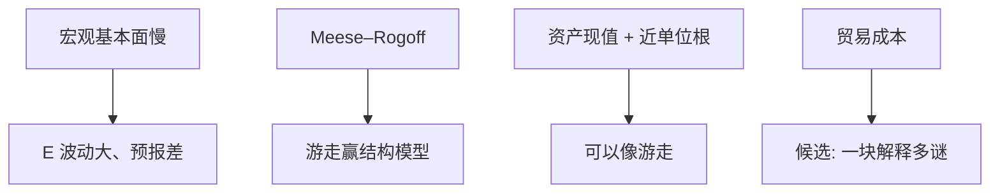

# 汇率脱节之谜

宏观基本面——货币、产出、利率——解释不了汇率的短期波动；随机游走往往胜过结构模型，这叫脱节，不是再估一条 PPP。

<footer>—— Meese and Rogoff, Empirical Exchange Rate Models of the Seventies, JIE 1983；Obstfeld and Rogoff, The Six Major Puzzles in International Macroeconomics, NBER Macro Annual 2000</footer>

[上一课](/econ/fx-intervention-reserves)把官方放进外汇市场。本课缺口是私人价格：名义与实际汇率与宏观变量短期几乎脱节。远期溢价下一课把资产平价的偏差写细。本课钉 Meese–Rogoff 与 Obstfeld–Rogoff 谜族，不重写[UIP](/econ/uip-and-cip) 定义，不进限价簿。

## 问题

Meese–Rogoff：用事后才知道的基本面代入 1970 年代结构模型，样本外汇预报仍打不赢随机游走。Obstfeld–Rogoff 六谜：主乡偏好、FH、PPP 偏离持久、Backus–Smith、汇率波动过大、以及贸易弹性。脱节是波动与预报：宏观慢、$E$ 快。缺口不是再讲超调代数——[Dornbusch](/econ/dornbusch-overshoot) 已经给粘性价格下的超调；谜是定量上 $E$ 比能合理化的基本面波动大得多，且预报无用。

Engel–West：若基本面近单位根、贴现因子近 1，汇率可以近似随机游走而仍是现值。脱节可以是「贴现的资产价格」，不必是非理性。定量是否够，仍争。

## 方法

预报评估用[DM](/econ/forecast-evaluation-dm)：结构模型 vs 游走，损失平方。样本外才算。微观结构（Evans–Lyons 订单流）解释高频，本栏不写簿，只标：高频与宏观脱节可以分层。贸易成本（Obstfeld–Rogoff 对六谜的候选）用分割货物市场解释 PPP 与波动，但是否一块石头打六鸟有争议。

与 CIP：脱节主要是浮动名义汇率相对宏观；CIP 是短端复制，危机后基差是中介约束，对象不同，见量化栏。

## 机制

机制是汇率作为资产价格：对未来 $m$、$y$、政策的预期贴现。噪声、学习、微观流动性可以加大短期波动。货物市场慢（PTM、发票货币）使 $q$ 持久偏离 PPP——主干[PPP](/econ/ppp-loop) 已有环。脱节强调：**即使**把这些写进模型，1970–80 年代的估计仍预报失败。后来的 Taylor 规则模型、贝叶斯 VAR 有时改善，但不取消谜的地位。

与干预：官方可以暂时压波动，解释不了十年级的脱节。与 Lucas 批判：结构模型用旧制度系数预报新政后的 $E$，失败可以是批判而不是「汇率不可建模」。

六谜不必有单一微观。主乡偏好与风险分担可以是市场不完全；FH 可以是跨期约束；脱节可以是贴现。Obstfeld–Rogoff 用贸易成本当候选统一，本课当菜单不是定论。

## 边界

本课不重做 1983 年的表。不把随机游走写成市场有效的证明——有效可以有风险溢价，溢价下一课。不要用高频订单流吞并宏观课。下一课远期溢价：UIP 回归的斜率之谜，是脱节家族里资产平价那一支。

后课默认：短期 $E$ 相对宏观脱节，游走是苛刻基准；现值逻辑可部分和解预报，定量仍紧。PPP 长期、脱节短期，分层。UIP 偏差下一课专写。

## 小结

- Meese–Rogoff：结构模型样本外打不赢游走。
- 脱节：宏观慢、汇率快；超调定性不够定量。
- 现值 + 持久基本面可以产生近游走。
- 六谜是一簇，贸易成本是候选不是判决。
- 出处：Meese and Rogoff, *JIE* 1983；Obstfeld and Rogoff, NBER Macro Annual 2000；Engel and West。
