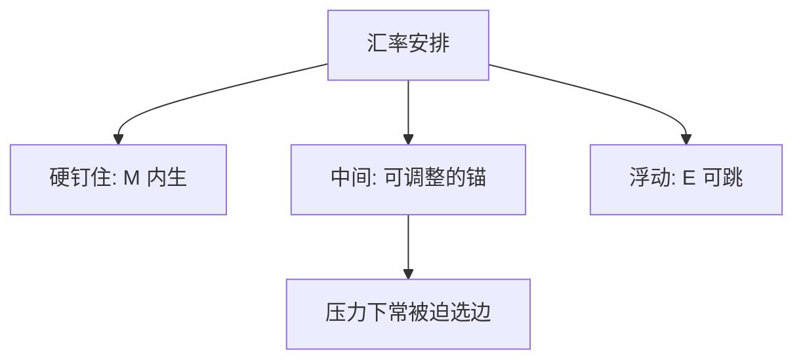

# 汇率制度

钉住承诺的是一个名义锚，不是一张永远不必调整的菜单；中间制度往往在压力下被迫走到两端。

<footer>—— 据 IMF 汇率安排分类；Obstfeld and Rogoff, The Mirage of Fixed Exchange Rates, Journal of Economic Perspectives, 1995</footer>

[上一课](/econ/dornbusch-overshoot)在浮动角上给出粘性物价下的超调。超调假定 $E$ 可以跳。本课缺口是制度菜单：钉住、浮动、以及夹在中间的管理安排，按什么口径分类，承诺在压力下为何像幻象。不重推 UIP 超调代数，不把某年的危机写成制度百科。

## 问题

蒙代尔已经把固定与浮动写成政策分叉：钉住则 $M$ 内生，浮动则 $E$ 承担调整。多恩布什补了浮动角的动态。缺口是：现实很少停在两个顶点。货币局、爬行钉住、汇率目标区、有管理浮动，名字很多。IMF 的 AREAER 用事实行为（de facto）校正法定声明（de jure）：宣布浮动却把 $E$ 钉在窄带里，分类跟行为走。

Obstfeld 与 Rogoff（1995）的缺口更硬：在资本流动下，软钉住难以同时保住储备与国内目标，中间制度是「幻象」——不是不能存在一年，而是危机时往往崩到硬钉或自由浮动。本课把菜单钉住，下一课才问货币同盟是不是硬钉住的极限。

de jure 是法律与公告；de facto 是汇率波动、储备变动与利率是否为守 $E$ 而动。三角约束的是同时可欲的目标，分类口径约束的是你实际上站在哪一条边。

## 方法

把安排收成三档，而不是一张邮票清单。硬钉住：货币局、美元化、法定货币同盟，本国失去独立 $M$。浮动：没有可保卫的中心平价，超调可以发生。中间：爬行、区间、管理浮动，保留一个可调整的锚。IMF 口径随年份改名，本课只取这三档精神。

可信钉住下 $\mathbb{E}\Delta e=0$，UIP 退化成 $i=i^*$，正是蒙代尔的固定角。不可信钉住把贬值预期写进利差，超调公式不再适用。CIP 仍是报价会计，见 `/quant/irp`；制度课不报基差。

### 中间不是第四个顶点

有管理浮动可以同时「有一点独立 $i$」和「有一点平滑 $E$」，代价是资本管制或储备波动，仍在三角内部折中。Obstfeld–Rogoff 说的幻象，是这种折中在完全流动下难以作为长期承诺。分类把折中标出来，不等于颁发第四个可同时满足的目标。

## 机制

机制是名义锚与储备。钉住把 $P$ 的趋势交给外国锚或商品锚，本国铸币税与最后贷款人空间变窄。浮动把锚留给本国货币规则，$q$ 的短波动由超调与风险溢价承担。中间试图用干预平滑 $q$，同时保留一点 $i$；一旦市场测试中心平价，储备或加息必须表态，承诺被揭穿。

卢卡斯批判：宣布的区间若只在平静时成立，预期会对准将被放弃的边。长期中性不因分类而消失：钉住进口外国 $\pi$，浮动则本国规则定 $\pi$。原罪使贬值变成净值税，于是许多国家更愿停在中间或硬钉——那是资产负债表对菜单的约束，不是弹性条件。

双极观点（中间难以持久）是 Obstfeld–Rogoff 一类的压力命题，不是 IMF 每年的分类表本身。分类描述行为；双极判断承诺。

## 边界

不要把制度写成福利排序。浮动的 $q$ 波动、钉住的输入通胀与突然贬值，要另评。也不要把外汇订单簿写成安排定义。下一课 [货币同盟](/econ/monetary-union)把硬钉住推到交出货币；再后课才把三选二收成不可能三角。

后课默认：安排按硬钉、中间、浮动三档读；de facto 可以揭穿 de jure。超调只活在浮动或突然放开的那一边。

CIP 与限价簿不在此重写。某国是否「真正浮动」是分类问题，不是 Fama 回归。

货币局把 $M$ 的发行纪律写进外汇准备，比软钉更硬，仍可退出。美元化连退出都更贵。分类把它们放进硬钉住，OCA 下一课才问「若干国家共用一种货币」是否比各自硬钉更划算。

储备变动是钉住的余量，不是独立的第四种制度。干预平滑 $E$ 而资本仍流动时，你已经在三角内部折中。

## 小结

- 汇率制度是名义锚与调整承担者的选择，不是邮票清单。
- IMF 口径用行为校正公告；中间安排在压力下常被迫选边。
- 超调需要 $E$ 可跳；可信钉住把 UIP 退化成 $i=i^*$。
- 硬钉住让 $M$ 内生；货币同盟下一课把硬钉住推到交出货币。
- CIP 与盘口不是分类口径；实证基差仍见 `/quant/irp`。
- de jure 可以撒谎；分类跟储备与利率是否为守 $E$ 而动。
- 出处：IMF 汇率安排分类；Obstfeld and Rogoff, *JEP* 1995。
