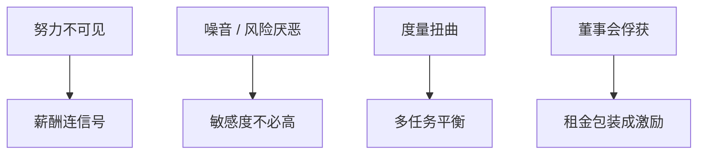

# 高管薪酬与激励

    
薪酬应让经理分担不可分散的企业风险，以换努力与少偷懒；可验证的业绩度量会被操纵，最优合同是激励、风险分担与度量扭曲之间的权衡。

    <footer>—— Jensen and Murphy, Performance Pay and Top-Management Incentives, Journal of Political Economy 1990；Holmström, Moral Hazard and Observability, Bell Journal of Economics 1979；对照 Tirole 第 1 编</footer>

[上一课](/econ/boards-monitoring)给出谁设计合同。本课缺口是合同内容：股权、期权、奖金如何对接[道德风险](/econ/moral-hazard)与[多任务](/econ/multitask-holmstrom)，以及 Jensen–Murphy 的「薪酬–业绩敏感度为何看起来低」。不重推一阶方法，不把期权会计当主体。

## 问题

经理努力不可验证，结果有噪音。Holmström：最优是把薪酬连到信息量高的信号（充足统计）。Jensen–Murphy：美国 CEO 的财富对股东价值的敏感度在样本里很小，像激励不足；反驳是风险厌恶、度量差、以及董事会被俘获后的抽租（Bebchuk–Fried）。缺口是：治理进阶把薪酬写成激励合同，而不是人力资源价目表。Tirole：有限责任与参与约束使高能激励变贵，低敏感度可以是最优而不是丑闻。

多任务：可度量的（股价、会计）挤出不可度量的（维护、安全、长期客户）。Holmström–Milgrom：任务间激励必须平衡，否则高能激励有害。EVA 课已警告单期会计。

## 方法

工具：工资（保险）、奖金（会计）、股票与期权（市值）、解雇威胁（董事会）、职业关注（[career-concerns](/econ/career-concerns)）。相对绩效：滤掉市场噪音，但会惩罚行业共同冲击下的正确行动，也可能鼓励破坏对手。期权：凸性鼓励风险承担，靠近债的资产替代——杠杆企业给虚值期权会加重赌大。

董事会俘获：经理影响薪酬委员会，合同变成租金抽取，用激励作包装。检验方向：差治理与高薪酬、低敏感度并存。本课并列激励最优与抽租，不裁判哪一篇回归赢。

与资本预算：用股价激励会让经理在窗口期择时发行、做高短期利润，与 Baker–Wurgler、EVA 操纵衔接。合同设计应意识到经理会优化度量。

## 机制

机制是风险分担对激励。股东分散，经理人力财富集中于本公司，最优敏感度被保险需求压低。这与家庭欧拉无关，是合同。凸性薪酬改变项目风险选择，把代理成本从偷懒转到赌大——债务契约与董事会要一起管。

宏观与市场：牛市期权自动值钱，像择时转移。索引行权价是补丁，实务少用，因为董事会与经理都不喜欢解释。

### 不要把「向股东看齐」写成越多股票越好

经理若已持有大量股权，再加期权可能过度风险。若持股是壕沟（投票权），激励与控制权混在一起——双层股权课再拆。Bebchuk–Fried 的抽租与 Holmström 的最优合同是对同一观测的两种读法：识别在最后一课。

Jensen–Murphy *JPE* 1990。后续薪酬水平上升，敏感度也变，但抽租争论未关闭。机制课要的是合同结构，不是 CEO 薪酬排行。

## 边界

不要把本课写成税法对期权的处理。下一课股东激进主义：当董事会与薪酬都失灵，外部股东直接施压。接管是更极端的替换。

后课默认：薪酬是有噪音度量下的激励–保险权衡；低敏感度可以是最优。多任务与凸性会扭曲项目风险。俘获是另一候选。

主干道德风险课已给一阶；本课只接到 CEO 合同与治理。

## 小结

- 最优薪酬连充足统计信号，被风险厌恶与有限责任压低敏感度。
- 多任务与期权凸性扭曲努力方向与风险；可以像资产替代。
- 低激励或高薪酬有两读：最优合同或董事会抽租。
- 出处：Holmström 1979；Jensen and Murphy, *JPE* 1990；Tirole。
