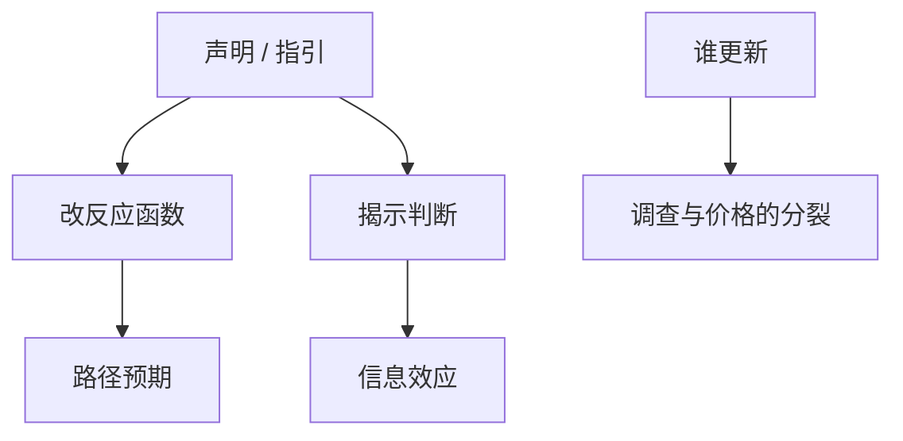

# 预期管理与沟通

工具利率受零下界或滞后约束时，路径的话与信息的话成为政策；听进去多少取决于更新率与信任。

<footer>—— Woodford, Central-Bank Communication；Eggertsson and Woodford 对 ZLB 的前瞻指引；Gürkaynak, Sack and Swanson 的公告效应</footer>

[上一课](/econ/survey-expectations)表明信念可测且常刚性。本课缺口是**政策如何移动信念**：沟通、前瞻指引。不重列 SPF 回归，不把资产负债表工具提前写完（QE 在后单元）。

## 问题

NK 里长期利率与预期路径进入总需求。ZLB 时当前隔夜利率动不了，承诺未来更久的宽松（Eggertsson–Woodford）是理论工具。实践：声明、点阵图、记者会。Gürkaynak–Sack–Swanson：公告窗内不只当前利率，路径因子也动。缺口是把高频识别课的「意外」当成沟通的产出，接到粘性信息/疏忽：同样的声明，更新者与未更新者分裂。

Eggertsson and Woodford, *Brookings* 2003。Gürkaynak, Sack and Swanson, *IJCB* 2005。Blinder 等沟通综述。Campbell, Evans, Fisher, Justiniano 的 Odyssean vs Delphic。

## 方法

Odyssean：承诺改变未来反应函数。Delphic：揭示对经济的判断（信息效应）。调查与高频一起：若声明后家庭预期不动、市场价格动，疏忽或注意力配置在家庭侧。HANK：沟通若只动资产价格，财富效应走低 MPC；若动失业预期，走高 MPC。学习：体制转换声明要足够久才能进 PLM。

可信度：时间不一致课已说明承诺难。沟通不能替代制度承诺，但能改变信息集。

## 机制

机制是移动状态变量「信念」。在完全信息 RE，沟通要么是揭示私人信息，要么是承诺；没有「解释清楚」的独立通道。有粘性信息，重复沟通提高有效 $\lambda$。有疏忽，简单、少噪声的规则节省容量。诊断性：生动情景可能过冲。因此沟通设计依赖本单元前几课选哪一套。

与财政：财政路径的沟通同样改李嘉图程度；HANK 里「未来税落在谁头上」的信念直接进乘数。

本课不写新闻稿文案技巧。也不把点阵图当成最优合约。

## 边界

本课不估计最优词汇表。QE、TLTRO 是数量工具，后课资产负债表。通胀锚定下一课专写长期预期，本课是一般沟通装置。不进外汇微观结构。

后课默认：沟通分 Odyssean/Delphic；效力被更新率与信任打折。下一课：长期通胀预期如何被钉住或解钉。

## 小结

- 前瞻指引与声明移动路径预期；ZLB 时更重要。
- Odyssean vs Delphic 决定 IRF 符号。
- 家庭与市场价格分裂，用本单元的信息摩擦解释。
- 出处：Eggertsson and Woodford 2003；Gürkaynak, Sack and Swanson, *IJCB* 2005。
