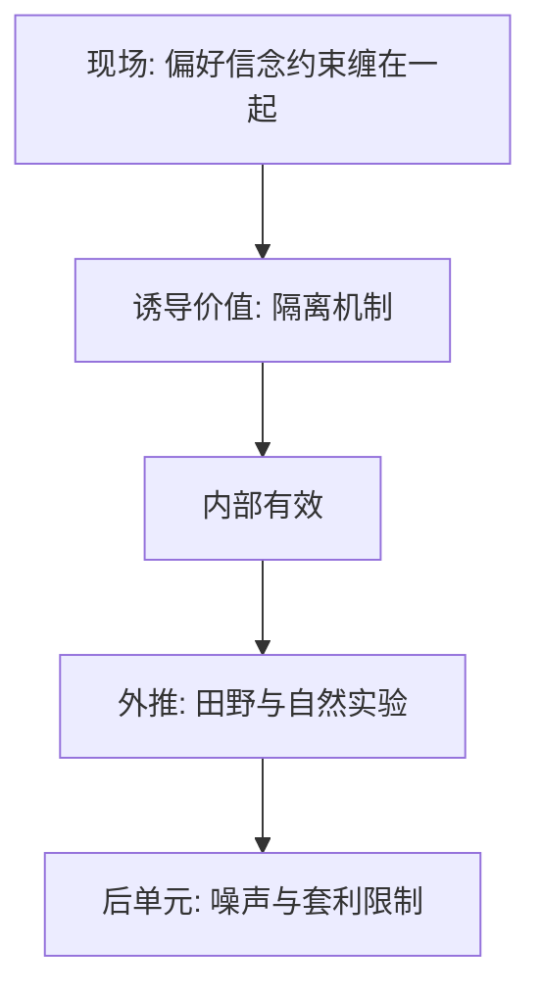

# 实验经济学方法

用货币诱导价值，把理论的 $u$ 变成可操纵的支付；内部有效不等于现场有效，但没有内部有效就没有机制证据。

<footer>—— Smith, Experimental Economics: Induced Value Theory, 1976；Smith, Microeconomic Systems as an Experimental Science, AER 1982</footer>

[上一课](/econ/belief-updating-biases)堆叠了实验室风格的偏差。本课缺口是方法：如何把这些主张从故事变成可复制的证据，以及证据能外推多远。行为单元在此收束，下一单元把偏差放进资产市场理论。

## 问题

现场价格同时含偏好、信念、约束和均衡。拒绝 [EMH](/econ/emh) 或拒绝欧拉，无法直接读出「因为损失厌恶」。Vernon Smith 的诱导价值：用货币支付诱导出实验者想要的价值和信息结构，从而隔离机制。最后通牒、杯子、校准测验，都依赖这一逻辑。缺口是标明识别与外推，而不是再做一个偏差清单。

内部有效：在所设环境下因果清楚。外部有效：对现场仍成立。两者冲突时，本栏补层先要内部有效，再谈加总。

## 方法

设计要素：随机分配、匿名、真实支付、重复与学习、控制信息。市场实验看能否收敛到竞争均衡；个人实验看是否偏离 vNM。本课不教软件。对照：自然实验与田野实验（Ashraf–Karlan–Yin 的承诺账户、Madrian–Shea 的默认）牺牲部分控制，换取外部有效。行为金融理论课将混合使用：实验室给零件，价格与持仓给加总。

## 机制

机制是控制。诱导价值把[偏好](/econ/preference-choice)的 $X$ 变成实验者设定的支付表；若仍出现禀赋效应，就不能把原因推给「未知的真实 u」。信息集被写在说明书里，过度自信就可以对照客观精度。重复博弈看偏差是否被套利或学习消灭——这正是下一课 DSSW 要问的市场问题的实验室前身。

支付过小会把选择变成廉价交谈；支付过大受预算限制。风险态度被实验室财富与「房子钱」账户污染——心理账户在方法上是威胁。

Smith 的市场实验表明：诱导价值下双拍卖可以收敛到竞争均衡，即使被试不会解瓦尔拉斯。因此「人有偏差」与「市场能加总」不是同一命题——DSSW 问的正是加总何时失败。内部有效要求随机分配与真实支付；外部有效要求现场的约束也在。401(k) 默认是田野，杯子是实验室，PEAD 是价格。三层证据要分开标，不能用一层否证另一层的全部。

## 边界

学生样本、低利害、抽象框架，限制外推到家庭组合与机构套利。本课不宣称实验室否证了 [vNM](/econ/expected-utility) 在所有现场的用途；主干定价核仍用它。补层的态度是：实验室给出可靠零件，市场理论问零件能否在套利下存活。

后课默认：噪声交易者不是实验室被试的别名，而要有一个风险与资本的均衡模型。

诱导价值把 $u$ 变成可操纵支付；内部有效先于外推。市场能收敛与个人有偏差不是同一命题。

实验室给零件，田野给外部有效，价格残差给加总。下一单元问零件在套利下能否存活。

实验室收敛不能推出现场无偏差；现场残差也不能单独指认心理学零件。

## 小结

- 诱导价值隔离机制；内部有效先于外推。
- 田野补外部有效；价格残差单独不能指认心理学。
- 行为单元到此结束；下一单元问偏差如何进入资产价格。
- 支付过小变成廉价交谈。
- 房子钱账户会污染风险态度。
- 出处：Smith 1976, *AER* 1982。
