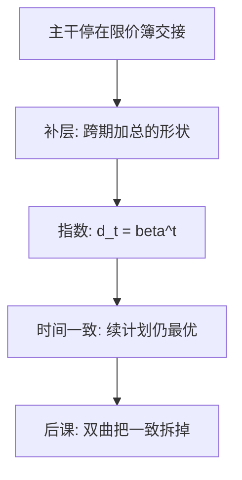

# 指数贴现与时间一致

把各期效用乘上几何级数再加总，今天的最优计划到了明天仍然最优——这不是心理学发现，是使动态规划可递推的约定。

<footer>—— Samuelson, A Note on Measurement of Utility, Review of Economic Studies, 1937；对照 Strotz, Review of Economic Studies, 1955–56</footer>

[上一课](/econ/to-limit-order-book)（到限价簿：理论在此停）。主干在限价簿交接处停：均衡给出应当满足的 $p$，协议从队列处起，量化栏拥有[限价簿](/quant/lob-structure)。本课是补层，不重写簿，也不把中间价当成欧拉里的 $r$。缺口是：主干已经用过 $\beta$，但没有问这串权重为什么必须是几何的。后课默认已经读完本课。

## 问题

[两期消费](/econ/two-period-micro)把菜单写成 $u(c_0)+\beta u(c_1)$；[跨期欧拉](/econ/consumption-euler)把它沿无限期写下去。$\beta$ 从哪来？若只是「人更看重今天」，任意递减序列 $d_t$ 都能加权。Samuelson（1937）的贴现效用把 $d_t=\beta^t$，于是

$$
U_t=\sum_{k=0}^{\infty}\beta^k u(c_{t+k}).
$$

缺口不是再推 [vNM](/econ/expected-utility)，也不是再写斯勒茨基：确定消费上的排序已经有了。缺口是跨期加总的**形状**。任意 $d_t$ 一般会时间不一致：在 $t$ 订的 $(c_{t+1},c_{t+2},\ldots)$，到 $t+1$ 用新的 $U_{t+1}$ 会想改。指数贴现是使「今天的续计划 = 明天的最优」的充分条件。Strotz 把不一致写成动态的自我博弈；本课先钉住一致的那一支。

Koopmans（1960）把平稳性写成公理：推迟同样长的一段时间，相对排序不变。几何 $\beta^t$ 是平稳加可分的表示，不是对耐心的测量。

## 方法

对象仍是日期商品上的偏好，见[偏好](/econ/preference-choice)。补的只是可分加平稳：各期 $u$ 相同，贴现因子对延迟长度不变。一阶条件沿用已有欧拉 $u'(c_t)=\beta(1+r_t)u'(c_{t+1})$，不重导。时间一致的操作含义：在 $t$ 选出的路径，限制在 $t+1$ 的续路径上仍最大化 $U_{t+1}$。动态规划的贝尔曼方程依赖这一条；否则「值函数」每期要换一套偏好。

市场利率 $r$ 仍是相对价格，不是报价档。本课不进入簿。

## 机制

几何级数使相邻两期的相对权重永远是 $\beta$，与「还剩多远」无关。因此自我之间没有冲突：未来的你用同一把尺。这与宏观政策课的时间不一致不是同一对象——那里是政府面对私人预期再优化；这里是同一偏好在不同日期是否还承认自己昨天的计划。补层回到家庭，不改 Kydland–Prescott 的政策故事。

指数贴现并不声称人真按 $\beta^t$ 感受延迟。它是使欧拉可递推、使生命周期计划可执行的技术。经验上短期贴现往往陡于长期，那是下一课的缺口。本课只要：主干里用过的 $\beta$，在补层里被标明为时间一致的选择，而不是心理学常数。

[期望效用](/econ/expected-utility)管的是状态之间的加总，本课管的是日期之间的加总；两者都可分，独立性与几何贴现不是同一条公理。后课准双曲只拆日期权重，不拆 vNM。也不把 $r$ 写成盘口利率。

## 边界

不重写 [EMH](/econ/emh)、不重写股权溢价。不确定仍用已有期望效用，贴现与风险厌恶是两件事。也不把 $\beta=1/(1+r)$ 写成公理：那是切点，不是定义。无限期、连续时间只改求和为积分，形状仍是指数。

后课默认：说到「标准贴现效用」，指指数、时间一致；若要现时偏差，必须显式换权重。

## 小结

- 主干在限价簿交接处停；本课是补层，回到跨期偏好，不重写簿。
- Samuelson 贴现效用取几何权重，使计划时间一致。
- $\beta$ 是偏好，$r$ 是价格；欧拉在切点对齐，不重导。
- 非几何贴现把自我博弈留给下一课。
- 出处：Samuelson, *RES* 1937；Strotz, *RES* 1955–56；Koopmans 1960。
