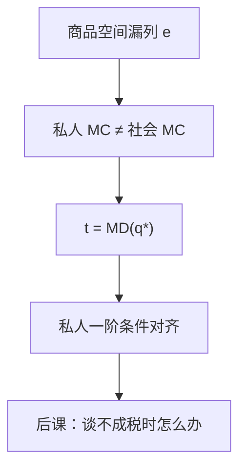

# 外部性与庇古税

私人净产品与社会净产品发生歧义之处，正是产业需要国家干预的地方。

<footer>—— 据 Pigou, The Economics of Welfare, 1920 整理</footer>

[上一课](/econ/core-equivalence)把核收到竞争均衡：人多、可结盟、商品列全时，讨价还价的剩余被竞争掉。[福利第一定理](/econ/welfare-theorems)也站在同一商品空间上。缺口是：有些影响根本没有对应的商品。工厂的烟进了邻居的效用，但烟没有价格、不能拿去核里阻塞。本课打开「市场失灵」课序，只钉外部性与一阶纠正，不预支科斯谈判。

## 问题

竞争均衡把每人的 MRS 对齐到同一组相对价格。若 $i$ 的效用还直接依赖 $j$ 的行动 $a^j$，一阶条件里多出一项 $\partial u^i/\partial a^j$，市场价格看不见它。私人边际成本（或收益）与社会边际成本分叉，均衡配置一般不再帕累托有效。核同样失效：联盟「带着自己的禀赋走开」时，污染是否跟着走，资源集没有定义。

缺口不是再证存在性，而是：在商品空间漏列一项时，如何用可观察的税把漏掉的边际搬回决策者的一阶条件。庇古的答案是单位税（或补贴）等于边际外部损害（或收益）。

### 外部效应不是「互相影响」

两人在盒里交易也互相影响，但那是通过价格与禀赋，已经内部化。外部性是非市场的直接进入：生产函数或效用函数的自变量里出现了别人的选择，而这个选择没有作为商品被定价。金钱外部性（pecuniary）只改价格，第一定理仍成立；技术外部性才拆有效性。

标准教具：边际损害 $\mathrm{MD}(q)$ 随排放升，私人边际成本 $\mathrm{MC}(q)$ 不含它。社会有效点满足 $\mathrm{MC}(q^*)+\mathrm{MD}(q^*)=\mathrm{MB}(q^*)$。从量税 $t=\mathrm{MD}(q^*)$ 使私人一阶条件与社会重合。

## 方法

把商品空间扩一维：把排放 $e$ 写成带负价格的商品。若能为 $e$ 建市场，问题退回完整市场的第一定理。做不到时，计划者选定额税 $t$，厂商面对 $\mathrm{MC}(q)+t$。最优 $t$ 等于有效点上的边际外部损害，不是「损害的平均值」，也不是总损害除以产量。

补贴对称：正外部性把私人收益写低了，补贴补齐边际。配额加可交易许可在完全信息、无不确定性时与庇古税等价——都是把影子价格塞回私人问题。本课用税，因为后课归宿、次优都从价税、从量税说话。

信息不免费。计划者要知道 $\mathrm{MD}$ 在 $q^*$ 处的值，而 $q^*$ 又取决于税。这是圆周。本课只写完全信息下的一阶纠正；谈判与产权是下一课对这个圆周的另一条出路。

## 机制

税改变的是相对价格，不是偏好。决策者仍最大化私人目标，只是预算或成本里多了一项 $t e$。对齐发生在边际：inframarginal 的总剩余转移给谁，有效性不管——那是后课归宿。配额钉数量、税钉价格，不确定下两者分开，Weitzman 的比较不在本课。

多源排放时，统一税率只在边际损害只取决于总量时正确。损害随地点变，就要分化税率，等于承认「排放」其实是许多不同商品。庇古工具的精度跟着商品定义走。

与[第二定理](/econ/welfare-theorems)的差别：第二定理用总额转移改购买力，相对价格仍是有效价格。庇古税故意扭一项相对价格，因为那一项本来缺市场。它不是总额税，因此后课的归宿与次优都会找上门：楔子一旦留下，就不能假装其余切条件自动最优。

## 边界

第一定理的假设是完整市场，不是「无政府」。庇古税是用一种扭曲去补一种漏列；若经济里已经有其他扭曲，单补这一个可能更糟——[次优](/econ/theory-of-second-best)会回收这句话。非凸（临界污染、不可分）让「边际税」没有良好定义的 $q^*$。

也不要把庇古税读成现实环保法的说明书。税率要边际损害，损害要评价健康与生态，那是测度，不是本课的存在性。科斯将问：若产权清晰、谈判免费，还要不要税。

后课默认：谈到「市场失灵」的第一种，指技术外部性；一阶纠正是把 $\mathrm{MD}$ 写成税。

## 小结

- 核与第一定理要求商品列全；漏列的直接影响是技术外部性。
- 庇古税把有效点上的边际损害写进私人一阶条件。
- 税对齐边际，不决定谁承担 inframarginal 负担。
- 计划者需要 $\mathrm{MD}(q^*)$；下一课用谈判绕开这个信息。
- 出处：Pigou, *The Economics of Welfare*, 1920。
